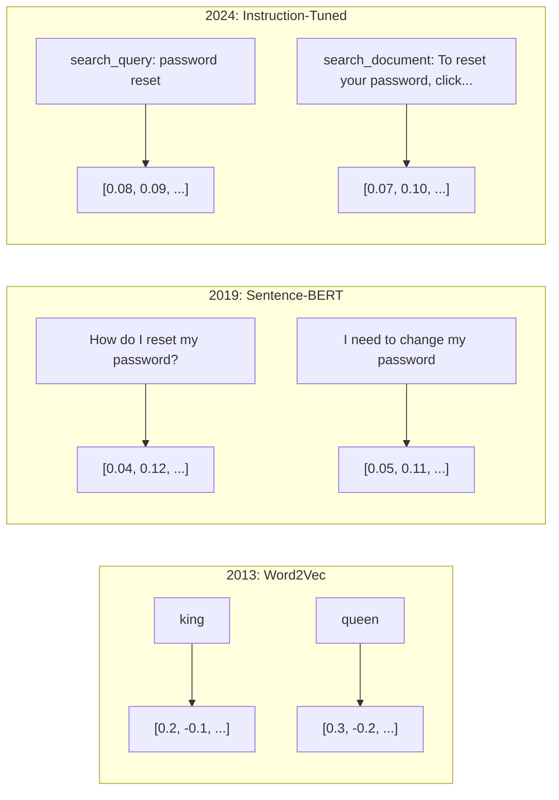
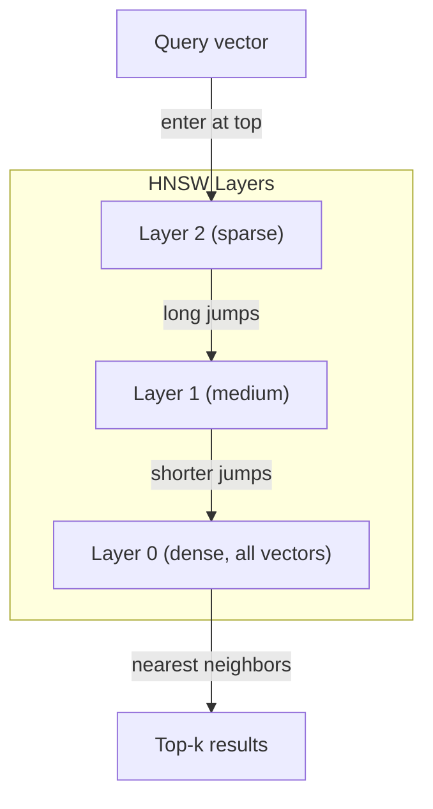
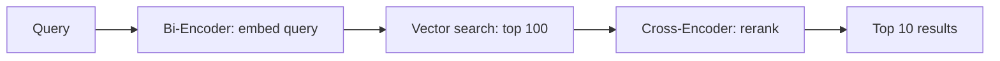

# 嵌入式和向量表示

> 文字是离散的.数学是连续的.每次你要求LLM找到"类似"的文件,比较含义,或者搜索超越关键词,你依赖于这两个世界之间的桥梁.那座桥梁是嵌入式.如果你不理解嵌入式,你就不理解现代人工智能.你只是使用它.

**Type:** Build
**Languages:** Python
**Prerequisites:** Phase 11, Lesson 01 (Prompt Engineering)
**Time:** ~75 minutes
**Related:**阶段5 · 22 (嵌入模型深度潜水) 涵盖密集对稀少对多向量,马特里奥斯卡切割,每个轴模型选择.本课程侧重于生产管道 (向量DB,HNSW,相似数学的). 在选择模型之前阅读阶段5 · 22.

## 学习目标

- 使用API提供商和开源模型生成文本嵌入,并计算它们之间的共数相似性
- 解释为什么嵌入式解决了关键字搜索无法处理的词汇不匹配问题
- 建立一个语义搜索索引,以取出文档的含义而不是精确的关键词匹配
- 使用检索基准 (precision@k,回忆) 评估嵌入质量,并选择适合您的任务的嵌入模型

## 问题

你有1万张支持门票.一个客户写道:"我的付款没有完成".你需要找到类似的过去门票.关键字搜索会找到包含"付款"和"没有完成"的门票.它错过了"交易失败","收费被拒绝",和"账单错误".这些门票描述了完全不同的词汇.

人类语言有几十种方法来说同样的东西.关键词搜索对待每个词作为一个独立的符号,没有意义.它不能知道"拒绝"和"没有通过"指的是同一个概念.

你需要一个文字的表示,其中意思,而不是拼写,决定相似性. 你需要一种方法,在某个数学空间中将"我的付款没有完成"和"交易被拒绝"放在一个近距离,同时推 "我的付款到达了时间"远远,尽管分享了"付款"这个词.

这种表现是嵌入式.

## 概念

### 植入是什么?

嵌入式是代表文本的意义的浮点数量的密集向量. "密集"这个词是重要的 - 每个维度都包含信息,而不同于稀疏的表示 (字包,TF-IDF),其中大多数维度都是零.

"猫坐在床上"变成了这样的东西`[0.023, -0.041, 0.087, ..., 0.012]`根据模型,这些数字编码含义.你从来没有直接检查它们.你比较它们.

###  Word2Vec 突破

2013年,托马斯·米科洛夫和谷歌的同事发表了Word2Vec.核心见解:训练一个神经网络来预测一个词从其邻居 (或邻居从一个词),而隐藏的层重量成为有意义的向量表示.

著名的结果:

```
king - man + woman = queen
```

词嵌入中的矢量算数捕捉了语义关系.从"男人"到"女人"的方向大致与从"国王"到"女王"的方向相同.这是在该领域意识到几何可以编码意义时.

Word2Vec产生了300维向量.每个词都得到了一个向量,不管背景. "河岸"中的"银行"和"银行账户"的嵌入式相同. 这种限制推动了下一个十年的研究.

### 从单词到句子

字符嵌入代表单个代币. 制作系统需要嵌入整个句子,段落或文档. 出现了四种方法:

**Averaging**简单的文字,很便宜,很有损失,很好吃. 完全失去了单词顺序. "狗咬人"和"狗咬人"得到相同的嵌入式.

**CLS token**转换器模型 (BERT, 2018) 输出一个特殊的 [CLS]代币嵌入,代表整个输入.比平均更好,但[CLS]代币被训练为下一句预测,而不是相似性.

**Contrastive learning**根据"我如何重置密码?"和"我需要更改密码",模型学习这些应该几乎相同的向量.

**Instruction-tuned embeddings**模型可以使用一个模特为多个任务服务. 模型可以使用一个模特为多个任务服务.



### 现代嵌入式模型

根据市场的统计数据,市场已分成数量产品级的选择 (MTEB比分:2026年初,MTEB v2):

| Model | Provider | Dimensions | MTEB | Context | Cost / 1M tokens |
|-------|----------|-----------|------|---------|------------------|
| Gemini Embedding 2 | Google | 3072 (Matryoshka) | 67.7 (retrieval) | 8192 | $0.15 |
| embed-v4 | Cohere | 1024 (Matryoshka) | 65.2 | 128K | $0.12 |
| voyage-4 | Voyage AI | 1024/2048 (Matryoshka) | 66.8 | 32K | $0.12 |
| text-embedding-3-large | OpenAI | 3072 (Matryoshka) | 64.6 | 8192 | $0.13 |
| text-embedding-3-small | OpenAI | 1536 (Matryoshka) | 62.3 | 8192 | $0.02 |
| BGE-M3 | BAAI | 1024 (dense+sparse+ColBERT) | 63.0 multilingual | 8192 | Open-weight |
| Qwen3-Embedding | Alibaba | 4096 (Matryoshka) | 66.9 | 32K | Open-weight |
| Nomic-embed-v2 | Nomic | 768 (Matryoshka) | 63.1 | 8192 | Open-weight |

MTEB (大规模文本嵌入基准) v2涵盖100多项任务,包括检索,分类,集群,重新排名和总结. 较高就更好. 到2026年,开放式型号 (Qwen3-Embedding, BGE-M3) 在大多数轴上匹配或超过封闭主机型号. 双子座嵌入2带来了纯粹的检索;旅行/Cohere带来了特定领域 (金融,法律,代码). 在做出承诺之前,总是根据自己的问题进行基准.

### 类似度指标

鉴于两个嵌入向量,测量它们的相似性有三个方法:

**Cosine similarity**视角:两个向量之间的角的共数.从 -1 (相反) 到 1 (相同的方向). 忽略大小 - 10 字句和 500 字文档可以得到 1.0 如果它们指向相同的方向.这是 90% 的使用案例的默认.

```
cosine_sim(a, b) = dot(a, b) / (||a|| * ||b||)
```

**Dot product**微分数是两个向量的原始内部产物.当向量正常化时与可西因相似 (单位长度).计算更快.OpenAI的嵌入式是正常化的,因此点产物和可西因都得到相同的排名.

```
dot(a, b) = sum(a_i * b_i)
```

**Euclidean (L2) distance**微小 = 类似. 敏感于大小差异. 使用当空间中的绝对位置重要时,而不是仅仅是方向.

```
L2(a, b) = sqrt(sum((a_i - b_i)^2))
```

什么时候使用:

| Metric | Use when | Avoid when |
|--------|----------|------------|
| Cosine similarity | Comparing texts of different lengths; most retrieval tasks | Magnitude carries information |
| Dot product | Embeddings are already normalized; maximum speed | Vectors have varying magnitudes |
| Euclidean distance | Clustering; spatial nearest-neighbor problems | Comparing documents of wildly different lengths |

### 矢量数据库和HNSW

根据"大力相似性搜索"的数据,每一个存储的向量都会对比到一个问题.

矢量数据库使用近邻近近邻 (ANN) 算法解决这一问题.主导算法是HNSW (层次导航小世界):

1. 构建一个多层的向量图
2. 顶层是稀疏的 - - 远程的连接
3. 底层密集,附近的向量之间有细粒度的连接.
4. 搜索从顶层开始,贪地下降到精炼
5. 返回大约在 O(log n) 时间中的 top-k结果,而不是 O(n)

在10万向量时,粗 lực需要几秒钟.在HNSW需要几毫秒.



生产选择:

| Database | Type | Best for | Max scale |
|----------|------|----------|-----------|
| Pinecone | Managed SaaS | Zero-ops production | Billions |
| Weaviate | Open source | Self-hosted, hybrid search | 100M+ |
| Qdrant | Open source | High performance, filtering | 100M+ |
| ChromaDB | Embedded | Prototyping, local dev | 1M |
| pgvector | Postgres extension | Already using Postgres | 10M |
| FAISS | Library | In-process, research | 1B+ |

### 碎策略

文件太长了,不能作为单个向量嵌入. 50页的PDF涵盖了数十个主题. 它的嵌入成为所有东西的平均值,类似于什么也没有具体的.

**Fixed-size chunking**简单且可预测. 文件没有清晰的结构时,它可以很好地运作. 具有512个代币的部分,具有50个代币的重叠:第1个部分是代币0-511,第2个部分是代币462-973.

**Sentence-based chunking**单词的分数是:分为句子边界,把句子组合在一起,直到达到标志性限度.每一个部分至少是一个完整的句子.

**Recursive chunking**试试在最大边界 (区块标题) 上分开.如果仍然太大,试试段界.然后句子界限.然后字符界限.这是LangChain的.`RecursiveCharacterTextSplitter`对于混合格式的体体来说,它很好.

**Semantic chunking**嵌入式的相似性下降到门以下时,开始一个新的部分.昂贵 (需要单独嵌入每个句子),但产生最一致的部分.

| Strategy | Complexity | Quality | Best for |
|----------|-----------|---------|----------|
| Fixed-size | Low | Decent | Unstructured text, logs |
| Sentence-based | Low | Good | Articles, emails |
| Recursive | Medium | Good | Markdown, HTML, mixed docs |
| Semantic | High | Best | Critical retrieval quality |

对于大多数系统来说,最好的点是256-512个代币块,

### 双编码器与交叉编码器

双编码器独立嵌入查询和文件,然后比较向量.快速 - - 你嵌入查询一次,然后与预先计算的文件嵌入进行比较.这是你用于检索的.

交叉编码器将查询和文档作为单个输入,并输出相关性分数.慢 - 它通过完整模型处理每个查询-文档对. 但更准确,因为它可以同时处理查询和文档代币.

生产模式:双编码器检索前100名候选人,跨编码器将他们排名至前10名.



排名模型:Cohere Rerank 3.5 (每1000个查询每2美元),BGE-reranker-v2 (免费,开源),Jina Reranker v2 (免费,开源).

### 马特里奥斯卡嵌入式

传统的嵌入式是全部或什么都没有.一个1536维向量使用1536个浮动.你不能在没有重新训练的情况下切断到256维度.

马特里奥斯卡表示学习 (Kusupati等, 2022) 解决了这一问题.该模型训练以使第一个N维度捕获最重要的信息,就像俄罗斯的巢穴娃娃.将1536d的马特里奥斯卡嵌入到256维度的切断会失去一些准确性,但仍然是功能性的.

通过                                                                                                                                                                                                                                                                                                                                                                                                                                                                                                                            `dimensions`要求256个维度而不是1536个维度将存储量减少6倍,在MTEB基准上约有3-5%的准确性损失.

### 双数量化

作为 float32 存储的1536维嵌入式使用了6,144个字节.乘以1000万份文件:仅仅为向量为61GB.

双数量化将每个浮动数量转换为单位数:正值变为1,负值变为0.存储量从6,144字节降至192字节 - 这意味着32倍的减少.类似性是使用汉密距离计算的 (数分不同位数), CPU可以在单个指示中完成.

检索回忆时,准确度达到5-10%. 常见模式是:对数百万向量进行首次通过搜索的二进制量化,然后使用完全精确的向量重新排列前1000. 这使您获得了95%+的完全精确度,并且存储量减少了32倍.

```figure
cosine-similarity
```

## 建立它

我们从零开始构建了一个语义搜索引擎.没有向量数据库.没有外部嵌入API.纯Python和数学的numpy.

### 步骤1: 删除文字

```python
def chunk_text(text, chunk_size=200, overlap=50):
    words = text.split()
    chunks = []
    start = 0
    while start < len(words):
        end = start + chunk_size
        chunk = " ".join(words[start:end])
        chunks.append(chunk)
        start += chunk_size - overlap
    return chunks


def chunk_by_sentences(text, max_chunk_tokens=200):
    sentences = text.replace("\n", " ").split(".")
    sentences = [s.strip() + "." for s in sentences if s.strip()]
    chunks = []
    current_chunk = []
    current_length = 0
    for sentence in sentences:
        sentence_length = len(sentence.split())
        if current_length + sentence_length > max_chunk_tokens and current_chunk:
            chunks.append(" ".join(current_chunk))
            current_chunk = []
            current_length = 0
        current_chunk.append(sentence)
        current_length += sentence_length
    if current_chunk:
        chunks.append(" ".join(current_chunk))
    return chunks
```

### 步骤2:从零开始构建嵌入式

我们使用TF-IDF实现了简单的密集嵌入式,并使用L2正常化.这不是神经嵌入式,但它遵循相同的合同:文字进,固定尺寸的向量出,类似的文本产生类似的向量.

```python
import math
import numpy as np
from collections import Counter

class SimpleEmbedder:
    def __init__(self):
        self.vocab = []
        self.idf = []
        self.word_to_idx = {}

    def fit(self, documents):
        vocab_set = set()
        for doc in documents:
            vocab_set.update(doc.lower().split())
        self.vocab = sorted(vocab_set)
        self.word_to_idx = {w: i for i, w in enumerate(self.vocab)}
        n = len(documents)
        self.idf = np.zeros(len(self.vocab))
        for i, word in enumerate(self.vocab):
            doc_count = sum(1 for doc in documents if word in doc.lower().split())
            self.idf[i] = math.log((n + 1) / (doc_count + 1)) + 1

    def embed(self, text):
        words = text.lower().split()
        count = Counter(words)
        total = len(words) if words else 1
        vec = np.zeros(len(self.vocab))
        for word, freq in count.items():
            if word in self.word_to_idx:
                tf = freq / total
                vec[self.word_to_idx[word]] = tf * self.idf[self.word_to_idx[word]]
        norm = np.linalg.norm(vec)
        if norm > 0:
            vec = vec / norm
        return vec
```

### 步骤3:相似性功能

```python
def cosine_similarity(a, b):
    dot = np.dot(a, b)
    norm_a = np.linalg.norm(a)
    norm_b = np.linalg.norm(b)
    if norm_a == 0 or norm_b == 0:
        return 0.0
    return float(dot / (norm_a * norm_b))


def dot_product(a, b):
    return float(np.dot(a, b))


def euclidean_distance(a, b):
    return float(np.linalg.norm(a - b))
```

### 步骤4:使用粗力搜索的向量指数

```python
class VectorIndex:
    def __init__(self):
        self.vectors = []
        self.texts = []
        self.metadata = []

    def add(self, vector, text, meta=None):
        self.vectors.append(vector)
        self.texts.append(text)
        self.metadata.append(meta or {})

    def search(self, query_vector, top_k=5, metric="cosine"):
        scores = []
        for i, vec in enumerate(self.vectors):
            if metric == "cosine":
                score = cosine_similarity(query_vector, vec)
            elif metric == "dot":
                score = dot_product(query_vector, vec)
            elif metric == "euclidean":
                score = -euclidean_distance(query_vector, vec)
            else:
                raise ValueError(f"Unknown metric: {metric}")
            scores.append((i, score))
        scores.sort(key=lambda x: x[1], reverse=True)
        results = []
        for idx, score in scores[:top_k]:
            results.append({
                "text": self.texts[idx],
                "score": score,
                "metadata": self.metadata[idx],
                "index": idx
            })
        return results

    def size(self):
        return len(self.vectors)
```

### 步骤5:语义搜索引擎

```python
class SemanticSearchEngine:
    def __init__(self, chunk_size=200, overlap=50):
        self.embedder = SimpleEmbedder()
        self.index = VectorIndex()
        self.chunk_size = chunk_size
        self.overlap = overlap

    def index_documents(self, documents, source_names=None):
        all_chunks = []
        all_sources = []
        for i, doc in enumerate(documents):
            chunks = chunk_text(doc, self.chunk_size, self.overlap)
            all_chunks.extend(chunks)
            name = source_names[i] if source_names else f"doc_{i}"
            all_sources.extend([name] * len(chunks))
        self.embedder.fit(all_chunks)
        for chunk, source in zip(all_chunks, all_sources):
            vec = self.embedder.embed(chunk)
            self.index.add(vec, chunk, {"source": source})
        return len(all_chunks)

    def search(self, query, top_k=5, metric="cosine"):
        query_vec = self.embedder.embed(query)
        return self.index.search(query_vec, top_k, metric)

    def search_with_scores(self, query, top_k=5):
        results = self.search(query, top_k)
        return [
            {
                "text": r["text"][:200],
                "source": r["metadata"].get("source", "unknown"),
                "score": round(r["score"], 4)
            }
            for r in results
        ]
```

### 步骤 6: 进行相似度量测量

```python
def compare_metrics(engine, query, top_k=3):
    results = {}
    for metric in ["cosine", "dot", "euclidean"]:
        hits = engine.search(query, top_k=top_k, metric=metric)
        results[metric] = [
            {"score": round(h["score"], 4), "preview": h["text"][:80]}
            for h in hits
        ]
    return results
```

## 用它

通过生产嵌入式API,架构保持相同.只有嵌入器改变:

```python
from openai import OpenAI

client = OpenAI()

def openai_embed(texts, model="text-embedding-3-small", dimensions=None):
    kwargs = {"model": model, "input": texts}
    if dimensions:
        kwargs["dimensions"] = dimensions
    response = client.embeddings.create(**kwargs)
    return [item.embedding for item in response.data]
```

通过OpenAI进行缩,相同的模型,尺寸较小,存储量较低:

```python
full = openai_embed(["semantic search query"], dimensions=1536)
compact = openai_embed(["semantic search query"], dimensions=256)
```

对于1000万份文件,这相当于10GB对61GB.标准基准标准的准确性损失大约为3-5%.

为了重新排名科赫:

```python
import cohere

co = cohere.ClientV2()

results = co.rerank(
    model="rerank-v3.5",
    query="What is the refund policy?",
    documents=["Full refund within 30 days...", "No refunds after 90 days..."],
    top_n=3
)
```

对于没有API依赖的本地嵌入式:

```python
from sentence_transformers import SentenceTransformer

model = SentenceTransformer("BAAI/bge-small-en-v1.5")
embeddings = model.encode(["semantic search query", "another document"])
```

它们可以使用任何一个类型, 换个嵌入函数, 保持搜索逻辑.

## 运送它

这一课产生了:
- `outputs/prompt-embedding-advisor.md`-- 针对特定使用情况的嵌入模型和战略的提示
- `outputs/skill-embedding-patterns.md`能教导代理人如何有效地使用嵌入式产品

## 运动

1. **Metric comparison**根据测量结果,测量结果是不同于测量结果的,为什么?

2. **Chunk size experiment**查看数据库的数据库:以50个,100个,200个,500个字的分类大小进行索引.每一个,运行5个查询,记录前1个相似度分数.绘制分类大小和检索质量的关系.找到较大的分类开始疼痛的地方.

3. **Matryoshka simulation**简单的缩器可以产生500d向量. 切断到50,100,200和500维度. 测量每次切断时检索回忆如何降低. 这模拟了Matryoshka行为,而无需真正的训练技巧.

4. **Binary quantization**搜索引擎中的嵌入式,将它们转换为二进制 (1如果是正,如果是负),并执行哈密距离搜索. 根据完全精确的共数相似性进行比较. 测量重叠百分比.

5. **Sentence-based chunking**: 取代固定尺寸的碎片`chunk_by_sentences`按照句子界限来改善结果吗?

## 关键词

| Term | What people say | What it actually means |
|------|----------------|----------------------|
| Embedding | "Text to numbers" | A dense vector where geometric proximity encodes semantic similarity |
| Word2Vec | "The OG embedding" | 2013 model that learned word vectors by predicting context words; proved vector arithmetic encodes meaning |
| Cosine similarity | "How similar are two vectors" | Cosine of the angle between vectors; 1 = identical direction, 0 = orthogonal, -1 = opposite |
| HNSW | "Fast vector search" | Hierarchical Navigable Small World graph -- multi-layer structure enabling O(log n) approximate nearest neighbor search |
| Bi-encoder | "Embed separately, compare fast" | Encodes query and document independently into vectors; enables pre-computation and fast retrieval |
| Cross-encoder | "Slow but accurate reranker" | Processes query-document pair jointly through the full model; higher accuracy, no pre-computation |
| Matryoshka embeddings | "Truncatable vectors" | Embeddings trained so the first N dimensions capture the most important information, enabling variable-size storage |
| Binary quantization | "1-bit embeddings" | Converting float vectors to binary (sign bit only) for 32x storage reduction with Hamming distance search |
| Chunking | "Split docs for embedding" | Breaking documents into 256-512 token segments so each can be independently embedded and retrieved |
| Vector database | "Search engine for embeddings" | Data store optimized for storing vectors and performing approximate nearest neighbor search at scale |
| Contrastive learning | "Train by comparison" | Training approach that pushes similar pair embeddings together and dissimilar pair embeddings apart |
| MTEB | "The embedding benchmark" | Massive Text Embedding Benchmark -- 56 datasets across 8 tasks; standard for comparing embedding models |

## 进一步阅读

- 微洛夫等人",在矢量空间中的词表表的有效估算" (2013) -- 开始了与国王-女王比喻的嵌入革命的Word2Vec论文
- 雷默斯和古雷维奇, "Sentence-BERT:使用西安式BERT网络的句子嵌入" (2019) --如何训练双码码器以实现句子级别的相似性,现代嵌入模型的基础
- 库苏帕蒂等人",马特里奥斯卡表示学习" (2022) - - OpenAI采用的变量化嵌入技术3
- 马尔科夫和雅舒宁, "使用层次导航式小世界图表的最接近邻居" (2018) -- HNSW 论文,大多数生产向量搜索背后的算法
- 开放AI嵌入式指南 (platform.openai.com/docs/guides/embeddings) - - 包括Matryoshka尺寸缩小在内的文本嵌入式-3模型的实用参考
- MTEB 领袖板 (huggingface.co/spaces/mteb/leaderboard) - - 现场比较所有嵌入式模型在任务和语言中
- [Muennighoff et al., "MTEB: Massive Text Embedding Benchmark" (EACL 2023)](https://arxiv.org/abs/2210.07316)-- 排名表报告的8项任务类别 (分类,聚类,对分类,重新排名,检索,STS,总结,Bitext挖掘) 的基准;在信任任何单一的MTEB分数之前阅读.
- [Sentence Transformers documentation](https://www.sbert.net/)两码码器与跨码码器的可信参考, 汇集策略,
