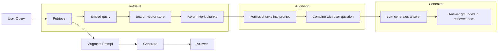
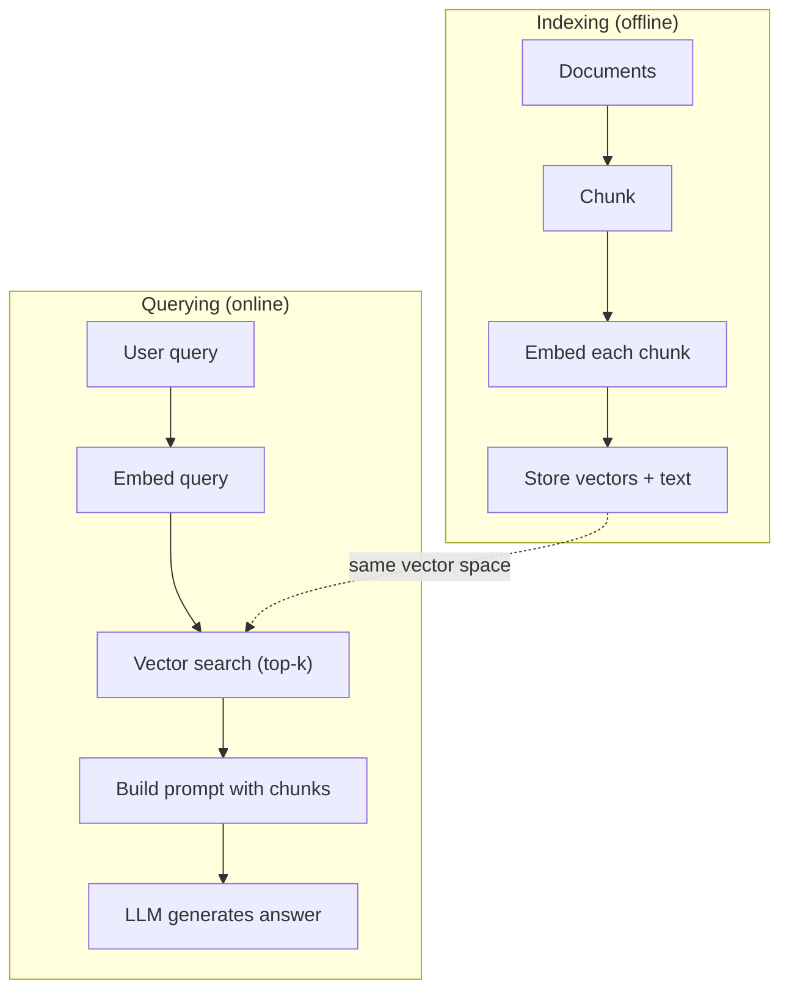

# 恢复增强的产物

> 你的LLM知道一切,直到培训截止.它不知道任何关于你的公司的文件,你的代码库,或上周会议笔记.RAG通过检索相关文件和填充它们在提示中解决了这一问题.这是生产人工智能最广泛的模式.如果你从这个课程中构建一个东西,构建一个RAG管道.

**Type:** Build
**Languages:** Python
**Prerequisites:** Phase 10 (LLMs from Scratch), Phase 11 Lessons 01-05
**Time:** ~90 minutes
**Related:**阶段5 · 23 (RAG的缩减策略) 针对六个缩减算法,每一个算法当中获胜时.阶段5 · 22 (嵌入模型深度潜水) 选择嵌入器.阶段11 · 07 (高级RAG) 针对混合搜索,重新排名和查询转换.

## 学习目标

- 构建完整的RAG管道:文件加载,分块化,嵌入,向量存储,检索和生成
- 执行使用向量数据库 (ChromaDB, FAISS或Pinecone) 的语义搜索,并进行适当的索引
- 解释为什么RAG优先于基于知识的应用程序的细节调整 (成本,新鲜性,归因)
- 通过检索指标 (精度,召回) 和生成指标 (忠实性,相关性) 评估RAG质量

## 问题

公司的客户问:"企业计划的退款政策是什么?"LLM回答了一个关于典型的SaaS退款政策的通用答案.实际的政策,埋在一个200页的内部维基,说企业客户获得60天的退款窗口.LLM从未见过这个文件.它不能知道它没有接受培训的内容.

调整是一个解决方案. 拿下LLM,训练它在你的内部文件上,并部署更新模型. 这种方法有效,但有严重的问题.调整成本数千美元的计算. 模型变得陈旧一旦文件改变. 你没有办法知道模型来源. 如果公司下个月收购了另一个产品线,你再次调整.

另一种解决方案是RAG. 让模型保持无损. 当一个问题出现时,请搜索文件库中相关段落,将它们粘贴在问题前的提示符中, 文件库可以在几分钟内更新. 您可以看到哪些文件被检索出来. 模型本身永远不会改变. 这就是为什么RAG是生产中的主导模式:它更便宜,更新鲜,更可审计,

## 概念

### 红色电气模式

整个模式是四个步骤:



查询 -> 检索 -> 增强提示 -> 生成.每个RAG系统都遵循这个模式.生产RAG系统之间的区别在于每个步骤的细节:你如何分块,如何嵌入,如何搜索,以及如何构建提示.

### 为什么RAG比调整更好

| Concern | Fine-tuning | RAG |
|---------|------------|-----|
| Cost | $1,000-$100,000+ per training run | $0.01-$0.10 per query (embedding + LLM) |
| Freshness | Stale until retrained | Updated in minutes by re-indexing docs |
| Auditability | Cannot trace answer to source | Can show exact retrieved passages |
| Hallucination | Still hallucinates freely | Grounded in retrieved documents |
| Data privacy | Training data baked into weights | Documents stay in your vector store |

调整将模型的重量永久改变.RAG暂时改变模型的背景.对于大多数应用程序,临时背景是你想要的.

只有在调整细节的情况下,你需要模型采用特定的风格,语调或推理模式,而不能仅通过提示实现.

### 嵌入模型

嵌入模型将文本转换为密集的向量.类似的文本在这个高维空间中产生密集的向量. "我如何重置密码?"和"我需要更改密码"虽然分享了几个字,但几乎相同的向量. "猫坐在床上"产生了非常不同的向量.

常见嵌入型号 (2026年排列  查看第5阶段 · 22 详细分析):

| Model | Dimensions | Provider | Notes |
|-------|-----------|----------|-------|
| text-embedding-3-small | 1536 (Matryoshka) | OpenAI | Best price/performance for most use cases |
| text-embedding-3-large | 3072 (Matryoshka) | OpenAI | Higher accuracy, truncatable to 256/512/1024 |
| Gemini Embedding 2 | 3072 (Matryoshka) | Google | Top MTEB retrieval; 8K context |
| voyage-4 | 1024/2048 (Matryoshka) | Voyage AI | Domain variants (code, finance, law) |
| Cohere embed-v4 | 1024 (Matryoshka) | Cohere | Strong multilingual, 128K context |
| BGE-M3 | 1024 (dense + sparse + ColBERT) | BAAI (open-weight) | Three views from one model |
| Qwen3-Embedding | 4096 (Matryoshka) | Alibaba (open-weight) | Top open-weight retrieval score |
| all-MiniLM-L6-v2 | 384 | Open-weight (Sentence Transformers) | Prototyping baseline |

我们使用TF-IDF构建了自己的简单嵌入式,而不是因为TF-IDF是生产系统使用的,而是因为它使这个概念成为具体的:文本进入,向量出,类似的文本产生类似的向量.

### 矢量相似性

鉴于两个向量,你如何测量相似性?

**Cosine similarity**距离为 - 1 (相反) 到 1 (相同). 忽略大小,只关心方向.这是RAG的默认标准.

```
cosine_sim(a, b) = dot(a, b) / (||a|| * ||b||)
```

**Dot product**较大的向量得到更高的分数. 很有用,当大小携带信息时 (更长的文档可能更相关).

```
dot(a, b) = sum(a_i * b_i)
```

**L2 (Euclidean) distance**距离在向量空间中直线距离.较小距离 =更相似.对大小差异敏感.

```
L2(a, b) = sqrt(sum((a_i - b_i)^2))
```

随着一个人说"向量搜索",他们几乎总是指随量相似.

### 碎策略

文件太长了,不能作为单个向量嵌入. 50 页的 PDF 可能会产生一个可怕的嵌入,因为它包含了几十个主题.

**Fixed-size chunking**简单且可预测.一个512代币的部分和50代币的重叠意味着1个部分是代币0-511,2个部分是代币462-973,等等.重叠确保你不会在一个不好的边界分开句子.

**Semantic chunking**部分或标记标题. 每个部分是一个连贯的意义单位. 实施更复杂,但产生更好的回收.

**Recursive chunking**试图先在最大边界分开 (节目标题).如果一个节目仍然太大,则分开在段落边界.如果一个段落仍然太大,则分开在句子边界.这是LangChain RecursiveCharacterTextSplitter方法,它在实践中很好工作.

碎片的尺寸比人们想象的更重要:

- 太小 (64-128个代币):每块都没有文本. "上季度增长了15%",没有什么意思,如果不知道"它"指的是什么.
- 太大 (2048+代币):每个部分涵盖多个主题,从而稀释相关性.当你搜索收入数据时,你会得到10%的收入和90%的员工.
- 甜点点 (256-512代币):足够的背景以保持自主性,足够的关注以保持相关性.

大多数生产RAG系统使用256-512个代币块,50个代币重叠.安тропо克的RAG指南建议使用这种范围.

### 矢量数据库

一旦你有嵌入式,你需要存储和搜索它们的地方.

| Database | Type | Best for |
|----------|------|----------|
| FAISS | Library (in-process) | Prototyping, small to medium datasets |
| Chroma | Lightweight DB | Local development, small deployments |
| Pinecone | Managed service | Production without ops overhead |
| Weaviate | Open source DB | Self-hosted production |
| pgvector | Postgres extension | Already using Postgres |
| Qdrant | Open source DB | High-performance self-hosted |

对于这个课程,我们建立了一个简单的内存向量存储器.它存储在列表中的向量,并进行粗武宇宙相似性搜索.这相当于 FAISS 具有平板索引.它在放缓之前扩展到可能10万个向量.生产系统使用HNSW等近邻 (ANN) 算法在毫秒内搜索数百万个向量.

### 整个管道



索引阶段每份文件都运行一次 (或文件更新时).查询阶段运行在每个用户请求上.在生产中,索引可能会在数小时内处理数百万份文件.查询必须在不到一秒内响应.

### 真实数字

大多数生产RAG系统使用以下参数:

- **k = 5 to 10**查询中的检索分数
- **Chunk size = 256 to 512 tokens**具有50个代币重叠
- **Context budget**:每次查询中获取的内容的2500至5000个代币
- **Total prompt**: ~ 8,000-16,000个代币 (系统提示 + 获取的块 + 对话历史记录 + 用户查询)
- **Embedding dimension**: 384-3072 根据模型
- **Indexing throughput**:每秒100-1,000份文件,包含API嵌入式
- **Query latency**获取时间为50-200ms,生成时间为500-3000ms

```figure
rag-chunking
```

## 建立它

### 步骤1:文件的分化

```python
def chunk_text(text, chunk_size=200, overlap=50):
    words = text.split()
    chunks = []
    start = 0
    while start < len(words):
        end = start + chunk_size
        chunk = " ".join(words[start:end])
        chunks.append(chunk)
        start += chunk_size - overlap
    return chunks
```

### 步骤2:TF-IDF嵌入

我们构建了一个简单的嵌入函数.TF-IDF (Term Frequency-Inverse Document Frequency) 并不是一个神经嵌入,但它以捕捉词的重要性的方式将文本转换为向量.文档中的频繁字体获得更高的TF.体内的罕见字体获得更高的IDF.产品给出了重要的,独特的词体具有高值的向量.

```python
import math
from collections import Counter

def build_vocabulary(documents):
    vocab = set()
    for doc in documents:
        vocab.update(doc.lower().split())
    return sorted(vocab)

def compute_tf(text, vocab):
    words = text.lower().split()
    count = Counter(words)
    total = len(words)
    return [count.get(word, 0) / total for word in vocab]

def compute_idf(documents, vocab):
    n = len(documents)
    idf = []
    for word in vocab:
        doc_count = sum(1 for doc in documents if word in doc.lower().split())
        idf.append(math.log((n + 1) / (doc_count + 1)) + 1)
    return idf

def tfidf_embed(text, vocab, idf):
    tf = compute_tf(text, vocab)
    return [t * i for t, i in zip(tf, idf)]
```

### 步骤3:寻找相似性

```python
def cosine_similarity(a, b):
    dot = sum(x * y for x, y in zip(a, b))
    norm_a = math.sqrt(sum(x * x for x in a))
    norm_b = math.sqrt(sum(x * x for x in b))
    if norm_a == 0 or norm_b == 0:
        return 0.0
    return dot / (norm_a * norm_b)

def search(query_embedding, stored_embeddings, top_k=5):
    scores = []
    for i, emb in enumerate(stored_embeddings):
        sim = cosine_similarity(query_embedding, emb)
        scores.append((i, sim))
    scores.sort(key=lambda x: x[1], reverse=True)
    return scores[:top_k]
```

### 第四步: 快速建造

接下来,我们将这些部分进行编程,将它们格式化为提示,并要求法师根据所提供的背景回答.

```python
def build_rag_prompt(query, retrieved_chunks):
    context = "\n\n---\n\n".join(
        f"[Source {i+1}]\n{chunk}"
        for i, chunk in enumerate(retrieved_chunks)
    )
    return f"""Answer the question based ONLY on the following context.
If the context doesn't contain enough information, say "I don't have enough information to answer that."

Context:
{context}

Question: {query}

Answer:"""
```

### 步骤5:完整的RAG管道

```python
class RAGPipeline:
    def __init__(self):
        self.chunks = []
        self.embeddings = []
        self.vocab = []
        self.idf = []

    def index(self, documents):
        all_chunks = []
        for doc in documents:
            all_chunks.extend(chunk_text(doc))
        self.chunks = all_chunks
        self.vocab = build_vocabulary(all_chunks)
        self.idf = compute_idf(all_chunks, self.vocab)
        self.embeddings = [
            tfidf_embed(chunk, self.vocab, self.idf)
            for chunk in all_chunks
        ]

    def query(self, question, top_k=5):
        query_emb = tfidf_embed(question, self.vocab, self.idf)
        results = search(query_emb, self.embeddings, top_k)
        retrieved = [(self.chunks[i], score) for i, score in results]
        prompt = build_rag_prompt(
            question, [chunk for chunk, _ in retrieved]
        )
        return prompt, retrieved
```

### 步骤 6: 产物 (模拟)

在生产中,这是你称之为LLM API的位置. 在这个课程中,我们通过从中获取的文本中提取最相关的句子来模拟生成.

```python
def simple_generate(prompt, retrieved_chunks):
    query_words = set(prompt.lower().split("question:")[-1].split())
    best_sentence = ""
    best_score = 0
    for chunk in retrieved_chunks:
        for sentence in chunk.split("."):
            sentence = sentence.strip()
            if not sentence:
                continue
            words = set(sentence.lower().split())
            overlap = len(query_words & words)
            if overlap > best_score:
                best_score = overlap
                best_sentence = sentence
    return best_sentence if best_sentence else "I don't have enough information."
```

## 用它

通过实质的嵌入模式和LLM,

```python
from openai import OpenAI

client = OpenAI()

def embed(text):
    response = client.embeddings.create(
        model="text-embedding-3-small",
        input=text
    )
    return response.data[0].embedding

def generate(prompt):
    response = client.chat.completions.create(
        model="gpt-4o-mini",
        messages=[{"role": "user", "content": prompt}],
        temperature=0
    )
    return response.choices[0].message.content
```

或是人类:

```python
import anthropic

client = anthropic.Anthropic()

def generate(prompt):
    response = client.messages.create(
        model="claude-sonnet-5",
        max_tokens=1024,
        messages=[{"role": "user", "content": prompt}]
    )
    return response.content[0].text
```

管道是相同的. 换嵌件函数. 换生成函数. 取回逻辑,分块,快速构建 - - 所有的相同,不管你使用哪种模型.

为了进行量级向量存储,用适当的向量数据库取代原力搜索:

```python
import chromadb

client = chromadb.Client()
collection = client.create_collection("my_docs")

collection.add(
    documents=chunks,
    ids=[f"chunk_{i}" for i in range(len(chunks))]
)

results = collection.query(
    query_texts=["What is the refund policy?"],
    n_results=5
)
```

克罗玛内部处理嵌入式 (默认使用全MiniLM-L6-v2) 并存储向量在本地数据库中.

## 运送它

这一课产生了:
- `outputs/prompt-rag-architect.md`-- 针对特定使用情况设计RAG系统的提示
- `outputs/skill-rag-pipeline.md`能教导代理人如何构建和调试RAG管道

## 运动

1. 替换TF-IDF嵌入式使用简单的单词包方法 (二进制:如果词存在,则1;如果没有).对样本文件的检索质量进行比较.TF-IDF应该比较高,因为它重量较高的罕见单词.

2. 试用部分大小:试用同一文件集中的50个,100个,200个,500个字.对于每个大小,运行相同的5个查询,并计算在前3个中返回相关的部分的数量.

3. 添加各部分的元数据 (来源文档名称,部分位置). 修改提示模板以包含源属性,以便LLM引用其来源.

4. 执行一个简单的评估:给出10个问题-答案对,通过RAG管道运行每个问题,并测量检索的部分中含有多少个百分比的答案.

5. 建立一个熟悉对话的RAG管道:记录过去3个交易所,并将它们与检索的部分一起添加到提示中.

## 关键词

| Term | What people say | What it actually means |
|------|----------------|----------------------|
| RAG | "AI that reads your docs" | Retrieve relevant documents, paste them into the prompt, and generate an answer grounded in those documents |
| Embedding | "Convert text to numbers" | A dense vector representation of text where similar meanings produce similar vectors |
| Vector database | "Search engine for AI" | A data store optimized for storing vectors and finding the nearest neighbors by similarity |
| Chunking | "Split docs into pieces" | Breaking documents into smaller segments (typically 256-512 tokens) so each can be embedded and retrieved independently |
| Cosine similarity | "How similar are two vectors" | The cosine of the angle between two vectors; 1 = identical direction, 0 = orthogonal, -1 = opposite |
| Top-k retrieval | "Get the k best matches" | Return the k most similar chunks to the query from the vector store |
| Context window | "How much text the LLM can see" | The maximum number of tokens the LLM can process in a single request; retrieved chunks must fit within this |
| Augmented generation | "Answer using given context" | Generating a response using retrieved documents as context rather than relying solely on trained knowledge |
| TF-IDF | "Word importance scoring" | Term Frequency times Inverse Document Frequency; weights words by how distinctive they are within a corpus |
| Indexing | "Preparing docs for search" | The offline process of chunking, embedding, and storing documents so they can be searched at query time |

## 进一步阅读

- 路易斯等人",知识密集型NLP任务的恢复增强代" (2020) - - 来自Facebook人工智能研究的原始RAG论文,正式化了恢复然后生成模式
- 关于"人类"的RAG文档 (docs.anthropic.com) - - 关于零件尺寸,快速构建和评估的实际指南
- 松学习中心"RAG是什么?" - - 清晰的视觉解释RAG管道与生产考虑
- 句子-BERT:Reimers & Gurevych (2019) -- 全 MiniLM 嵌入模型背后的论文,展示如何训练双码码器以实现语义相似性
- [Karpukhin et al., "Dense Passage Retrieval for Open-Domain Question Answering" (EMNLP 2020)](https://arxiv.org/abs/2004.04906)通过DPR文件证明密集的双码码检索比BM25在开放域的QA,
- [LlamaIndex High-Level Concepts](https://docs.llamaindex.ai/en/stable/getting_started/concepts.html)构建RAG管道时需要知道的主要概念:数据加载器,节点分类器,索引器,检索器,响应合成器.
- [LangChain RAG tutorial](https://python.langchain.com/docs/tutorials/rag/)它们可以在一个单个模式中进行检测,然后生成.
