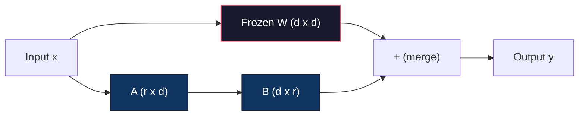
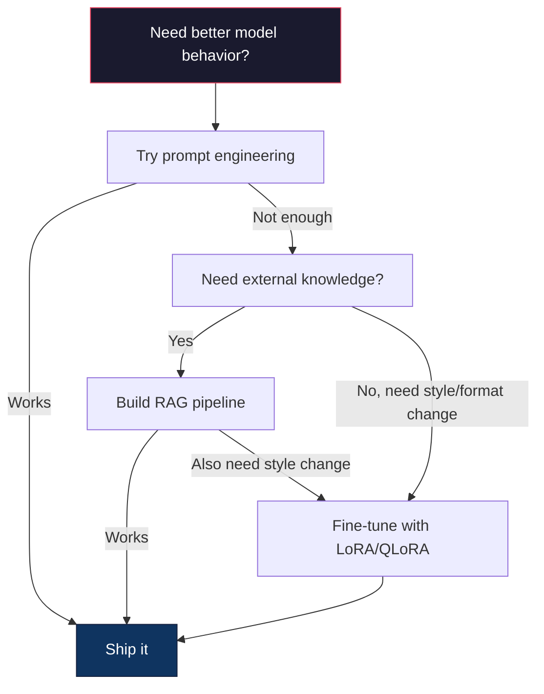

# 精细调节与LoRA和QLoRA

> 完全调整7B模型需要56GB的VRAM.你没有.大多数公司也不会.LoRA允许你通过训练不到1%的参数来调整6GB的模型.这不是妥协 - - 它与大多数任务的完整调整质量相匹配.整个开源调整生态系统都运行在这个技巧上.

**Type:** Build
**Languages:** Python
**Prerequisites:** Phase 10, Lesson 06 (Instruction Tuning / SFT)
**Time:** ~75 minutes
**Related:**第十阶段将从零开始涵盖SFT/DPO循环. 本课程将这些循环连接到2026年PEFT工具包中 (PEFT,TRL,Unsloth,Axolotl,LLaMA-Factory).

## 学习目标

- 通过注入低级适配器矩阵 (A和B) 进入预训练模型的注意力层来实现LoRA
- 计算LoRA对完全微调的参数节省:r级别与d_模型尺寸列车2*r*d参数而不是d2
- 使用QLoRA (4位量化基 + LoRA适配器) 调整模型,以适应消费者GPU内存
- 将LoRA重量重新融入部署的基模型,并将推断速度与无适配器进行比较

## 问题

你有一个基本模型,Llama3 8B. 你希望它能用公司的声音回答客户支持票.SFT是答案.但SFT有成本问题.

完全细调更新模型中的每个参数.Llama 3 8B 有800亿参数.在fp16中,每个参数需要2字节.这仅仅是16GB来加载重量.在训练期间,你还需要梯度 (16GB),优化状态为Adam (32GB为动力 +变量),以及激活.总数:大约56GB的VRAM为单个8B模型.

一个A10080GB几乎不能容纳这两款A100的价格.$3-4/hour on cloud providers. Training for 3 epochs on 50,000 examples takes 6-10 hours. That's $试验每次30-40次,试验10次,以获得超参数的正确性,

只有重量,需要一个集群,每次实验100美元以上.

现在,我们需要一个更深层次的问题. 完整的细节调整改变了模型的每一个重量. 如果你细节调整了客户支持数据,你可能会降低模型的一般能力. 这被称为灾难性忘记. 模型在你的任务上变得更好,而其他事情上变得更糟.

你需要一种训练少参数,使用少记忆,

## 概念

### 低级调整

微软的爱德华·胡和同事于2021年6月发布了LoRA.论文的见解是:细调过程中的权重更新具有低内在等级.你不需要更新4096x4096权重矩阵中的所有1670万参数.更新中的有用信息可以通过16或32等级的矩阵捕获.

标准线性层计算:

```
y = Wx
```

在 W 是 d_out x d_in 矩阵.为4096x4096的注意力投影,这是16777,216参数.

洛拉结W并添加低级分解:

```
y = Wx + BAx
```

在B是 (d_out x r) 和A是 (r x d_in) 的位置 r 比d小得多 - 通常是8,16或32

对于4096x4096层的 r=16:
- 基本参数:4096 x 4096 = 16,777,216
- 低温率参数: (4096 x 16) + (16 x 4096) = 65,536 + 65,536 = 131,072
- 减少:131,072 / 16,777,216 = 0.78%

你训练0.78%的参数,得到95%-100%的质量.



A是随机高斯人初始化. B是初始化到零.这意味着LoRA贡献从零开始 - - 模型从原始行为开始训练,并逐渐学习适应.

### 规模因素:阿尔法

洛拉引入了扩展因子alpha,它控制了低级更新对输出的影响:

```
y = Wx + (alpha / r) * BAx
```

当alpha=r时,规模为1x.当alpha=2r (常见默认) 时,规模为2x.这个超参数独立于基础学习率控制了LoRA路径的学习速度.

实际指导:
- 位是一个常见的社区公约 (原始使用的论文是位在大多数实验中)
- 率为1x的规模,保守但稳定
- 高级alpha意味着每步的更新更大,这可以加速化或导致不稳定性

### 适用Lora的地点

变压器有很多线性层,你不需要把LoRA添加到它们所有.原始的纸质测试了不同的组合:

| Target Layers | Trainable Params (7B) | Quality |
|--------------|----------------------|---------|
| q_proj only | 4.7M | Good |
| q_proj + v_proj | 9.4M | Better |
| q_proj + k_proj + v_proj + o_proj | 18.9M | Best for attention |
| All linear (attention + MLP) | 37.7M | Marginal gain, 2x params |

对于大多数任务的甜点点:q_proj + v_proj. 这针对查询和值预测,以自我注意,这些预测控制模型所关注的内容和它提取的信息.添加MLP层有助于复杂的任务,如代码生成,但对更简单的任务减少回报的参数数量增加了一倍.

### 排名选择

级r控制了适应的表达性:

| Rank | Trainable Params (per layer) | Best For |
|------|---------------------------|----------|
| 4 | 32,768 | Simple classification, sentiment |
| 8 | 65,536 | Single-domain Q&A, summarization |
| 16 | 131,072 | Multi-domain tasks, instruction following |
| 32 | 262,144 | Complex reasoning, code generation |
| 64 | 524,288 | Diminishing returns for most tasks |
| 128 | 1,048,576 | Rarely justified |

胡等人表明,r=4已经捕获了对简单任务的适应大部分.r=8和r=16是实践中最常见的选择.超越r=64很少改善质量,并开始失去LoRA的记忆优势.

### 定量:4位量化+LORA

蒂姆·德特默斯和华盛顿大学的同事在2023年5月发表了QLoRA. 想法是:将冷基模型量化到4位精度,然后将LoRA适配器附在fp16上方.

这会显著改变记忆方程:

| Method | Weight Memory (7B) | Training Memory (7B) | GPU Required |
|--------|-------------------|---------------------|-------------|
| Full fine-tune (fp16) | 14GB | ~56GB | 1x A100 80GB |
| LoRA (fp16 base) | 14GB | ~18GB | 1x A100 40GB |
| QLoRA (4-bit base) | 3.5GB | ~6GB | 1x RTX 3090 24GB |

洛拉提供了三个技术贡献:

**NF4 (Normal Float 4-bit)**网络重量遵循基本正常分布.NF4将其16个量化水平定位在标准正常分布的量化值.这是通常分布的数据的信息理论上最佳.它损失的信息比统一的4位量化 (INT4) 或标准 Float4少.

**Double quantization**量子定位本身需要记忆.每块64重量需要fp32尺度因子 (4字节).对于7B模型,这是额外的0.4GB.双量子定位将这些定位量化为fp8,降低上空成本到0.1GB.小但它加起来.

**Paged optimizers**训练期间,优化器状态 (亚当的动力和变异) 在长序列上可以超过GPU内存.页面优化器使用NVIDIA的统一内存,在GPU内存耗尽时自动将优化器状态转到CPU RAM上,并在需要时将它们转页.这以免OOM失败以牺牲一些吞吐量.

### 质量问题

减少参数或量化基数是否会损害质量?

| Method | MMLU (5-shot) | MT-Bench | HumanEval |
|--------|--------------|----------|-----------|
| Full fine-tune (Llama 2 7B) | 48.3 | 6.72 | 14.6 |
| LoRA r=16 | 47.9 | 6.68 | 14.0 |
| QLoRA r=16 (NF4) | 47.5 | 6.61 | 13.4 |
| QLoRA r=64 (NF4) | 48.1 | 6.70 | 14.2 |

在大多数基准值上,R=16的LoRA在1%内.R=16的QLoRA损失了另一个百分比.R=64的QLoRA基本上与完全的细调匹配,同时使用90%的内存.

### 实际成本

精细调节Llama 3 8B50000个样本 (3个时代):

| Method | GPU | Time | Cost |
|--------|-----|------|------|
| Full fine-tune | 2x A100 80GB | 8 hours | ~$32 |
| LoRA r=16 | 1x A100 40GB | 4 hours | ~$8 |
| QLoRA r=16 | 1x RTX 4090 24GB | 6 hours | ~$5 |
| QLoRA r=16 (Unsloth) | 1x RTX 4090 24GB | 2.5 hours | ~$2 |
| QLoRA r=16 | 1x T4 16GB | 12 hours | ~$4 |

单个消费者GPU上的QLoRA成本低于午餐.这就是为什么开放权重细调社区在2023年爆炸,以及为什么每一个低于QLoRA的培训框架都会在2026年默认地将QLoRA发送.

### 根据"2026年"的标准,

| Framework | What it is | Pick when |
|-----------|-----------|-----------|
| **Hugging Face PEFT** | The canonical LoRA/QLoRA/DoRA/IA3 library | You want raw control and your training loop is already on `transformers.Trainer` |
| **TRL** | HF's reinforcement-from-feedback trainers (SFT, DPO, GRPO, PPO, ORPO) | You need DPO/GRPO after SFT; built on top of PEFT |
| **Unsloth** | Triton-kernel rewrite of the forward/backward pass | You want 2-5x speedup + half the VRAM with no accuracy loss; Llama/Mistral/Qwen family |
| **Axolotl** | YAML-config wrapper over PEFT + TRL + DeepSpeed + Unsloth | You want reproducible, version-controlled training runs |
| **LLaMA-Factory** | GUI/CLI/API over PEFT + TRL | You want zero-code fine-tuning; 100+ model families supported |
| **torchtune** | Native PyTorch recipes, no `transformers` dep | You want minimal deps and your org already standardizes on PyTorch |

基本规则:研究使用或一次性实验 → PEFT.可重复生产管道 → 无核启用的Axolotl.抛弃原型 → LLaMA-工厂.

### 融合适配器

训练后,你有两个东西:结的基模型和一个小的LoRA适配器 (通常是10-100MB).

1. **Keep them separate**根据本模型的定义,您可以使用一个模型的多个细调变体.

2. **Merge them permanently**计算W' =W + (alpha/r) *BA,并将结果保存为新的完整模型. 合并模型与原始相同的尺寸. 没有推断费用. 没有适配器可管理.

为了完成多项任务 (客户支持适配器,代码适配器,翻译适配器),将它们分开.

复合多个适配器的先进合并技术:

- **TIES-Merging**达夫及其他2023年: 切除小幅参数,解决信号冲突,然后合并.减少适配器之间的干扰.
- **DARE**和其他2023年:在合并之前随机降低适配器参数,然后重新扩展其余.
- **Task arithmetic**简单地添加或减去适配器重量.添加"代码"适配器和"数学"适配器通常会产生一个模型在两者都很好.

### 什么时候不调整

调整是第三种选择,不是第一个.

**First: prompt engineering.**写一个更好的系统提示,添加几个拍摄的例子,使用链接思考. 这不花费什么,需要几分钟. 如果提示让你达到80%的路径,你可能不需要调整.

**Second: RAG.**如果模型需要了解您的具体数据 (文件,知识库,产品目录),则检索比成权重更便宜,更可维护.

**Third: fine-tuning.**需要模型采用特定的风格,格式或推理模式,但不能通过提示实现.需要一致的结构化输出.需要将更大的模型化为更小的模型. 延迟重要,并且您无法承担一些投篮提示的额外代币.



```figure
lora-params
```

## 建立它

我们将LoRA从零开始运用纯PyTorch,没有图书馆,没有魔法. 你将构建LoRA层,注入模型中,训练它,并将重量重新合并.

### 第一个步骤:洛拉层

```python
import torch
import torch.nn as nn
import math

class LoRALayer(nn.Module):
    def __init__(self, in_features, out_features, rank=8, alpha=16):
        super().__init__()
        self.rank = rank
        self.alpha = alpha
        self.scaling = alpha / rank

        self.A = nn.Parameter(torch.randn(in_features, rank) * (1 / math.sqrt(rank)))
        self.B = nn.Parameter(torch.zeros(rank, out_features))

    def forward(self, x):
        return (x @ self.A @ self.B) * self.scaling
```

产品BA从零开始,所以模型从其原始行为开始.

### 步骤2:LoRA绕线性层

```python
class LinearWithLoRA(nn.Module):
    def __init__(self, linear, rank=8, alpha=16):
        super().__init__()
        self.linear = linear
        self.lora = LoRALayer(
            linear.in_features, linear.out_features, rank, alpha
        )

        for param in self.linear.parameters():
            param.requires_grad = False

    def forward(self, x):
        return self.linear(x) + self.lora(x)
```

只有LoRA参数 (A和B) 才能进行训练.

### 步骤3:将LoRA注入模型中

```python
def inject_lora(model, target_modules, rank=8, alpha=16):
    for param in model.parameters():
        param.requires_grad = False

    lora_layers = {}
    for name, module in model.named_modules():
        if isinstance(module, nn.Linear):
            if any(t in name for t in target_modules):
                parent_name = ".".join(name.split(".")[:-1])
                child_name = name.split(".")[-1]
                parent = dict(model.named_modules())[parent_name]
                lora_linear = LinearWithLoRA(module, rank, alpha)
                setattr(parent, child_name, lora_linear)
                lora_layers[name] = lora_linear
    return lora_layers
```

首先,结模型中的每个参数.然后走在模型树上,找到符合目标名称的线性层,并用LoRA包装版本取代它们.LoRA A和B矩阵是整个模型中的唯一可训练的参数.

### 步骤 4: 计算参数

```python
def count_parameters(model):
    total = sum(p.numel() for p in model.parameters())
    trainable = sum(p.numel() for p in model.parameters() if p.requires_grad)
    frozen = total - trainable
    return {
        "total": total,
        "trainable": trainable,
        "frozen": frozen,
        "trainable_pct": 100 * trainable / total if total > 0 else 0
    }
```

### 步骤5:重量重量重量重量重量重量重量重量重量重量重量重量重量重量重量重量重量重量重量重量重量重量重量重量重量重量重量重量重量重量重量重量重量重量重量重量重量重量重量重量重量重量重量重量重量重量重量重量重量重量重量重量重量重量重量重量重量重量重量重量重量重量重量重量重量重量重量重量重量重量重量重量重量重量重量重量重量重量重量重量重量重量重量重量重量重量重量重量重量重量重量重量重量重量重量重量重量重量重量重量重量重量重量重量重量重量重量重量重量重量重量重量重量重量重量重量重量重量重量重量重量重量重量重量重量重量重量重量重量重量重量重量重量重量重量重量重量重量重量重量重量重量重量重量重量重量重量重量重量重量重量重量重量重量重量重量重量重量重量重量重量重量重量重量重量重量重量重量重量重量重量重量重量重量重量重量重量重量重量重量重量重量重量重量重量重量重量重量重量重量重量重量重量重量重量重量重量重量重量重量重量重量重量重量重量重量重量重量重量重量重量重量重量重量重量

```python
def merge_lora_weights(model):
    for name, module in model.named_modules():
        if isinstance(module, LinearWithLoRA):
            with torch.no_grad():
                merged = (
                    module.lora.A @ module.lora.B
                ) * module.lora.scaling
                module.linear.weight.data += merged.T
            parent_name = ".".join(name.split(".")[:-1])
            child_name = name.split(".")[-1]
            if parent_name:
                parent = dict(model.named_modules())[parent_name]
            else:
                parent = model
            setattr(parent, child_name, module.linear)
```

合并后,LoRA层消失了.模型与原始尺寸相同,适应量被烤成重量.

### 步骤 6:模拟QLoRA量化

```python
def quantize_to_nf4(tensor, block_size=64):
    blocks = tensor.reshape(-1, block_size)
    scales = blocks.abs().max(dim=1, keepdim=True).values / 7.0
    scales = torch.clamp(scales, min=1e-8)
    quantized = torch.round(blocks / scales).clamp(-8, 7).to(torch.int8)
    return quantized, scales

def dequantize_from_nf4(quantized, scales, original_shape):
    dequantized = quantized.float() * scales
    return dequantized.reshape(original_shape)
```

这通过在64个块内映射权重为16个分离层次进行4位量化.

### 七步:训练循环

```python
def train_lora(model, data, epochs=5, lr=1e-3, batch_size=4):
    optimizer = torch.optim.AdamW(
        [p for p in model.parameters() if p.requires_grad], lr=lr
    )
    criterion = nn.MSELoss()

    losses = []
    for epoch in range(epochs):
        epoch_loss = 0.0
        n_batches = 0
        indices = torch.randperm(len(data["inputs"]))

        for i in range(0, len(indices), batch_size):
            batch_idx = indices[i:i + batch_size]
            x = data["inputs"][batch_idx]
            y = data["targets"][batch_idx]

            output = model(x)
            loss = criterion(output, y)

            optimizer.zero_grad()
            loss.backward()
            optimizer.step()

            epoch_loss += loss.item()
            n_batches += 1

        avg_loss = epoch_loss / n_batches
        losses.append(avg_loss)

    return losses
```

### 步骤8:完整的演示

```python
def demo():
    torch.manual_seed(42)
    d_model = 256
    n_classes = 10

    model = nn.Sequential(
        nn.Linear(d_model, 512),
        nn.ReLU(),
        nn.Linear(512, 512),
        nn.ReLU(),
        nn.Linear(512, n_classes),
    )

    n_samples = 500
    x = torch.randn(n_samples, d_model)
    y = torch.randint(0, n_classes, (n_samples,))
    y_onehot = torch.zeros(n_samples, n_classes).scatter_(1, y.unsqueeze(1), 1.0)

    data = {"inputs": x, "targets": y_onehot}

    params_before = count_parameters(model)

    lora_layers = inject_lora(
        model, target_modules=["0", "2"], rank=8, alpha=16
    )

    params_after = count_parameters(model)

    losses = train_lora(model, data, epochs=20, lr=1e-3)

    merge_lora_weights(model)
    params_merged = count_parameters(model)

    return {
        "params_before": params_before,
        "params_after": params_after,
        "params_merged": params_merged,
        "losses": losses,
    }
```

演示程序创建了一个小模型,将LoRA注入两个层,训练它,并将重量重新合并.参数数数从完全可训练到LoRA训练期间可训练的 ~ 1%,然后在合并后返回原始架构.

## 用它

通过拥抱面孔生态系统, LoRA在一个真正的模型上需要大约20条线:

```python
from transformers import AutoModelForCausalLM, AutoTokenizer
from peft import LoraConfig, get_peft_model, TaskType

model = AutoModelForCausalLM.from_pretrained("meta-llama/Llama-3.1-8B")
tokenizer = AutoTokenizer.from_pretrained("meta-llama/Llama-3.1-8B")

lora_config = LoraConfig(
    task_type=TaskType.CAUSAL_LM,
    r=16,
    lora_alpha=32,
    lora_dropout=0.05,
    target_modules=["q_proj", "v_proj"],
)

model = get_peft_model(model, lora_config)
model.print_trainable_parameters()
```

对于QLoRA,添加位和字节量化:

```python
from transformers import BitsAndBytesConfig

bnb_config = BitsAndBytesConfig(
    load_in_4bit=True,
    bnb_4bit_quant_type="nf4",
    bnb_4bit_compute_dtype=torch.bfloat16,
    bnb_4bit_use_double_quant=True,
)

model = AutoModelForCausalLM.from_pretrained(
    "meta-llama/Llama-3.1-8B",
    quantization_config=bnb_config,
    device_map="auto",
)

model = get_peft_model(model, lora_config)
```

基本模型现在是4位,LoRA适配器是Fp16的,整个东西都适合6GB.

为了接受接受面部训练:

```python
from transformers import TrainingArguments, Trainer
from datasets import load_dataset

dataset = load_dataset("tatsu-lab/alpaca", split="train[:5000]")

training_args = TrainingArguments(
    output_dir="./lora-llama",
    num_train_epochs=3,
    per_device_train_batch_size=4,
    gradient_accumulation_steps=4,
    learning_rate=2e-4,
    fp16=True,
    logging_steps=10,
    save_strategy="epoch",
    optim="paged_adamw_8bit",
)

trainer = Trainer(
    model=model,
    args=training_args,
    train_dataset=dataset,
)

trainer.train()

model.save_pretrained("./lora-adapter")
```

保存的适配器为10-100MB. 基模型保持不变. 在拥抱面孔中心可以分享适配器,而不需要重新分配完整的模型.

## 运送它

这一课产生了:
- `outputs/prompt-lora-advisor.md`-- 提示帮助您决定您的特定任务的 LoRA 排名,目标模块和超参数
- `outputs/skill-fine-tuning-guide.md`能教导代理人如何做出决定,

## 运动

1. **Rank ablation study.**运行排名 2, 4, 8, 16, 32, 和 64 的演示. 绘制最终损失与排名. 找到减少回报的点,在排名的翻倍不再减半损失.对于256维特征的简单分类任务,这应该是约r=8-16.

2. **Target module comparison.**修改Inject_lora以仅针对层 "0",仅针对层 "2",仅针对层 "4",以及所有三个.训练每个变体20个时代.比较缩速度和最终损失.这反映了针对 q_proj vs v_proj vs 所有线性层的真实决定.

3. **Quantization error analysis.**计算中方误差,最大绝对误差,以及原始和重复的关系.使用 block_size值的 32, 64, 128 和 256 进行实验.

4. **Multi-adapter serving.**训练两个LoRA适配器在不同的数据子集 (即使是指数与奇数指数).保存两个适配器.一次加载基模型,然后交换适配器,并验证每个输出都在同一输入上产生不同的输出. 这就是生产系统从一个基点服务多个细调模型的方式.

5. **Merge vs. unmerged inference.**根据 LoRA 模型的输出,在同一100个输入中,并列_lora_weights之前和之后的输出量进行比较. 检查输出量相同 (在浮点容忍度为1e-5) 然后对两个 - 合并的推断速度应该略快,因为它是单个矩阵乘以而不是两个.

## 关键词

| Term | What people say | What it actually means |
|------|----------------|----------------------|
| LoRA | "Efficient fine-tuning" | Low-Rank Adaptation: freeze base weights, train two small matrices A and B whose product approximates the full weight update |
| QLoRA | "Fine-tune on a laptop" | Quantized LoRA: load the base model in 4-bit NF4, train LoRA adapters in fp16 on top, enabling 7B fine-tuning in 6GB VRAM |
| Rank (r) | "How much the model can learn" | The inner dimension of the A and B matrices; controls expressiveness vs. parameter count |
| Alpha | "LoRA learning rate" | Scaling factor applied to the LoRA output; alpha/r scales the adaptation's contribution to the final output |
| NF4 | "4-bit quantization" | Normal Float 4: a 4-bit data type with quantization levels at normal distribution quantiles, optimal for neural network weights |
| Adapter | "The small trained part" | The LoRA A and B matrices saved as a separate file (10-100MB), loadable on top of any copy of the base model |
| Target modules | "Which layers to LoRA" | The specific linear layers (q_proj, v_proj, etc.) where LoRA adapters are injected |
| Merging | "Bake it in" | Computing W + (alpha/r) * BA and replacing the original weight, eliminating the adapter overhead at inference |
| Paged optimizers | "Don't OOM during training" | Offloading optimizer states (Adam momentum, variance) to CPU when GPU memory is exhausted |
| Catastrophic forgetting | "Fine-tuning broke everything else" | When updating all weights causes the model to lose previously learned capabilities |

## 进一步阅读

- 胡等人",LoRA:大语言模型的低级适应 (2021) "--原稿介绍了低级分解方法,在GPT-3 175B上测试,级别低于4
- 德特默斯等人",QLoRA:量化语言模型的有效细节调整" (2023) -- 引入了NF4,双量化和页面优化器,使在单个48GB的GPU上能够进行65B细节调整
- 接面的环境环境 (Huggingface.co/docs/peft) - - 接面生态系统中LoRA,QLoRA和其他参数效率高的标准库
- 亚达夫等人",TIES-Merging: Solving Interference When Merging Models" (2023) -- 技术用于在质量下降的情况下结合多个LoRA适配器
- [Rafailov et al., "Direct Preference Optimization: Your Language Model is Secretly a Reward Model" (NeurIPS 2023)](https://arxiv.org/abs/2305.18290)根据SFT的定义,没有奖励模型.
- [TRL documentation](https://huggingface.co/docs/trl/)-- 官方参考`SFTTrainer`现在`DPOTrainer`现在`KTOTrainer`并且与PEFT/bitsandbytes/Unsloth的集成表面.
- [Unsloth documentation](https://docs.unsloth.ai/)-- 融合的核能,可双倍调整吞吐量,减半内存; TRL 下的性能层.
- [Axolotl documentation](https://axolotl-ai-cloud.github.io/axolotl/)设置为YAML配置的多GPUSFT/DPO/QLoRA训练器;为手写脚本提供配置为代码的替代方案.
