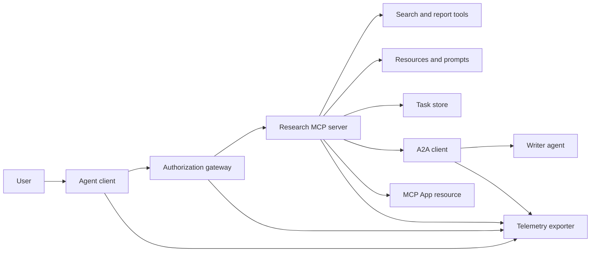
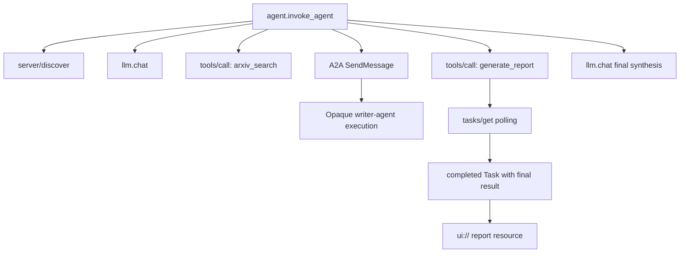
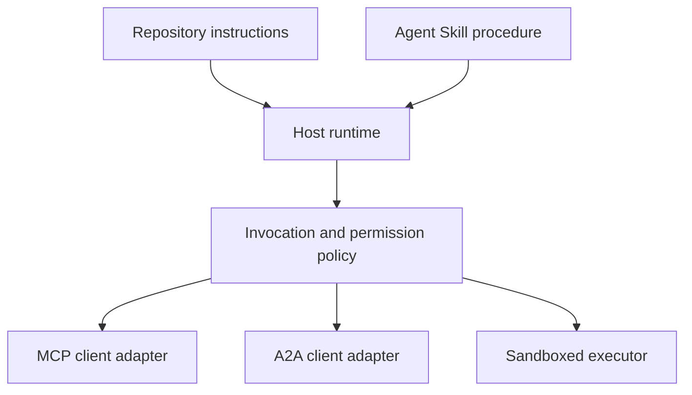

# 标题:无国籍工具生态系统

> 生产代理系统是一个界限集,而不是一个功能堆. 这块结石分开了可读的过程模拟,从协议客户端,授权服务器,沙箱和远程仪表出口者,一个实际部署仍然需要.

**Type:** Build
**Languages:** Python (stdlib, in-process simulation)
**Prerequisites:** Phase 13 · 01 through 22, using MCP revision `2026-07-28`
**Time:** ~120 minutes

## 学习目标

- 编写工具调用,任务形状的结果,委托工作,UI资源,授权政策,并将记录记录记录集成到一个流程中.
- 在每个MCP请求中运行协议版本,客户端身份和功能,而不是依赖连接会话.
- 在使用前发现服务器,并通过官方任务扩展程序进行长时间工作.
- 区分一个协议形状的模拟与MCP,A2A,OAuth或OpenTelemetry实现.
- 绘制每个模拟的边界,将其取代的生产元件绘制出来.
- 保持`AGENTS.md`机器,机器,安全政策,
- 解释哪些索赔可以从本地输出中验证,哪些需要实时集成测试.

## 问题

设计一个研究和报告系统.用户要求关于代理协议的论文.系统搜索了纸质目录,委托了总结,生成了报告,返回了一个UI资源,并记录了系统的路径.

这句话隐藏了几个独立的合同:

- 模型面向的工具方案;
- 无国籍请求包和服务器发现合同;
- 关口决定参与者,范围和工具身份;
- 长期运营合同;
- 委托议定书;
- 接待者与应用程序之间的桥梁;
- 痕迹传播和出口;
- 可重复使用的操作程序.

`code/main.py`它不会打开传输,联系 arXiv,执行 OAuth,调用A2A服务器,染MCP应用程序或导出远程测量.这使得控制流程很容易检查,而不需要呈现模拟为符合服务.

## 概念

### 目标架构



建筑是公共协议模式的概念组成. 它不是关于任何产品的私人内部的声明.

### 目标追踪



在实际实现中,每个跳跃都传播了痕迹背景. 跨度名称和属性必须遵循由选定的仪器版本支持的OpenTelemetry语义公约.单独的共享痕迹识别符不能证明正确的亲属,出口或后端摄入.

### 现行协议表面

使用当前协议所定义的方法名称,而不是从旧草案中记忆的名称:

| Boundary | Current surface | What the capstone simulates |
|---|---|---|
| MCP discovery | Mandatory `server/discover` | A direct function returning versions, capabilities, and server identity |
| MCP request context | Version, capabilities, and client identity in every `params._meta` | Fresh request metadata passed to every simulated call |
| MCP tool call | `tools/call` | Direct Python function dispatch |
| MCP task polling | `io.modelcontextprotocol/tasks` with `tasks/get` | A working handle followed by a completed task carrying its final result |
| A2A delegation | `SendMessage` in gRPC and JSON-RPC; `POST /message:send` in HTTP+JSON | One nested span with no remote call or artificial delay |
| MCP App calling a server tool | `app.callServerTool({ name, arguments })` | An HTML string with no live bridge |
| OAuth authorization | Authorization server, protected-resource metadata, audience and scope validation | Static token lookup and scope membership |
| OpenTelemetry | SDK, propagator, exporter, and collector or backend | In-memory span dictionaries |

协议名称仅仅是第一层. 生产测试必须在实线上进行序列化,身份验证故障,取消,时间切断,重试和版本兼容性.

### 无国籍的MCP改变了集成边界

修订`2026-07-28`删除协议会议和`initialize`现在,`notifications/initialized`握手,也可以消除`Mcp-Session-Id`每个请求都包含这些名字空间`_meta`字段:

```json
{
  "io.modelcontextprotocol/protocolVersion": "2026-07-28",
  "io.modelcontextprotocol/clientCapabilities": {
    "extensions": {
      "io.modelcontextprotocol/tasks": {}
    }
  },
  "io.modelcontextprotocol/clientInfo": {
    "name": "capstone-client",
    "version": "1.0.0"
  }
}
```

服务器必须实现`server/discover`常见结果使用`resultType: "complete"`任务处理器使用`resultType: "task"`每个结果都应该在 `_meta.io.modelcontextprotocol/serverInfo`现在,我们要去.

任务延长已`tasks/get`现在`tasks/update`其他`tasks/cancel`一个工具可能首先返回`resultType: "task"`其他`tasks/get`它们本身回来了.`resultType: "complete"`完成的`Task`总体而言,`tasks/result`其他`tasks/list`客户必须宣传 `io.modelcontextprotocol/tasks`如果没有,服务器会返回 `-32021`随着`requiredCapabilities`形状为缺失客户能力对象,包括`extensions.io.modelcontextprotocol/tasks`现在,我们要去.

### 安全姿势

预期部署使用深度防御:

- 客户端类型要求的PKCE的OAuth授权;
- 发行访问令牌的资源和观众绑定;
- 通过RBAC检查所需工具和范围的门口;
- 存储在模型可见的背景之外的上游凭证;
- 置或审查的工具描述说明书;
- 对于不值得信赖的输入,敏感数据和后续行动的第二规则审查;
- 执行沙箱,其文件系统,进程,网络,凭证和资源限制在技能之外被执行.

演示程序只实现静态代币,范围检查和描述哈希. 它是用于政策流动,而不是安全验证.

### 技能是程序,而不是交通

经理技能可以告诉运行时间如何执行研究工作流程,哪些工具合约预期,什么证据保存,何时停止.它不能使一个MCP服务器存在,建立A2A兼容性,授予范围,或创建沙箱.



程序引用伴侣文件时,请发送完整的技能目录.这块旧的顶石中的平面文物是课程蓝图,而不是主机保存可移植的捆绑的证据.24-27课程构建和测试完整的捆绑生命周期.

### 课程文物元数据是本地适配器

课程目录和安装器识别名为平板文件`skill-*.md`它们的最小前面材料解析器只读取顶级键.因此,这个课程保持了可移植的身份字段和课程目录字段在相同的水平:

```yaml
---
name: ecosystem-blueprint
description: Produce a full Phase 13 ecosystem architecture for a product need.
version: "1.0.0"
phase: "13"
lesson: "23"
tags: [mcp, capstone, ecosystem, architecture, a2a, otel]
---
```

`name`其他`description`它们是可移植的身份字段.`version`现在`phase`现在`lesson`其他`tags`课程分析器需要`tags`作为一个直线列表`--tag capstone`能匹配它.

可移植目录技能可能会使用可选的`metadata`字符串值扩展数据的地图.`metadata`如果这个平板文件子`version`或`tags`下面`metadata`产品主机应该使用安全的YAML解析器并验证自己的记录式方案.

### 模拟与生产

| Layer | `code/main.py` | Production replacement | Required evidence |
|---|---|---|---|
| Discovery | `server_discover()` plus static `TOOLS` | `server/discover` followed by cache-aware `tools/list` | Wire transcript, deterministic order, and schema validation |
| Authentication | Token-keyed dictionary | OAuth authorization and resource server validation | Issuer, audience, scope, expiry, and failure tests |
| Authorization | Scope membership | Gateway policy bound to actor, tool, target, and tenant | Allow and deny audit cases |
| Search | Static paper fixtures | Search API or MCP server | Source provenance, ranking, and error tests |
| Tasks | Local handle plus immediate `tasks/get` | Durable `io.modelcontextprotocol/tasks` store with `tasks/get`, `tasks/update`, `tasks/cancel`, and TTL | State-transition, input, cancellation, and recovery tests |
| Delegation | Sleep plus nested span | A2A client and remote Agent Card | Contract, timeout, retry, and opacity tests |
| App | HTML string and URI | MCP Apps resource and `App` bridge | CSP, permissions, tool-call, and browser tests |
| Telemetry | In-memory list | OTel SDK and exporter | Collector receipt and trace-parent assertions |
| Sandbox | None | Host-enforced isolated executor | Escape, egress, secret, and resource-limit tests |

绿色局部运行仅验证了模拟.

### 阶段13地图

| Lessons | Contribution |
|---|---|
| 01-05 | Tool interfaces, calls, schemas, structured results, and deterministic validation |
| 06-14 | Stateless MCP request envelopes, discovery, transports, resources, prompts, extensions, and Apps |
| 15-18 | Poisoning defenses, OAuth, gateways, registries, and production authentication |
| 19 | A2A message and task delegation |
| 20 | OpenTelemetry GenAI trace design |
| 21 | Model-provider routing |
| 22 | Portable skill contract and runtime boundary |

```figure
t3-capstone-chain
```

## 建立它

运行过程中的带:

```bash
cd phases/13-tools-and-protocols/23-capstone-tool-ecosystem
python3 code/main.py
```

检查五件事:

1. `server/discover`宣传修订`2026-07-28`并且扩展任务.
2. 爱丽丝可以读取和生成报告,而勃的写作电话被拒绝.
3. 每个在一个管弦乐队运行的本地跨度都共享一个痕迹识别符,并记录了父母跨度识别符.
4. 报告开始作为一个任务处理.`tasks/get`返回完成任务,最终结果包含文本和一个`ui://`参考
5. 委托的作者仍然不透明,因为乐团主持人只记录了边界跨度.
6. 没有输出索赔网络连接,OAuth交换,集装器出口,浏览器染或沙箱执行发生.

编程运行两次,所以产生两个根痕迹.审计输入是过程本地,然后在下一次运行上重置.

## 用它

推广一个层次:

1. 取代`server_discover()`和现实的静态工具列表`server/discover`其他`tools/list`发送版本,身份和功能在每个请求中.
2. 通过授权服务器和保护资源验证来取代静态代币.
3. 执行`io.modelcontextprotocol/tasks`延长和测试`tasks/get`现在`tasks/update`现在`tasks/cancel`没有添加`tasks/result`或`tasks/list`现在,我们要去.
4. 替换代理文件,用A2A客户端来解决代理卡并发送消息.
5. 使用官方SDK构建应用程序,并通过 调用服务器工具`app.callServerTool`现在,我们要去.
6. 输出到检测器,并在接收器确认亲属.
7. 运行工具和脚本执行从课26的沙盒合同中.
8. 包装程序作为一个完整的目录捆绑,然后通过27课的释放门.

每次促销都需要一个跨越新界限的集成测试.

## 运送它

这一课产生了`outputs/skill-ecosystem-blueprint.md`要求一个页面的架构,涵盖原始,安全,委托,远程测量,包装和最难的运营风险.其顶级目录领域由库的真实目录和安装器进行.

由于它不是目录捆绑,它不能携带参考,脚本,资产或评估设置.在本课外发布可重复使用技能时,使用从课程22和24到27的包格式.

## 运动

1. 跑步`code/main.py`产量证明的单独事实与生产索赔,仍然需要集成证据.
2. 添加第二个静态后端,并定义两个同名工具的碰撞规则.然后将两个列表替换为真`tools/list`电话.
3. 取代写作器的片用A2A测试服务器记录代理卡,消息请求,时间过关路径,返回的文物.
4. 添加一个存储任务, 保存进程重启. 证明客户端可以恢复`tasks/get`尊重`pollIntervalMs`阅读完成任务的最终结果`tasks/result`现在,我们要去.
5. 建立一个最小的MCP应用程序,并验证`app.callServerTool`在具有限制性CSP和明确许可的浏览器中.
6. 通过OTel SDK将模拟的跨度输出到本地收藏器. 声明收件,追踪标识符,亲属和错误状态.
7. 写下`AGENTS.md`对于整个库的维护规则和可重复使用的研究程序的单独技能包.解释为什么没有文件都授予工具权.

## 关键词

| Term | What people say | What it actually means |
|---|---|---|
| Capstone | "Everything wired together" | A staged integration whose simulated and live boundaries remain explicit |
| Protocol-shaped simulation | "It is basically MCP" | Local data and calls that resemble a protocol without implementing its wire contract |
| Tasks extension | "Long tool call" | An optional `io.modelcontextprotocol/tasks` lifecycle with durable identity, polling, client input, final result, and cancellation semantics |
| Opacity boundary | "The other agent handles it" | The caller sees the declared interface and artifacts, not private reasoning or internal state |
| Runtime adapter | "Skill integration" | Host code that maps portable procedure to discovery, invocation, tools, policy, and context |
| Integration evidence | "It passed" | A transcript, artifact, or receiver-side observation proving the real boundary was crossed |

## 进一步阅读

- [MCP specification 2026-07-28](https://modelcontextprotocol.io/specification/2026-07-28)对于无国籍请求,发现,工具,授权和运输行为.
- [MCP 2026-07-28 key changes](https://modelcontextprotocol.io/specification/2026-07-28/changelog)对于删除会议,按请求的元数据,MRTR,延长和减记.
- [MCP Tasks extension](https://tasks.extensions.modelcontextprotocol.io/specification/draft/tasks)为了`tasks/get`现在`tasks/update`现在`tasks/cancel`终端任务的最终结果.
- [MCP Apps SDK](https://github.com/modelcontextprotocol/ext-apps/blob/main/docs/overview.md)为了`App`其他`app.callServerTool`现在,我们要去.
- [A2A protocol](https://a2a-protocol.org/latest/)对于代理卡,消息传递,任务,文物和运输绑定.
- [OpenTelemetry GenAI semantic conventions](https://opentelemetry.io/docs/specs/semconv/gen-ai/)对于跟踪和属性公约.
- [Agent Skills specification](https://agentskills.io/specification)对于程序层所使用的便携式包装合同.
