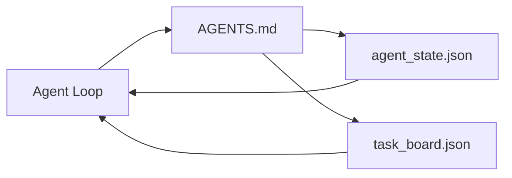

# 工作桌的最小代理

> 最小的有用工作台是三个文件:根指令路由器,状态文件和任务板.其他所有东西都被层次叠加在上面.如果一个备忘录不能携带这三个文件,则没有模型会保存它.

**Type:** Build
**Languages:** Python (stdlib)
**Prerequisites:** Phase 14 · 31 (Why Capable Models Still Fail)
**Time:** ~45 minutes

## 学习目标

- 定义构成最小可行的工作台的三个文件.
- 解释为什么一个短的根路由器比一个长的单形路由器更好`AGENTS.md`现在,我们要去.
- 建立一个状态文件, 代理可以在每一个转折阅读,
- 建立一个可以在不需要聊天历史的情况下进行多次工作的任务板.

## 问题

大多数团队通过写一个3000行来达到工作台`AGENTS.md`模型将其加载,忽略无法总结的部分,

需要相反的东西.一个小的根文件,只能将代理导向更深的文件,只有当它相关时. 持久状态,代理在行动之前读取,然后写出.一个任务板,说明飞行中什么,被阻止什么,以及接下来什么.

每个文件都有一个工作,每个文件都能被机器读取,以后可以演变成一个真正的系统.

## 概念



### 代理.md 是一个路由器,而不是一个手册

一个好`AGENTS.md`简短,指向代理人:

- 州文件 (你所在的地方).
- 任务板 (剩下的).
- 更深层次的规则 (`docs/agent-rules.md`)
- 验证命令 (如何知道它运行).

长时间的文件只能在需要时加载,长时间的手册被忽视,短时间的路由器被追踪.

### 代理_状态.json是记录系统

状态载有:活动任务ID,触及的文件,所做的假设,阻塞器和下一步操作. 代理在每次转机上读取它. 下一次会议读取它,而不是重播聊天.

由于聊天历史是不可靠的,会议会死亡,对话会被削减.

### 任务板.json是排队

任务委员会将每个任务都进行状态`todo | in_progress | done | blocked`随着该状态空,代理人从哪里拉到的排队,

工作板上有个ID,一个目标,一个主 (`builder`现在`reviewer`其他`human`面板是故意小的:它在屏幕上长大时,你有计划问题,而不是面板问题.

### 三个文件是地板,而不是天花板

后来的课程增加了范围合约,反运行器,验证门户,审查员检查列表和交付包.

```figure
wb-three-files
```

## 建立它

`code/main.py`写出最小工作桌子为空置 repo,并证明一个单个代理转换:

1. 阅读`agent_state.json`现在,我们要去.
2. 从 中拉下一个任务`task_board.json`如果国家是空的.
3. 触及一个文件的范围.
4. 写回更新状态.

运行它:

```
python3 code/main.py
```

剧本创造了`workdir/`转换一个转换,然后打印了差异. 再次运行,看第二转换如何继续前进.

## 用它

在生产代理产品中,相同的三份文件以不同的名称出现:

- **Claude Code:** `AGENTS.md`或`CLAUDE.md`对于路由器,`.claude/state.json`对于州的风格店,对于董事会的子.
- **Codex / Cursor:**路由器的工作空间规则,状态的会议内存,板块的聊天侧排列任务.
- **Custom Python agent:**你刚刚写的文件.

名称改变,形状却不改变.

## 野生生产模式

工作桌面在三种模式上层时会与真正的单机机保持联系.

**Nested `AGENTS.md` with nearest-wins precedence.**开放AI船 88 `AGENTS.md`编程,课件,克劳德代码和Copilot都从工作文件走向 repo 根,并连接每一个`AGENTS.md`它们在路上找到. 字母目录文件扩大了根文件.`AGENTS.override.md`增强代码的测量是最重要的:最好的方法是:`AGENTS.md`文件的质量跳跃相当于升级从海库到Opus; 最差的文件的输出比根本没有文件更糟.

**Anti-patterns to refuse, even when they look like coverage.**矛盾的指示默默地将代理从互动模式下放到贪模式 (ICLR 2026 AMBIG-SWE: 48.8% → 28% 分辨率); 编号优先级,而不是堆它们. 没有执行命令的不可验证的风格规则 ("遵循Google Python Style Guide") 让代理发明遵守;将每个风格规则与精确的 lint命令结合起来. 引导用风格而不是命令埋葬了验证路径;命令先,风格最后. 写作是为了人类而不是代理人,

**Cross-tool symlinks.**单个根文件,具有符号链接 (`ln -s AGENTS.md CLAUDE.md`现在`ln -s AGENTS.md .github/copilot-instructions.md`现在`ln -s AGENTS.md .cursorrules`让每个编码代理都能找到相同的真相来源.`nx ai-setup`通过一个配置,可自动化了Cloade Code,Cursor,Copilot,Gemini,Codex和OpenCode.

## 运送它

`outputs/skill-minimal-workbench.md`创建任何新的 repo 的三文件工作台:`AGENTS.md`路由器调整到项目,一个`agent_state.json`按右键,`task_board.json`现在的后备.

## 运动

1. 添加一个`last_run`时间标签`agent_state.json`如果文件超过24小时,除非经营者确认.
2. 添加一个`priority`按键盘,然后更改拉机,以选择最高优先级.`todo`现在,我们要去.
3. 迁移`task_board.json`为了使每个任务都是一个行,并且在版本控制中,差异是清洁的.
4. 写一个`lint_workbench.py`如果`AGENTS.md`超过80行或引用一个不存在的文件.
5. 决定哪个文件最伤害失去.

## 关键词

| Term | What people say | What it actually means |
|------|----------------|------------------------|
| Router | `AGENTS.md` | Short root file that points the agent at deeper docs and files |
| State file | "The notes" | Machine-readable record of where the agent is, written every turn |
| Task board | "The backlog" | JSON queue of work with status, owner, acceptance |
| System of record | "Source of truth" | The file the workbench treats as authoritative when chat is gone |

## 进一步阅读

- [agents.md — the open spec](https://agents.md/)由Cursor,Codex,Claude Code,Copilot,Gemini,OpenCode采用
- [Augment Code, A good AGENTS.md is a model upgrade. A bad one is worse than no docs at all](https://www.augmentcode.com/blog/how-to-write-good-agents-dot-md-files)测量质量跳跃
- [Blake Crosley, AGENTS.md Patterns: What Actually Changes Agent Behavior](https://blakecrosley.com/blog/agents-md-patterns)经验性工作,不
- [Datadog Frontend, Steering AI Agents in Monorepos with AGENTS.md](https://dev.to/datadog-frontend-dev/steering-ai-agents-in-monorepos-with-agentsmd-13g0)实践中的先进性
- [Nx Blog, Teach Your AI Agent How to Work in a Monorepo](https://nx.dev/blog/nx-ai-agent-skills) 六种工具的单源生成
- [The Prompt Shelf, AGENTS.md Best Practices: Structure, Scope, and Real Examples](https://thepromptshelf.dev/blog/agents-md-best-practices/) 部分订单,经过审查
- [Anthropic, Claude Code subagents](https://code.claude.com/docs/en/sub-agents)
-                
- 阶段14 · 34  长期状态方案本课前景
