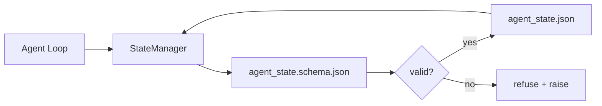

# 存储器内存和持久状态

> 聊天历史是不稳定的. 备忘录是持久的. 工作桌商店代理状态在版本文件中,所以下一个会议,下一个代理,下一个评论者都从同一个来源的真相读取.

**Type:** Build
**Languages:** Python (stdlib + `jsonschema` optional)
**Prerequisites:** Phase 14 · 32 (Minimal Workbench)
**Time:** ~60 minutes

## 学习目标

- 定义属于备忘录和属于聊天历史的内容.
- 作者 JSON 方案`agent_state.json`其他`task_board.json`现在,我们要去.
- 建立一个状态管理员, 负载,验证,变化, 保持状态的原子.
- 通过该方案,在他们破坏工作台之前,拒绝坏的写作.

## 问题

代理完成一个会议.聊天结束.下一个会议打开,问从哪里开始.模型说"让我检查文件",阅读过时的笔记,然后重新完成工作.或者更糟糕的是,它重写完成的文件,因为没有人告诉它文件已经完成.

工作台的修复是 repo 存储器:状态在 repo 中的 JSON 文件中存在,写在一个方案下,保持在原子上,在代码审查中保持差异.聊天是一个过渡的传输; repo 是记录系统.

## 概念



### 什么属于备忘录

| Belongs | Does not belong |
|---------|-----------------|
| Active task id | Raw chat transcripts |
| Touched files this session | Token-level reasoning traces |
| Assumptions the agent made | "The user seemed frustrated" |
| Open blockers | Sampled completions |
| Next action | Vendor-specific model ids |

如果是,再测试,如果是,再测试.如果是,再测试.如果是,再测试.

### 方案第一状态

没有它,每个代理都会发明新的字段,每个评论员都会学习新的形状,每个CI脚本都必须将过去的版本特殊情况进行处理.

方案包括:

- 需要钥匙.
- 允许`status`价值观
- 禁止值 (例如:`null`对于阵列).
- 模式限制 (任务标识匹配 `T-\d{3,}`)
- 转移版本字段

### 原子写道

状态写作需要生存部分失败:写到一个tempfile,fsync,重命名目标.状态文件是真相来源;半写的一个比根本没有文件更糟糕.

### 移民

当图案改变时,将一个迁移脚本发送到图案弹旁边.状态文件包含一个 `schema_version`管理器拒绝从无法迁移的版本中加载文件.

```figure
wb-state-persist
```

## 建立它

`code/main.py`执行:

- `agent_state.schema.json`其他`task_board.schema.json`现在,我们要去.
- 仅使用 stdlib 验证器 (JSON 方案的子集:要求,类型,enum,模式,项目).
- `StateManager.load`现在`StateManager.update`现在`StateManager.commit`原子的时间和重命名写字.
- 演示,改变状态,持续,重新加载,证明了回路.

运行它:

```
python3 code/main.py
```

剧本写着`workdir/agent_state.json`其他`workdir/task_board.json`通过两轮转换,每一步都会打印验证状态.

## 野生生产模式

经过四种模式,课程的最低值变成了多代理单机能生存的东西.

**Atomic temp-and-rename is not optional.**2026年3月的Hive项目错误报告清晰记录了故障模式: `state.json`通过`write_text()`部分写左派会议恢复反对腐败状态没有信号. 解决方案总是:`tempfile.mkstemp`在与目标相同的目录中,写下,`fsync`现在`os.replace`现在我们要做什么?`atomic_write`现在,我知道.

**Idempotency keys on every non-idempotent tool call.**如果一个代理在调用工具后崩,但在检查结果之前,恢复重新尝试工具调用.安全阅读;危险于电子邮件,DB插入,文件上传.模式:在执行之前记录每个工具调用ID在一个`pending_calls.jsonl`在重试时,检查身份证;如果存在,请跳过电话并使用缓存结果.安тропо克和兰格链都在2026年指导中呼叫这项指导;兰格拉夫的检查点仍然在等待写作的原因相同.

**Separate large artifacts from state.**不要在 CSV,长的转录或生成的文件中存储`agent_state.json`保存文物作为一个独立的文件 (或上传到物体存储) 并只保持路径状态.检查点保持小和快速;文物独立增长.

**Event sourcing for audit, snapshots for resume.**添加到事件日志 (`state.events.jsonl`) 在每种突变中; 定期截图`state.json`简历读取快照,然后重复快照的时间印记后的任何事件. 这成本更多的磁盘,但允许您重复代理决定字面上在调试长视线运行时至关重要.

**Schema migrations or refuse to load.**其他`schema_version`整数是合同.当管理员在未知的版本上加载文件时,它拒绝阅读. 寄一个迁移脚本到图案弹旁边; `tools/migrate_state.py`在每一个创业公司上都会无力运行.

## 用它

在生产中:

- **LangGraph checkpointers.**检查点保持图形状态到SQLite,Postgres,或一个自定义后端.这个课程教导的方案是你达到什么当检查点死亡,你需要手动阅读状态.
- **Letta memory blocks.**持续的区块,有结构化方案 (阶段14 · 08).
- **OpenAI Agents SDK session store.**现在我们要做什么?

## 运送它

`outputs/skill-state-schema.md`生成一个项目特定的JSON Schema对 (状态 + 板),一个Python `StateManager`通过电缆,将原子写作,以及一个迁移架子,

## 运动

1. 添加一个`last_human_touch`拒绝任何代理在人类编辑后的五秒内写作.
2. 扩展验证器到支持`oneOf`因此,一个任务可以是构建任务或具有不同的要求领域的审查任务.
3. 添加一个`schema_version`字段并写从v1到v2的迁移 (重命名 `blockers`为了`risks`)
4. 将存储后端从本地文件移动到SQLite.`StateManager`它们的API相同.
5. 运行两个代理对同一状态文件, 50ms写作竞赛.

## 关键词

| Term | What people say | What it actually means |
|------|----------------|------------------------|
| Repo memory | "Notes file" | State stored in tracked files in the repo, under schema |
| Schema-first | "Validate inputs" | Define the contract before the writer, refuse drift |
| Atomic write | "Just rename" | Write to temp, fsync, rename, so partial failures cannot corrupt |
| Migration | "Schema bump" | A script that turns vN state into v(N+1) state |
| System of record | "Source of truth" | The artifact the workbench treats as authoritative |

## 进一步阅读

- [JSON Schema specification](https://json-schema.org/specification.html)
- [LangGraph checkpointers](https://langchain-ai.github.io/langgraph/concepts/persistence/)
- [Letta memory blocks](https://docs.letta.com/concepts/memory)
- [Fast.io, AI Agent State Checkpointing: A Practical Guide](https://fast.io/resources/ai-agent-state-checkpointing/) 方案首次检查,无限性
- [Fast.io, AI Agent Workflow State Persistence: Best Practices 2026](https://fast.io/resources/ai-agent-workflow-state-persistence/)同时控制,TTL,事件采购
- [Hive Issue #6263 — non-atomic state.json writes silently ignored](https://github.com/aden-hive/hive/issues/6263)在一个真正的项目中失败模式
- [eunomia, Checkpoint/Restore Systems: Evolution, Techniques, Applications](https://eunomia.dev/blog/2025/05/11/checkpointrestore-systems-evolution-techniques-and-applications-in-ai-agents/)从操作系统历史中对代理应用的CR原始
- [Indium, 7 State Persistence Strategies for Long-Running AI Agents in 2026](https://www.indium.tech/blog/7-state-persistence-strategies-ai-agents-2026/)
- [Microsoft Agent Framework, Compaction](https://learn.microsoft.com/en-us/agent-framework/agents/conversations/compaction)供应商检查站经理
- 阶段14 · 08  记忆区块和睡眠时间计算
- 阶段14 · 32 这个课程规划了三档次最小值
- 阶段14 · 40 从同一方案中读取的传递包
