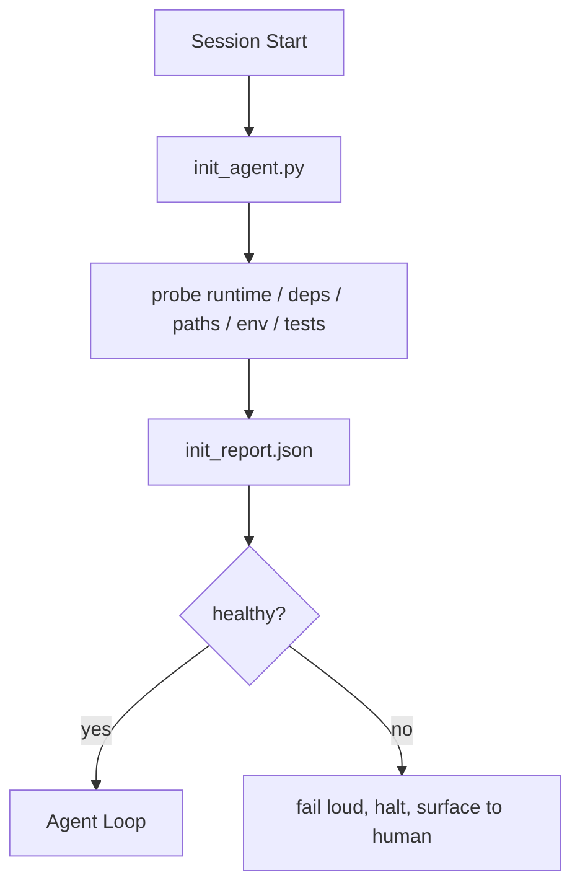

# 代理的初始化脚本

> 每个开始冷的会议都会缴纳税收. 代理阅读相同的文件,再试同样的探测,再发现相同的路径. 一个 init 脚本一次支付税收,然后写出答案.

**Type:** Build
**Languages:** Python (stdlib)
**Prerequisites:** Phase 14 · 32 (Minimal Workbench), Phase 14 · 34 (Repo Memory)
**Time:** ~45 minutes

## 学习目标

- 确定一个代理人不应该每次重复的工作.
- 建立一个确定性 init 脚本,检查运行时间,依赖性和 repo 状态.
- 继续检查结果,使代理阅读它,而不是重新检查.
- 设置一个地方,当初始化失败时.

## 问题

打开一个会议. 代理猜测Python版本. 猜测测试命令. 列出 repo 根五次找到入口点. 尝试导入未安装的包. 问用户配置文件居住在哪里. 到它真正编辑时,已经有了十万个代币已经进入设置工作,应该是单个脚本.

解决方案是一个初始化脚本,在代理做任何其他事情之前运行,`init_report.json`代理在启动时读取.

## 概念



### 导向脚本探测的内容

| Probe | Why it matters |
|-------|----------------|
| Runtime versions | Wrong Python or Node version means silent wrong-version bugs |
| Dependency availability | A missing package later costs ten times the cost of catching it now |
| Test command | The agent must know how to verify; if the command is missing the workbench is broken |
| Repo paths | Hard-coded paths drift; resolve them once and pin |
| Environment variables | Missing `OPENAI_API_KEY` is a failure surface, not a runtime mystery |
| State + board freshness | Stale state from a crashed session is a footgun |
| Last-known-good commit | Anchor for the handoff diff at the end of the session |

### 声,快速,在一个地方

探测器失败意味着停止和表面的人. 没有"代理会弄清楚. " 整个点是拒绝开始当工作台被打破.

### 无力

运行两次连续.第二次运行应该是无运行,除了新的时间印. 无效率是让你将脚本连接到CI,子或任务前的切割命令.

### 启动规则与初始规则

规则 (阶段14 · 33) 描述了必须是真的的行为. 开始是脚本,确定这些规则可以检查. 没有 init 的规则成为"小心. "没有规则的开始变成了抛光的失败.

```figure
wb-init-probes
```

## 建立它

`code/main.py`实现`init_agent.py`其他:

- 五个探测器:Python版本,通过 列出依赖性`importlib.util.find_spec`检测命令可解决性,环境要求,状态文件的新鲜性.
- 每个探测器都回来了`(name, status, detail)`现在,我们要去.
- 剧本写着`init_report.json`如果任何块重度探测器失败,

运行它:

```
python3 code/main.py
```

脚本打印了探测器的表,写了`init_report.json`通过一个错误的探测器,

## 野生生产模式

三个模式将有用的 init 脚本与仪式分开.

**Last-known-good commit anchoring.**检查当前的承诺`LKG`根据最新成功的合并文件.如果差异超过预算 (默认50文件),拒绝启动并要求一个人批准新的基线.这是Cloudflare的AI代码审查用来范围审查代理:每个审查会议着相同的最后知名好,从来没有化合物漂移在会议之间.

**Lock files with TTL.**写一个`prereqs.lock`之后的运行信任锁 N 小时 (24h默认) 并跳过昂贵的探测器. init 脚本首先读取锁;如果它是新鲜的,并且依赖表达式匹配哈希,它会短路.这是Docker用于层缓存的相同模式:无权探测器 +内容哈希 =跳.

**No network, no LLM, no surprises in the hot path.**试验室探测器是确定性管道.一个探测器调用LLM来分类故障或击中外部服务检查许可证不是探测器;它是一个工作流程.如果试验室在干燥运行中需要超过三秒,请把它视为工作桌气味,或者将其从 init移动或缓存结果.

## 用它

在生产中:

- **Claude Code hooks.** `pre-task`如果它失败,Hook会调用 init脚本,拒绝发射代理.
- **GitHub Actions.**`setup-agent`工作运行了 init脚本; 代理工作取决于它.
- **Docker entrypoint.**代理容器在执行代理运行时间之前运行 init 脚本;在故障时记录表格.

由于它没有调用特定框架,所以 init 脚本是便携式的.

## 运送它

`outputs/skill-init-script.md`项目进行采访,将其设置工作分为探测器,并发出项目具体的信息.`init_agent.py`另外一个CI工作流程,在任何代理步骤之前运行它.

## 运动

1. 添加一个探测器,将当前的提交与最后的已知-好提交区分开放,如果更改了50多个文件,则拒绝启动.
2. 编写脚本`prereqs.lock`如果锁定时间超过7天,请申请并拒绝启动.
3. 添加一个`--fix`旗自动安装缺失的开发器依赖,但从来没有在未经批准的情况下修改运行时间依赖.
4. 移动探测器从硬码函数到YAML注册表.
5. 探测器的时间比3秒长,就是工作桌的气味.

## 关键词

| Term | What people say | What it actually means |
|------|----------------|------------------------|
| Probe | "A check" | A deterministic function returning `(name, status, detail)` |
| Init report | "Setup output" | JSON written next to state with the probe results |
| Idempotent | "Safe to re-run" | Two runs in a row produce identical reports modulo timestamp |
| Fail loud | "Don't swallow" | Halt and surface to the human; no silent fallback |
| Setup tax | "Bootstrap cost" | The tokens the agent spends per session rediscovering the obvious |

## 进一步阅读

- [Anthropic, Effective harnesses for long-running agents](https://www.anthropic.com/engineering/effective-harnesses-for-long-running-agents)
- [GitHub Actions, composite actions for setup](https://docs.github.com/en/actions/sharing-automations/creating-actions/creating-a-composite-action)
- [microservices.io, GenAI dev platform: guardrails](https://microservices.io/post/architecture/2026/03/09/genai-development-platform-part-1-development-guardrails.html)预约+IC检查作为初始
- [Augment Code, How to Build Your AGENTS.md (2026)](https://www.augmentcode.com/guides/how-to-build-agents-md)初始期望
- [Codex Blog, Codex CLI Context Compaction](https://codex.danielvaughan.com/2026/03/31/codex-cli-context-compaction-architecture/)开始会议作为紧缩意识的 init
- 阶段 14 · 33  规则设置本脚本使
- 阶段 14 · 34 状态文件这个脚本种子
- 阶段 14 · 38 验证门 init脚本输入
- 阶段14 · 40  消耗了初始报告最后已知好处的转让
