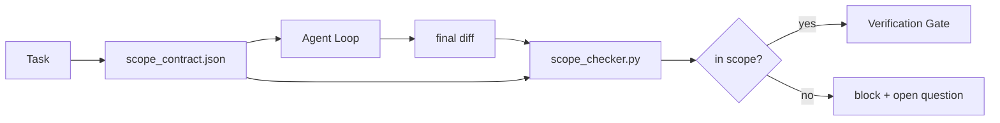

# 合同范围和任务限制

> 模型不知道工作结束在哪里. 范围合同是一个每项任务文件,说明工作在哪里开始,在哪里结束,以及如果工作倒闭时如何回滚. 合同从愿望变成支票.

**Type:** Build
**Languages:** Python (stdlib)
**Prerequisites:** Phase 14 · 32 (Minimal Workbench), Phase 14 · 33 (Rules as Constraints)
**Time:** ~50 minutes

## 学习目标

- 写一个范围合同,一个代理在任务开始时读取,一个验证者在任务结束时读取.
- 指定允许文件,禁止文件,接受标准,反弹计划和批准界限.
- 实施一个对合同差异进行比较的范围检查器,并标记违反合同.
- 让视野可见,自动,可检查.

## 问题

代理人爬行.任务是"修复登录错误".差异涉及登录路径,电子邮件助手,数据库驱动程序,README和发布脚本.每个触摸都有可行的原因.一起,它们与审查的变化不同.

范围爬行是代理工作中最少监控的故障模式,因为代理以诚信叙述每个步骤.修复不是更严格的提示.修复是磁盘上的合同,上面写着所承诺的内容,以及对比结果与承诺的检查.

## 概念



### 合同的范围

| Field | Purpose |
|-------|---------|
| `task_id` | Links to the task on the board |
| `goal` | One sentence the reviewer can verify |
| `allowed_files` | Globs the agent may write |
| `forbidden_files` | Globs the agent must not touch even by accident |
| `acceptance_criteria` | Test commands or assertion lines that prove done |
| `rollback_plan` | One paragraph the operator can execute if a halt is required |
| `approvals_required` | Actions outside scope that need explicit human sign-off |

没有合同`forbidden_files`负空间是合同的一半.

### 气球,不是原始路径

实际的存储文件移动.`app/**/*.py`现在`tests/test_signup*.py`) 因此,会议间的重点不会无效.

### 轮是范围的一部分

关于如何撤销合同的列表迫使合同作者考虑可能会发生什么问题.

### 范围检查是差异检查

检查器读取差异,允许的球体,禁止的球体,以及运行的任何接受命令的列表. 每次违规都是一个标签,检查门可以拒绝.

### 两个范围高度:特征列表和任务合同

范围合同限制了一个任务.它不限制项目.一个代理可以完美地保持在登录修正合同内,但在下一轮,决定项目还需要设置页面,暗模式转换,并重写路由器.合同从来没有被问到该项目的范围内的工作,只有哪些文件是该任务的范围.

另一种高度需要一个原始的:`feature_list.json`经纪人在会议开始时读取. 它是项目后备份作为一个机器可读的,订单的文件. 经纪人选择一个功能,`status`是`todo`写着它`id`现在,在一个时间内"一个功能"不再是提示中的一个行,代理可以合理化过去,成为一个值它读取磁盘和检查门执行.

```json
{
  "project": "knowledge-base",
  "active": "import-pdf",
  "features": [
    { "id": "import-pdf",   "status": "in_progress", "goal": "import a PDF into the library",        "done_when": "pytest tests/test_import.py && a sample PDF appears in the library view" },
    { "id": "full-text-search", "status": "todo",     "goal": "search document text and rank hits",   "done_when": "query returns ranked results with snippets" },
    { "id": "cite-answers", "status": "todo",         "goal": "answers carry source citations",        "done_when": "every answer renders at least one clickable citation" }
  ]
}
```

| Field | Purpose |
|-------|---------|
| `active` | The single feature the current session may touch; empty means pick one and set it |
| `features[].id` | Stable slug the scope contract's `task_id` points at |
| `features[].status` | `todo`, `in_progress`, `done`, `blocked`; only one `in_progress` at a time |
| `features[].goal` | One sentence the reviewer can verify |
| `features[].done_when` | The acceptance line that flips `in_progress` to `done` |

首先,不变量"最多一个"`in_progress`"本身就是一个启动检查 (阶段14 · 33):如果列表显示两个,会议拒绝启动直到一个人解决它.第二,功能列表是一个文件,而不是聊天消息,因为聊天滚动出文本,文件在会议和代理之间持续.转移 (阶段14 · 40) 将完成的功能状态写回到`done`所以下一次会议将开启到一个准确的板块,而不是重新推出剩下的.

合同和列表由最小特权组成,如下所述的相同合并:任务合同的`allowed_files`必须坐在任何活动特征触摸的内部,永远不要在外面.

```figure
wb-scope-bounce
```

## 建立它

`code/main.py`执行:

- `scope_contract.json`方案 (JSON方案的子集,全球阵列).
- 变化文件列表加上运行命令列表`RunSummary`现在,我们要去.
- `scope_check`这回归了`(violations, in_scope, off_scope)`违反合同.
- 检查员将确切的文件和理由标记给怪物.

运行它:

```
python3 code/main.py
```

结果:合同,两次运行,每次运行的判决,`scope_report.json`现在,我们要去.

## 野生生产模式

经验人员在使用代理之前在YAML中进行"规范xxing" (范围合同) 报告说,在三周内没有改变代理的情况下,子洞率从52%降至21%.合同做了工作,而不是模型.三个模式使得收益保持.

**Violation budgets, not binary failures.** `agent-guardrails`(通过MCP使用的Cloed Code,Cursor,Windsurf,Codex的OSS合并门) 运输`violationBudget`按任务:预算内小范围的分类被显示为警告;只有超过预算时,合并门拒绝.`violationSeverity: "error" | "warning"`预算是出发的门和被那些恨它的人灭的门之间的区别.

**Severity asymmetry by path family.**无限的写信到`docs/**`它们通常是`warn`无限的信件`scripts/**`现在`migrations/**`现在`config/prod/**`总是如此`block`这种不对称性必须在合同中存在,而不是在运行时间中,因为它是具体的项目,每项任务都会发生变化.

**Time and network budgets next to file budgets.**`time_budget_minutes`没有重新批准,运行时间拒绝继续经过它.`network_egress`导航服务器的使用者可以使用一个文件的域名,以便在文件中找到一个文件的域名.

**Multi-contract merge semantics (least privilege).**当两个范围合同 (例如,一个项目范围合同加上一个具体任务合同) 适用时,合并是: **intersect** `allowed_files`(两项合同都必须允许路径),**union** `forbidden_files`任何一个国家或地区都可能禁止`time_budget_minutes`是最限制性 (min),`approvals_required`的`network_egress`是`None`没有执行,`[]`否认一切的.`[...]`作为一个允许者;在合并下,`None`合同方案中说明这一点,以便合并是机械的,可审查的.

## 用它

生产模式:

- **Claude Code slash commands.**`/scope`命令写下合同,然后把它作为会议背景.
- **GitHub PRs.**按下合同作为一个JSON文件在公关机构或作为一个注册文物.CI运行范围检查器对合并差异.
- **LangGraph interrupts.**违规范围会引发中断; 处理者问人是否需要增长合同或代理需要退出.

合同与任务一起进行,任务结束时,合同被存档在`outputs/scope/closed/`现在,我们要去.

## 运送它

`outputs/skill-scope-contract.md`产生任务描述范围合同和全球性检查器,在每个不同代理中运行在CI中.

## 运动

1. 添加一个`network_egress`拒绝使用其他主机的运行.
2. 扩展检查器,以使软`docs/**`着着.`scripts/**`证明不对称性.
3. 让合同的效果`allowed_files`通过`goal`首先,在一个边缘情况下,什么是错误的?
4. 添加一个`time_budget_minutes`并且拒绝继续,一旦墙上的钟超过它.
5. 运行两个合同对相同的差异.当两者都适用时,正确的合并语义是什么?

## 关键词

| Term | What people say | What it actually means |
|------|----------------|------------------------|
| Scope contract | "The task brief" | Per-task JSON listing allowed/forbidden files, acceptance, rollback |
| Scope creep | "It also touched..." | Files outside the contract changed in the same task |
| Rollback plan | "We can revert" | The one-paragraph operator runbook for halting |
| Approval boundary | "Needs sign-off" | An action listed in the contract as requiring explicit human approval |
| Diff check | "Path audit" | Comparing touched files against the contract globs |

## 进一步阅读

- [LangGraph human-in-the-loop interrupts](https://langchain-ai.github.io/langgraph/concepts/human_in_the_loop/)
- [OpenAI Agents SDK tool approval policies](https://platform.openai.com/docs/guides/agents-sdk)
- [logi-cmd/agent-guardrails — merge gates and scope validation](https://github.com/logi-cmd/agent-guardrails)违规预算,严重程度
- [Dev|Journal, Preventing AI Agent Configuration Drift with Agent Contract Testing](https://earezki.com/ai-news/2026-05-05-i-built-a-tiny-ci-tool-to-keep-ai-agent-configs-from-drifting-in-my-repo/) `--strict`没有外部配件的模式
- [Agentic Coding Is Not a Trap (production logs)](https://dev.to/jtorchia/agentic-coding-is-not-a-trap-i-answered-the-viral-hn-post-with-my-own-production-logs-33d9) 标签收益: 52% → 21%
- [OpenCode permission globs](https://opencode.ai/docs/agents/)每次许可的细粒度范围
- [Knostic, AI Coding Agent Security: Threat Models and Protection Strategies](https://www.knostic.ai/blog/ai-coding-agent-security)作为最小特权的一部分
- [Augment Code, AI Spec Template](https://www.augmentcode.com/guides/ai-spec-template)三层边界系统 (必须/不需要/从来不需要)
- 阶段14 · 27   快速注射防御系统与范围锁相对
- 阶段14 · 33 本合同规则规定每个任务的专业化
- 验证门检查器报告到
