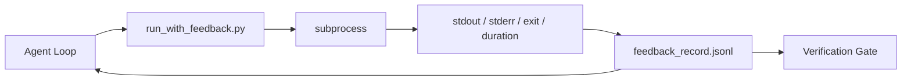

# 运行时间反循环

> 后者可以读取一个结构化记录中,然后代理会反事实而不是对事实的预测.

**Type:** Build
**Languages:** Python (stdlib)
**Prerequisites:** Phase 14 · 32 (Minimal Workbench), Phase 14 · 35 (Init Script)
**Time:** ~50 minutes

## 学习目标

- 区分运行时间反与可观测性远程测量.
- 建立一个反运行器,将 shell 命令包裹起来,并保留结构化的记录.
- 通过确定性来缩小大输出,使循环保持在代币预算范围内.
- 拒绝在没有反时推进循环.

## 问题

实际上没有测试进行. 代理想象出口,或者运行命令,但从来没有读取结果,或者读取结果,然后默默地缩小失败线.

反运行器消除了这一差距.每个命令通过运行器.每个记录都包含命令,捕获的 stdout 和 stderr,出口代码,墙钟的持续时间,以及一个线条的代理注释. 代理在下一个转折上读取记录.验证门在任务结束时读取记录.

## 概念



### 关于反记录的内容

| Field | Why it matters |
|-------|----------------|
| `command` | Exact argv, no shell expansion surprises |
| `stdout_tail` | Last N lines, deterministic truncation |
| `stderr_tail` | Last N lines, separate from stdout |
| `exit_code` | The unambiguous success signal |
| `duration_ms` | Surfaces slow probes and runaway processes |
| `started_at` | Timestamp for replay |
| `agent_note` | One line the agent writes about what it expected |

### 切割是决定性的

运行者将用一个子切断头和尾巴.`...truncated N lines...`没有样本采集,代理需要看到的部分 (最终错误,最终总结) 在尾部.

### 反与远程测量

电测 (阶段14·23 OTel GenAI公约) 是用于人类操作员在时间内审查运行.反是该运行的下一轮.它们共享字段,但它们存在于不同的文件中,具有不同的保留.

### 拒绝没有反的进步

如果跑步者在捕获出口之前犯错误,记录将载有`exit_code: null`其他`error: <reason>`代理环必须拒绝在一个`null`没有出口,没有进步.

```figure
wb-feedback-loop
```

## 建立它

`code/main.py`执行:

- `run_with_feedback(command, agent_note)`这是一子.`subprocess.run`截图中, 截图中, 截图中, 截图中, 截图中, 截图中, 截图中, 截图中, 截图中, 截图中, 截图中, 截图中, 截图中, 截图中, 截图中, 截图中, 截图中, 截图中, 截图中, 截图中, 截图中, 截图中, 截图中, 截图中, 截图中, 截图中, 截图中, 截图中, 截图中, 截图中, 截图中, 截图中, 截图中, 截图中, 截图中, 截图中, 截图中, 截图中, 截图中, 截图中, 截图中, 截图中, 截图中, 截图中, 截图中, 截图中, 截图中, 截图中, 截图中, 截图中, 截图中, 截图中, 截图中, 截图中, 截图中, 截图中, `feedback_record.jsonl`现在,我们要去.
- 简单的编程器,
- 演示程序,运行三个命令 (成功,失败,缓慢) 并每命令打印最后一个记录.

运行它:

```
python3 code/main.py
```

输出:附加了三个反记录`feedback_record.jsonl`随着文件的重复运行,循环积累.

## 野生生产模式

跑步者可以发射的3种模式.

**Redact at write, not at read.**任何触及stdout或stderr的记录都会泄露秘密. 运行者在JSONL附件之前发送编辑通行:`^Bearer `现在`password=`现在`api[_-]?key=`现在`AKIA[0-9A-Z]{16}`美国`xox[baprs]-`编辑在读时是脚步枪; 攻击者在磁盘上的文件是达到的. 根据生产运行时间观察的秘密格式,每季度审核编辑模式.

**Rotation policy, not a single file.**公司`feedback_record.jsonl`在每文件的1 MB;在过度流动时旋转到 `.1`现在`.2`放下`.5`运行时间成本是有限的.CI原件存储得到了全轮集.没有旋转,文件成为每次加载电话的瓶.

**Parent-command id for retry chains.**每个记录都得到了`command_id`试图进行`parent_command_id`审查员的"失败尝试"列表 (阶段14 · 40) 和验证门的审计都遵循链接.没有这种链接,重试看起来像独立的成功,审计掩盖了失败历史.

## 用它

生产模式:

- **Claude Code Bash tool.**工具已经捕捉到stdout,stderr,出口和持续时间.本课程中的运行者是任何代理产品的框架-无知等效.
- **LangGraph nodes.**入运行器中的任何节点,以便记录在图形状态之外存在.
- **CI logs.**输入JSONL到您的CI文物存储器中; 审查人员可以重复任何命令,而不需要重启会议.

跑者是一个薄薄的包装, 能够生存到每一个框架迁移, 因为它拥有记录的形状.

## 运送它

`outputs/skill-feedback-runner.md`产生一个特定项目`run_with_feedback.py`经过适当的裁剪预算,一个JSONL编写器连接到工作台,

## 运动

1. 添加一个`cwd`根据记录的字段,可以区分不同目录中的相同命令运行.
2. 添加一个`redaction`步骤,将相匹配的线条划分`^Bearer `或`password=`测试一个固定记录.
3. 总额`feedback_record.jsonl`转向 转向 转向 转向 转向 转向 转向 转向 转向 转向 转向 转向 转向 转向 转向 转向 转移`.1`现在`.2`保护轮换政策.
4. 添加一个`parent_command_id`后一个命令输入了输入的输入.
5. 输入JSONL到一个小的TUI中,突出了最新的非零出口.

## 关键词

| Term | What people say | What it actually means |
|------|----------------|------------------------|
| Feedback record | "Run log" | Structured JSONL entry with command, output, exit, duration |
| Tail truncation | "Trim the log" | Deterministic head+tail capture so records fit in token budget |
| Refuse-on-null | "Block on missing data" | The loop must not advance when `exit_code` is null |
| Agent note | "Expectation tag" | The one-line prediction the agent writes before reading the result |
| Telemetry split | "Two log files" | Feedback for the next turn, telemetry for the operator |

## 进一步阅读

- [OpenTelemetry GenAI semantic conventions](https://opentelemetry.io/docs/specs/semconv/gen-ai/)
- [Anthropic, Effective harnesses for long-running agents](https://www.anthropic.com/engineering/effective-harnesses-for-long-running-agents)
- [Guardrails AI x MLflow — deterministic safety, PII, quality validators](https://guardrailsai.com/blog/guardrails-mlflow)编辑模式作为回归测试
- [Aport.io, Best AI Agent Guardrails 2026: Pre-Action Authorization Compared](https://aport.io/blog/best-ai-agent-guardrails-2026-pre-action-authorization-compared/) 工具前/后捕获
- [Andrii Furmanets, AI Agents in 2026: Practical Architecture for Tools, Memory, Evals, Guardrails](https://andriifurmanets.com/blogs/ai-agents-2026-practical-architecture-tools-memory-evals-guardrails)可观测表面
- 阶段14 · 23  电力测量领域的OTel GenAI会议
- 阶段14 · 24  代理可观测平台 (Langfuse,Phoenix,Opik)
- 阶段14 · 33  要求在宣布完成之前反的规则
- 阶段 14 · 38 读取JSONL的验证门
