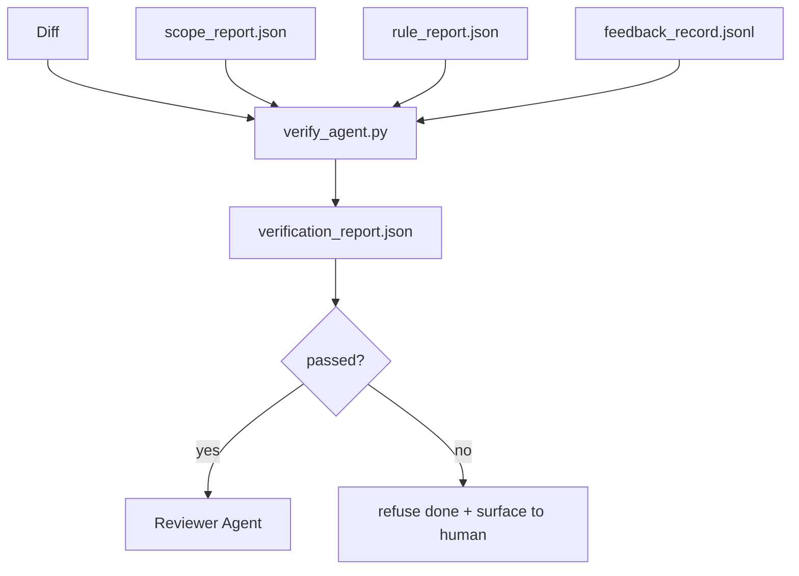

# 验证门

> 经纪人不能标记自己的工作做完了.验证门阅读范围合同,反日志,规则报告和差异,并回答一个问题:这个任务是否真的完成了?如果门说不,任务没有完成,无论聊天说什么.

**Type:** Build
**Languages:** Python (stdlib)
**Prerequisites:** Phase 14 · 33 (Rules), Phase 14 · 36 (Scope), Phase 14 · 37 (Feedback)
**Time:** ~55 minutes

## 学习目标

- 定义验证门作为工作桌文物上的确定性函数.
- 结合规则报告,范围报告,反记录,并将分歧构成一个判决.
- 发出一个`verification_report.json`审查员和通讯员都能读懂.
- 拒绝在任何区块严重性失败的情况下,无例外地提前任务.

## 问题

经纪人说成功太容易.

- "看起来很好".模型读到自己的差异,
- "测试通过了",他自信地说.
- 接受标准被解释为"任何类似于做的事情".

工作台修复是一个单个验证门,它读取代理已经制作的文物并进行电话.门是确定性的.门是版本控制.门是有线到CI.代理不能钱.

## 概念



### 门口检查什么

| Check | Source artifact | Severity |
|-------|-----------------|----------|
| All acceptance commands ran | `feedback_record.jsonl` | block |
| All acceptance commands exited zero | `feedback_record.jsonl` | block |
| Scope check has no forbidden writes | `scope_report.json` | block |
| Scope check has no off-scope writes | `scope_report.json` | block or warn |
| All block-severity rules pass | `rule_report.json` | block |
| No `null` exit codes in feedback | `feedback_record.jsonl` | block |
| Touched files match `scope.allowed_files` | both | warn |

`warn`发现注释判决;`block`发现阻碍`passed: true`现在,我们要去.

### 确定性,而不是概率

门必须每次对同一件产品出出同样的判决.没有LLM法官.LLM法官属于审查者 (阶段14 · 39) 目标是质量评估,而不是地位.

### 一份报告,一个路径

门发出一个`verification_report.json`按任务结尾,写在`outputs/verification/<task_id>.json`许多门,不同的路径,分开了真理的源头.

### 拒绝无例外

只有一个记录的人类才能对这些发现进行无效.`override_reason`其他`overridden_by`转换是签署的变更,而不是代理决定.

```figure
wb-gate-sequence
```

## 建立它

`code/main.py`执行:

- 每个输入器件都有一个装载器, 它们都在本地进行了插入,
- `verify(task_id, artifacts) -> VerdictReport`纯粹的功能.
- 显示每次检查结果和最终通过/失败的打印机.
- 演示中,有三个任务:清除通过,范围,缺失接受.

运行它:

```
python3 code/main.py
```

输出:三份判决报告,每个报告都保存在脚本旁边.

## 野生生产模式

现在,我们已经开始了四个模式,

**Defense-in-depth, not single gate.**预约 → CI状态检查 →预工具 authz →预合组门.每个层都是确定性的,因此一个层中的故障被下一个层捕获.microservices.io的2026年3月的游戏簿明确:预约是不可绕过的,因为与模型侧技能不同,它不依赖于遵循指令的代理.验证门位于CI / pre-merge层.

**Defense by deterministic check, model-judge only for nuance.**                                                                                                                                                                                                                                                              

**Signed override log, not Slack threads.**每次过关都会发出一行`outputs/verification/overrides.jsonl`运行时间拒绝任何没有签名的过失;审计轨迹是 git-tracked.这是过失政策和过失剧院之间的界线.

**Coverage floor as a first-class check.**`coverage_report.json`养一个`coverage_floor`检查 (默认80%) 如果测量覆盖率下降于地面或之前的合并地面水平超过1个百分点,则门失败.

**`--strict` mode promotes warns to blocks.**对于释放分支,阻船舶的公关,或事件后的分类,`--strict`旗是分支的选择,而不是全球默认,因为严格对所有的事情腐蚀了日常流动.

## 用它

生产模式:

- **CI step.**`verify_agent`合保护拒绝没有任何`passed: true`现在,我们要去.
- **Pre-handoff hook.**经理在发送文件之前打电话.
- **Manual triage.**经营者读到报告时,当一个代理声称成功,

门是工作台流量的决定边缘. 其他的表面都是上游的.

## 运送它

`outputs/skill-verification-gate.md`通过线程将门进入特定项目:哪些接受命令为其提供,哪些规则是区块严格,哪些离范围的写字被容忍,如何存储过失审计日志.

## 运动

1. 添加一个`coverage_floor`检查:测试指挥必须提供至少80%的覆盖报告. 决定哪个器件携带地板.
2. 支持一个`--strict`促进每一个`warn`为了`block`记录严格模式是正确的默认情况.
3. 让门除了JSON外生成一个Markdown总结. 保护哪些字段属于总结.
4. 添加一个`time_since_last_human_touch`检查:在人类键盘击中60秒内编辑的任何文件都免于离范围的标志.
5. 运行一个真正的代理与你的产品不同. 结果是多少真实和噪音? 门需要在哪里生长?

## 关键词

| Term | What people say | What it actually means |
|------|----------------|------------------------|
| Verification gate | "The check that stops things" | Deterministic function over workbench artifacts producing a pass/fail verdict |
| Block severity | "Hard fail" | A finding that prevents `passed: true` and requires a signed override |
| Override log | "Why we let it through" | Signed entries with reason and user id, audited by review |
| Acceptance command | "The proof" | A shell command whose zero exit is what `done` means |
| One report path | "Source of truth" | `outputs/verification/<task_id>.json`, consumed by CI and humans alike |

## 进一步阅读

- [Anthropic, Harness design for long-running application development](https://www.anthropic.com/engineering/harness-design-long-running-apps)
- [OpenAI Agents SDK guardrails](https://openai.github.io/openai-agents-python/guardrails/)
- [microservices.io, GenAI dev platform: guardrails](https://microservices.io/post/architecture/2026/03/09/genai-development-platform-part-1-development-guardrails.html)前承诺和CI之间的深度防御
- [ICMD, The 2026 Playbook for Agentic AI Ops](https://icmd.app/article/the-2026-playbook-for-agentic-ai-ops-guardrails-costs-and-reliability-at-scale-1776661990431)批准门梯 (草案 →批准 → 车辆在门以下)
- [Type-Checked Compliance: Deterministic Guardrails (arXiv 2604.01483)](https://arxiv.org/pdf/2604.01483)4作为确定性盖特的上限
- [logi-cmd/agent-guardrails — merge gate spec](https://github.com/logi-cmd/agent-guardrails)范围+突变测试门
- [Guardrails AI x MLflow](https://guardrailsai.com/blog/guardrails-mlflow)确定性验证器作为CI分数
- [Akira, Real-Time Guardrails for Agentic Systems](https://www.akira.ai/blog/real-time-guardrails-agentic-systems)前/后工具门
- 阶段14 · 27 快速注射防御 (门的对抗对)
- 阶段14 · 36 本门执行的范围合同
- 阶段14 · 37 反记录这个门得分
- 阶段14 · 39 审查员代理人
