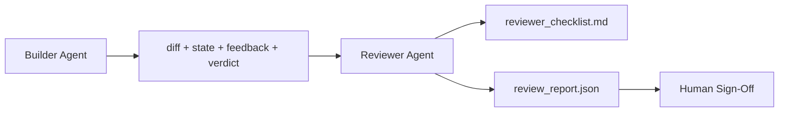

# 评论员代理: 独立的建筑师和标记器

> 编写代码的代理人不能评级代码. 审核器是一个第二循环,其系统提示不同,目标不同,并且只能读取构建者制作的所有内容.构建者和审核器之间的差距是最可靠的地方.

**Type:** Build
**Languages:** Python (stdlib)
**Prerequisites:** Phase 14 · 38 (Verification Gate)
**Time:** ~55 minutes

## 学习目标

- 解释为什么同一代理人不能可靠地审查自己的工作.
- 建立一个审查代理循环,它消耗了构建器文物,并发出了一个结构化审查报告.
- 写作一个评审者条目, 评分特定的尺寸, 而不是振动.
- 让审稿人进入工作台,让人类审稿步骤从一个真正的文物开始.

## 问题

检查门 (阶段14·38) 确认接受运行和范围保持. 门说`passed: true`两天后,你发现,修复解决了错误的半个错误.

接受是必要的,不够的. 审查者提出了接受不能提出的问题:这是否解决了正确的问题?

## 概念



### 审查员条款

五个维度,每个维度都是0到2的.

| Dimension | Question |
|-----------|----------|
| Problem fit | Did the change solve the task as stated, not a nearby task? |
| Scope discipline | Were edits confined to the contract or was the contract grown deliberately? |
| Assumptions | Are all hidden assumptions written down somewhere reviewable? |
| Verification quality | Does the acceptance command actually prove the goal, or did it prove a weaker version? |
| Handoff readiness | Could the next session pick up cleanly from the current state? |

总数是10个. 7以下的运行是软失败; 5以下的运行是硬失败.

### 评审员是一个独立的角色,而不是一个独立的模型

修建器可以使用同样的模型运行评论器. 纪律是角色分离:不同的系统提示,不同的输入,没有写入差异. 姿势的变化是信号的变化.

### 评论员不能编辑差异

评论员阅读差异,状态,反,判决. 它写了一个报告. 它不补丁差异. 如果报告说"修复这个",下一个构建者转会修复; 评论员回到审查. 混合角色打败了差距.

### 审查员分类与验证门

通过"审核"的过程,检查了确定性事实:是否接受,是否通过规则,是否适用.审核者做出了质量判断:这是否正确的工作,是否有文档,是否可使用.

```figure
wb-builder-marker
```

## 建立它

`code/main.py`执行:

- `ReviewerInputs`分析师阅读的文物.
- 每个函数都是对课程的决定性和 stub 级;实际的实现将称为LLM.
- `review_report.json`总数和判决 (`pass`现在`soft_fail`现在`hard_fail`)
- 两种示范案例:一个清洁的变化和一个"正确的测试,错误的问题"的变化.

运行它:

```
python3 code/main.py
```

输出:两个写到磁盘上的审查报告和一个控制台的维度分数表.

## 野生生产模式

收据:Cloudflare 2026年4月的AI代码审查系统在30天内通过5169个备忘录进行了48,095次合并请求的131,246次审查. 平均检查完成在3分39秒. 七名专业审查员 (安全性,性能,代码质量,文档,释放管理,合规性,工程编辑) 在审查协调员的同时进行了审查,该委员会将调查结果进行复制并判断严重性. 专家们在更便宜的阶段运行.

只有四种模式使得这个工作可以在规模上进行.

**Specialist pool, not one big reviewer.**一个具有5维分类的评论员为单独备份工作.一旦代码库具有安全关键,性能关键和文件表面,分为具有较小提示的专家.协调员进行排版;专家从来没有运行完整分类.模型层分离不出:廉价专家,昂贵的协调员.

**Bias mitigation as design requirement, not optimization.**法律法官显示有四种可靠的偏见 (Adnan Masood,2026年4月):位置偏见 (GPT-4 ~40%不一致于 (A,B) vs (B,A) 订单),语法偏见 (~15%的指数通胀向更长的输出),自偏 (法官更喜欢来自同一个模型家族的输出),权威 (法官对已知的作者进行过度引用). 减轻:评估两种排序,只计算一致的胜利;使用1-4个尺度,显然奖励简洁;在模型家庭中旋转评委;在得分之前剥离作者名称.

**Calibration set, not vibes.**根据历史记录,每次变化都会让审稿人重新审核.如果历史记录的一致性低于80%,审稿人需要在审稿人发出之前修改.这就是每个团队最终重新发现的东西;更好从中开始.

**Hybrid norm with the gate.**验证门 (阶段14 · 38) 处理确定性检查 (是否接受运行,是否通过测试,是否保持范围). 评论员处理语义检查 (这是正确的工作,假设已记录,是否可使用). 人类2026指南明确于这个分区:不要要求评论员重复已经证明的门.

## 用它

生产模式:

- **Claude Code subagents.**建筑师完成任务后,一个审核员就会跑去,并发布一个评论,
- **OpenAI Agents SDK handoffs.**建筑师可以向审核员交出完成任务.审核员可以向一个人交出一份发现列表.
- **Two-model pairing.**构建者使用更快的更便宜的模型. 评论者使用更强大的模型,

评论家是第二双眼睛,当人类不能自己做每一次评论时,工作台就会成长.

## 运送它

`outputs/skill-reviewer-agent.md`生成一个项目特定的审查员标签,一个与建筑商的文物连接的审查员代理标签,并与验证网关集成,

## 运动

1. 添加一个特定产品域的第六维度. 辩护为什么它不被现有五个吸收.
2. 通过两个不同的系统提示 (第三,词语) 运行评论器.
3. 添加一个`confidence`拒绝在最低维度的可信度低于0.6时发送报告.
4. 建立一个校准集: 10个历史任务的结局,已知正确的判决. 运行审查员在它们上. 它与历史记录不同的地方.
5. 补充一个"要求更多证据"的条件:审查员可以在得分之前要求建筑师进行特定的测试.

## 关键词

| Term | What people say | What it actually means |
|------|----------------|------------------------|
| Reviewer rubric | "Checklist" | Five-dimension 0-2 scoring with a written question per dimension |
| Soft fail | "Needs revisions" | Total below 7; builder gets findings to address |
| Hard fail | "Reject" | Total below 5 or any dimension at 0; halt and surface to human |
| Role separation | "Different prompt" | Same model can be both roles; the discipline is inputs and posture |
| Confidence floor | "Don't ship low-signal reports" | Refuse to emit a verdict when the rubric is uncertain |

## 进一步阅读

- [OpenAI Agents SDK handoffs](https://openai.github.io/openai-agents-python/handoffs/)
- [Anthropic Claude Code subagents](https://code.claude.com/docs/en/sub-agents)
- [Cloudflare, Orchestrating AI Code Review at Scale](https://blog.cloudflare.com/ai-code-review/) 7名专家+协调员架构,131万次运行/30天
- [Agent-as-a-Judge: Evaluating Agents with Agents (OpenReview / ICLR)](https://openreview.net/forum?id=DeVm3YUnpj) DevAI基准,366个层次解决方案要求
- [Adnan Masood, Rubric-Based Evaluations and LLM-as-a-Judge: Methodologies, Biases, Empirical Validation](https://medium.com/@adnanmasood/rubric-based-evals-llm-as-a-judge-methodologies-and-empirical-validation-in-domain-context-71936b989e80)四个偏见和减轻
- [MLflow, LLM-as-a-Judge Evaluation](https://mlflow.org/llm-as-a-judge) 对于分离的建筑/评估人员的生产工具
- [LangChain, How to Calibrate LLM-as-a-Judge with Human Corrections](https://www.langchain.com/articles/llm-as-a-judge)校准设置工作流程
- [Evidently AI, LLM-as-a-judge: a complete guide](https://www.evidentlyai.com/llm-guide/llm-as-a-judge)
- [Arize, LLM as a Judge — Primer and Pre-Built Evaluators](https://arize.com/llm-as-a-judge/)
- 阶段14 · 05 自我精炼和临界 (单代理自我审查的基准)
- 阶段14 · 30  Eval驱动的代理开发 (校准组生成器)
- 阶段14 · 38  审查员阅读的验证门
- 阶段14 · 40  审查者报告提供的交付包
