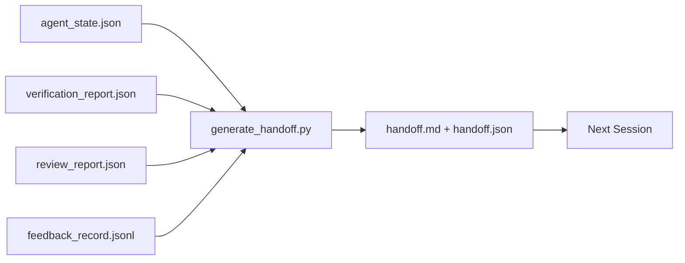

# 多次会议交换

> 交付包是把"代理工作了一个小时"变成"下一次会议在第一分钟就产生了效果". 建立它是有意的,不是后期思考.

**Type:** Build
**Languages:** Python (stdlib)
**Prerequisites:** Phase 14 · 34 (Repo Memory), Phase 14 · 38 (Verification), Phase 14 · 39 (Reviewer)
**Time:** ~50 minutes

## 学习目标

- 确定每一个发送包需要的7个字段.
- 通过手写散文,从工作桌上的文物中生成传递.
- 切除大数据记录,并将其编写成一个简要的概述.
- 让下一次会议的第一步决定性.

## 问题

会议结束. 代理说"很好,我们取得了进展". 下一个会议开幕. 下一个代理问"我们在哪里停下来?" 第一个代理的答案消失了. 下一个代理重新发现,重复执行相同的命令,重复问人类相同的问题,并燃烧三十分钟恢复前一个会议的最后三十秒.

错误的交付费用每次交付,每次交付费用都会持续到任务的寿命. 修正是交付结束时自动生成的数据包:什么改变了,为什么,什么尝试了,什么失败了,什么剩下,下次要做什么.

## 概念



### 每次交付都带有七个田野

| Field | Question it answers |
|-------|---------------------|
| `summary` | One paragraph of what was done |
| `changed_files` | The diff at a glance |
| `commands_run` | What was actually executed |
| `failed_attempts` | What was tried and why it did not work |
| `open_risks` | What could bite next session, with severity |
| `next_action` | The first concrete step next session takes |
| `verdict_pointer` | Path to the verification + review reports |

其他`next_action`只有一个,只有一个,只有一个.`next_action`报告是状态报告,而不是转让.

### 转让是产生的,而不是写的

机器阅读工作桌的文物并发射包.代理人的工作是让工作桌在一个状态中,机器可以总结,而不是写总结.

### 两种形式:可读于人和可读于机器

`handoff.md`人类读到的.`handoff.json`它们来自同一源件,如果它们分歧,JSON获胜.

### 反日志剪裁

完全的`feedback_record.jsonl`转发只包含最后一个K加上每一个输入的输出,但没有零. 下一个会议将加载完整的日志,但包保持小.

### 离开一个清洁的状态

简单的描述工作,清洁的状态使工作可以重复.`handoff.md`如果下一个会议开放到一个半应用差异,一个临时文件代理忘记,一个流浪的分支,然后在它们甚至运行之前测试错误.下一个代理然后花费其第十分钟清理后的最后一个而不是建造,成本复合每一个会议的寿命任务.

清理是自己的阶段,在交付之前运行,这是一个检查,而不是习惯,因为一个习惯是在一个艰难的日子里被跳过的东西.

| Check | Clean means | Dirty blocks because |
|-------|-------------|----------------------|
| Working tree | Every change committed or explicitly stashed with a note | A half-applied diff looks like intentional work to the next agent |
| Temp artifacts | No `*.tmp`, scratch dirs, debug prints, or commented-out blocks left behind | Stray files pollute the diff and the next agent's mental model |
| Tests | Green, or red with the failure named in `open_risks` | A silent red test is a trap the next session steps in |
| Feature board | `feature_list.json` status reflects reality (Phase 14 · 36) | A stale board sends the next session to work that is already done |
| Branch | On the expected branch, no detached HEAD, no orphan branches | Wrong branch means the next session's first commit lands in the wrong place |

清洁阶段发射了`clean_state.json`通过一个脏的树上建立的置不是置,而是转发的混乱.这两个文物对:清洁证明工作台是安全的离开,置证明下一个会议知道从哪里开始.

```figure
wb-handoff-packet
```

## 建立它

`code/main.py`执行:

- 收藏状态,判决,审查和反的载体.`WorkbenchSnapshot`现在,我们要去.
- `generate_handoff(snapshot) -> (markdown, payload)`功能.
- 选取最后的K反输入和所有非零出口.
- 写一个演示程序`handoff.md`其他`handoff.json`在剧本旁边.

运行它:

```
python3 code/main.py
```

输出:印制的传输机体,加上磁盘上的两个文件.

## 野生生产模式

编程CLI,克劳德编程Code和OpenCode每个都运送不同的缩放故事;结构化的交付包都位于三个以上.

**Compaction strategies vary; the packet schema does not.**编辑器CLI的POST /v1/responses/compact是一个服务器侧不透明的AES (OpenAI模型的快速路径);倒退是局部"补贴总结"附加为`_summary`开源代码在 95% 的语境中运行了五阶段的渐进式缩小.开源代码基于时间标签的信息隐藏以及一个五头的LLM摘要.三个不同的机制,相同的需要:将压缩存活的东西串行成便携式文物.包是那个文物.

**Fresh-session handoff is not compaction.**紧缩延长一个会议; 交给一个干净关闭, 赫尔默斯号#20372框架 (2026年4月) 是正确的:当内部压缩开始降低时,代理应该写一个紧的交付,结束会议,并在新文本中恢复. 包裹是使得过渡便宜的. 错误是继续压缩,直到质量崩; 解决办法是预算早些时候,

**One active handoff per branch and topic.**复合机器人协调在不良模型输出时会更容易出现故障.`branch`现在`last_known_good_commit`其他`status`其他`active | superseded | archived`现存的交付存储,只有活跃的交付驱动下一个会议.这是交付作为笔记和交付作为状态之间的区别.

**Wrap up before 50-75% context, not at the wall.**通过手写模式的玩法簿 (CLAUDE.md + HANDOVER.md) 报告了会议结束时最好的结果,而不是95%的文本预算. 包装生成器在压缩文物污染源状态之前运行得很清洁.文本完整时写作便宜;模型已经失去了位置时昂贵.

## 用它

生产模式:

- **Session-end hook.**运行时间在用户关闭聊天时启动发电机.`outputs/handoff/<session_id>/`现在,我们要去.
- **PR template.**评论员们没有打开五份文件.
- **Cross-agent handoff.**通过一个产品 (Claude Code) 构建,继续使用另一个产品 (Codex).

包装是小的,定期的,而且便宜的生产.

## 运送它

`outputs/skill-handoff-generator.md`产生的生成器调整到项目的文物路径,一个结束会议的子,`handoff.json`下一个代理在启动时读到的方案.

## 运动

1. 添加一个`assumptions_to_validate`构建者登记的每一个假设都会出现,但审查者没有超过1的分数.
2. 为了避免失败,要把反总结改成不同的,而不是通过的.
3. 问一个问题可以进入包装或聊天信息的门是多少?
4. 让发电机无力:运行两次就产生相同的包.
5. 添加一个"下一个会议预设"部分,列出下一个会议必须在执行之前装载的精品.

## 关键词

| Term | What people say | What it actually means |
|------|----------------|------------------------|
| Handoff packet | "Session summary" | Generated artifact carrying the seven fields, both markdown and JSON |
| Next action | "What to do first" | The one concrete step that starts the next session |
| Feedback trim | "Log summary" | Last K records plus every non-zero exit |
| Status report | "What we did" | A document missing `next_action`; useful, but not a handoff |
| Verdict pointer | "Receipt" | Path to the verification + review reports for traceability |

## 进一步阅读

- [Anthropic, Effective harnesses for long-running agents](https://www.anthropic.com/engineering/effective-harnesses-for-long-running-agents)
- [OpenAI Agents SDK handoffs](https://openai.github.io/openai-agents-python/handoffs/)
- [Codex Blog, Codex CLI Context Compaction: Architecture, Configuration, Managing Long Sessions](https://codex.danielvaughan.com/2026/03/31/codex-cli-context-compaction-architecture/) POST /v1/响应/紧和本地回落
- [Justin3go, Shedding Heavy Memories: Context Compaction in Codex, Claude Code, OpenCode](https://justin3go.com/en/posts/2026/04/09-context-compaction-in-codex-claude-code-and-opencode)三家供应商的压缩比较
- [JD Hodges, Claude Handoff Prompt: How to Keep Context Across Sessions (2026)](https://www.jdhodges.com/blog/ai-session-handoffs-keep-context-across-conversations/)CLAUDE.md + HANDOVER.md,50-75%的文本预算
- [Mervin Praison, Managing Handoffs in Multi-Agent Coding Sessions: Fresh Context Without Losing Continuity](https://mer.vin/2026/04/managing-handoffs-in-multi-agent-coding-sessions-fresh-context-without-losing-continuity/)分布式系统框架
- [Hermes Issue #20372 — automatic fresh-session handoff when compression becomes risky](https://github.com/NousResearch/hermes-agent/issues/20372)
- [Hermes Issue #499 — Context Compaction Quality Overhaul](https://github.com/NousResearch/hermes-agent/issues/499)Codex CLI中转移指导
- [Microsoft Agent Framework, Compaction](https://learn.microsoft.com/en-us/agent-framework/agents/conversations/compaction)
- [OpenCode, Context Management and Compaction](https://deepwiki.com/sst/opencode/2.4-context-management-and-compaction)
- [LangChain, Context Engineering for Agents](https://www.langchain.com/blog/context-engineering-for-agents)
- 阶段 14 · 34  状态文件发电器读取
- 阶段14 · 38 验证判决
- 阶段14 · 39  审查报告包装
