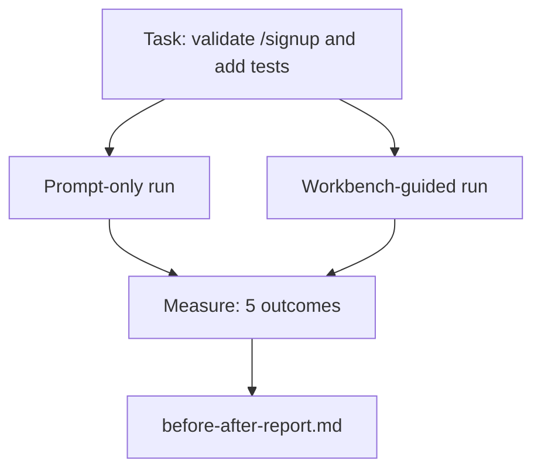

# 工作台在一个真正的商店

> 对于一个小样本应用程序,这个课程两次执行相同的任务:仅需提示与工作台指导. 数字是辩论的.

**Type:** Build
**Languages:** Python (stdlib)
**Prerequisites:** Phases 14 · 32 to 14 · 40
**Time:** ~60 minutes

## 学习目标

- 将七个工作桌面放在一个小应用上.
- 执行同一任务两次 (仅即时执行和工作台指导) 并测量五项结果.
- 阅读前后报告,并决定哪些表面产生了最大的影响力.
- 为了保护工作台免受"但我的模型足够好"的反驳.

## 问题

玩具任务的演示没有人相信. 工作桌的情况是当一个真正的任务在一个真正的重复工作中,生产失败的数量减少,回转的数量减少,

通过两条管道,这次课程将实现真正的回应,并通过两条管道执行相同的任务.

## 概念



### 样本应用程序

简单的FastAPI式处理器`sample_app/`其他:

- `app.py`随着`/signup`(目前还没有验证).
- `test_app.py`通过一个快乐道路测试.
- `README.md`其他`scripts/release.sh`作为禁止区域的.

### 任务

> 添加输入验证`/signup`拒绝短于8个字符的密码,返回422,输入错误包.添加证明新行为的测试.

### 两条管道

仅即时使用:

1. 阅读阅读.
2. 阅读`app.py`现在,我们要去.
3. 编辑文件.
4. 要求完成.

工作台指导:

1. 运行初始脚本 (课35).
2. 阅读合同范围 (第36课).
3. 阅读状态 (课34).
4. 仅允许编辑文件.
5. 通过反运行器运行接受命令 (课37).
6. 运行验证门 (课程38).
7. 经过审核 (第39课).
8. 产生交换 (课40).

### 测量的五个结果

| Outcome | Why it matters |
|---------|----------------|
| `tests_actually_run` | Most "tests passed" claims are unverifiable |
| `acceptance_met` | The test that proves the goal must be the test that ran |
| `files_outside_scope` | Scope creep is the dominant silent failure |
| `handoff_quality` | The next session pays for or benefits from this |
| `reviewer_total` | Qualitative judgment on top of the gate |

```figure
wb-ab-runs
```

## 建立它

`code/main.py`测量方法是通过测量方法进行的,这两个管道都与相同的样本应用程序固定进行了调整.`before-after-report.md`其他`comparison.json`现在,我们要去.

运行它:

```
python3 code/main.py
```

输出:每个管道的结果表,脚本旁边保存的标记报告,以及任何想要图表的JSON.

## 野生生产模式

怀疑者的问题是"工作台实际上有多有帮助?" 2026 年的数字比解释更清楚.

**Terminal Bench Top-30 to Top-5 on the same model.**兰格链的"机器人带的解剖" (2026年4月):一个编码器从前30名之外跳跃到终端台2.0上排名第五,仅仅改变了带.相同的模型.不同的表面.25位的三角形.

**Vercel 80% to 100% by deleting tools.**据Vercel报道,它删除了80%的代理工具, 提高了成功率从80%到100%. 工具表面较小, 范围更明晰, 失败的方法较少.

**Harvey 2x accuracy via harness alone.**法律代理通过利用优化带, 没有模型的改变,

**88% of enterprise AI agent projects fail to reach production.**预印.org*语言代理人运用工程*论文 (2026年3月) 追踪失败到运行时间,而不是推理:陈旧状态,脆弱的重试,过度生长的背景,

**Long-context collapse.**根据WebAgent的基本线程,在长文本条件下40-50%的成功降至10%以下,主要是由于无限循环和目标损失.

**False negatives still exist.**单步实事任务,单行列表,格式化运行,模型已经记得的任何东西,这些运行更快,只需提示.基准应该诚实列出它们,以便工作台不被视为过度.

模型确实随着时间的推移吸收了使用的技巧. 结果是,今天,工程负载在七个表面上,数字证明了这一点.

## 用它

这一课是你提到的案例文件:

- 有人问为什么每一个公关都会带着一个`agent-rules.md`并且有一个合同.
- 一支团队想放弃验证门, "仅仅是为了这个冲刺".
- 您需要一个可移植的基准,以确定它是否能节省时间.

数字远远远远远远远远远远远远远远远远远远远远远远远远远远远远远远远远远远远远远远远远远远远远远远远远远远远远远远远远远远远远远远远远远远远远远远远远远远远远远远远远远远远远远远远远远远远远远远远远远远远远远远远远远远远远远远远远远远远远远远远远远远远远远远远远远远远远远远远远远远远远远远远远远远远远远远远远远远

## 运送它

`outputs/skill-workbench-benchmark.md`是一个可移植的评估器件,通过两个管道运行任何代理产品,与项目自己的样本应用程序进行测试,并报告五项结果.

## 运动

1. 另外,我们还要做一个第六个结果:时间到第一次的有意义的编辑.
2. 在你的代码库中进行第二天的实际任务的比较.
3. 添加一个"假负"通过:只需提示才能更快的任务,工作桌面的费用是真正的成本. 无论如何,保护工作桌面的保留.
4. 取代剧本中的"代理"用一个真正的法师调用.
5. 专注于非工程师的一页摘要.

## 关键词

| Term | What people say | What it actually means |
|------|----------------|------------------------|
| Sample app | "Toy repo" | Small but realistic enough to exercise all seven surfaces |
| Pipeline | "Workflow" | Ordered sequence of surface reads/writes the agent follows |
| Before/after report | "The receipts" | The artifact you hand to a skeptic |
| False negative | "Workbench overkill" | Tasks where prompt-only is faster; useful to enumerate honestly |
| Workbench benchmark | "Reliability score" | Portable harness that runs the comparison on your codebase |

## 进一步阅读

- [LangChain, The Anatomy of an Agent Harness](https://blog.langchain.com/the-anatomy-of-an-agent-harness/)终端台前-30至前5的收据
- [MongoDB, The Agent Harness: Why the LLM Is the Smallest Part of Your Agent System](https://www.mongodb.com/company/blog/technical/agent-harness-why-llm-is-smallest-part-of-your-agent-system) 维尔塞尔 + 哈维数字
- [preprints.org, Harness Engineering for Language Agents](https://www.preprints.org/manuscript/202603.1756) 88%的企业失败率,运行时间的根本原因
- [HN: Improving 15 LLMs at Coding in One Afternoon. Only the Harness Changed](https://news.ycombinator.com/item?id=46988596)在15个模型中复制
- [Cloudflare, Orchestrating AI Code Review at Scale](https://blog.cloudflare.com/ai-code-review/) 131k 期复习 / 30 天生产
- [Anthropic, Building Effective Agents](https://www.anthropic.com/research/building-effective-agents)
- 阶段14 · 32至14 · 40 这个课程的表面
- 阶段14 · 19 SWE-bench,GAIA,AgentBench作为宏观基准本课补充
- 阶段 14 · 30  评估驱动的剂开发相同的带插头
