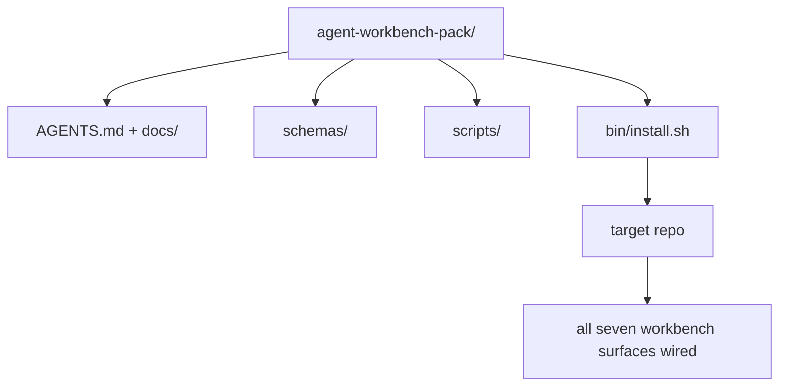

# 石:运输可重复使用的代理工作台包

> 任何一个回复中,你放一个包,最后一个小曲目.`cp -r`石是这门课程所使用的文物.

**Type:** Build
**Languages:** Python (stdlib)
**Prerequisites:** Phases 14 · 31 to 14 · 41
**Time:** ~75 minutes

## 学习目标

- 包装七个工作桌面面,
- 入方案,脚本和模板,这样一个新的 repo得到了已知的基础.
- 添加一个单个安装脚本,将包装无力放下.
- 决定什么留在群里,什么留在外,为每一个人辩护.

## 问题

工作桌面在Google文档,聊天历史和三个半记忆脚本中存在,是一个每季度重建的工作桌面.治疗方法是一个版本包:一个备忘录或目录,上面包含表面,方案,脚本和一个命令安装器.

你将结束这个课程`outputs/agent-workbench-pack/`发送在磁盘上`bin/install.sh`这将它放入任何目标回报.

## 概念



### 包装布局

```
outputs/agent-workbench-pack/
├── AGENTS.md
├── docs/
│   ├── agent-rules.md
│   ├── reliability-policy.md
│   ├── handoff-protocol.md
│   └── reviewer-rubric.md
├── schemas/
│   ├── agent_state.schema.json
│   ├── task_board.schema.json
│   └── scope_contract.schema.json
├── scripts/
│   ├── init_agent.py
│   ├── run_with_feedback.py
│   ├── verify_agent.py
│   └── generate_handoff.py
├── bin/
│   └── install.sh
└── README.md
```

### 什么是留在,什么是留在

在:

- 表面图案,这是合同.
- 上面的四个剧本,它们是运行时间.
- 它们是规则和规则.

走出去

- 任务属于目标备忘录的板块,而不是包装.
- 包装是框架无知的.
- 团队生活在团队现有的集团旁边,而不是内部.

### 安装器

简短的`bin/install.sh`(或`bin/install.py`):

1. 拒绝安装在现有包装上,没有`--force`现在,我们要去.
2. 复制包到目标存储器中.
3. 电缆如果有`.github/workflows/`没有.
4. 打印下一步:填写板,设置接受命令,运行 init脚本.

### 版本化

包装载有`VERSION`文件. 计划的颠覆和需要迁移的脚本变化颠覆主要. 只有文件的变化颠覆补丁. 目标备忘录的`agent_state.json`记录它被初始化为哪个包版本.

```figure
wb-pack-install
```

## 建立它

`code/main.py`组装包装成`outputs/agent-workbench-pack/`在课旁边, 种植了你已经写的小曲目中的前课程的方案和脚本.

运行它:

```
python3 code/main.py
```

脚本复制和接表面,写出 README,打印包树,然后退出零.重启是无效的.

## 野生生产模式

包装只能有价值,只要它存活着,如果它能保持良好的状态,如果它能保持良好的状态,

**`VERSION` is the contract, not the marketing.**基本上,需要一个状态迁移. 基本上,需要重新检查. 补丁的补丁只需要文件. 安装器写道`.workbench-version`在每次安装中, 进入目标备忘录;`lint_pack.py`如果目标的锁与包裹的锁不同,拒绝运输`VERSION`这就是怎么做`npm`现在`Cargo`其他`pyproject.toml`经历了10年的炼, 没有什么改变了规则.

**Single source for cross-tool distribution.**号船1号`nx ai-setup`这就说明了`AGENTS.md`现在`CLAUDE.md`现在`.cursor/rules/`现在`.github/copilot-instructions.md`包装器应做同样的事情;安装器发出了符号链接 (`ln -s AGENTS.md CLAUDE.md`对于每一个编码代理,只有一种信息来源.

**`uninstall.sh` that refuses on non-trivial state.**卸载包不能删除用户的文件`agent_state.json`现在`task_board.json`其他`outputs/`解装器删除了方案,脚本,文件,`AGENTS.md`(与`--keep-agents-md`由于该数据库的数据库是用户的,而该数据库并非其所有者.

**Skill-as-publishable. SkillKit-style distribution.**作为一个SkillKit技能:`skillkit install agent-workbench-pack`包装备是真相来源,SkillKit是分销道.供应商锁定崩;七面保持相同.

## 用它

包装船只的三个位置:

- **As a directory you drop into a repo.** `cp -r outputs/agent-workbench-pack /path/to/repo`现在,我们要去.
- **As a public template repo.**叉和定制,用`VERSION`控制漂移.
- **As a SkillKit skill.**连接到你的代理产品,所以只有一条命令可以设置它.

每个装配都是一个分量.

## 运送它

`outputs/skill-workbench-pack.md`产生一个项目调整的包:规则与团队的历史进行了调整,范围范围与 repo相匹配,条目尺寸通过一个特定领域的输入扩展.

## 运动

1. 决定哪个选项第五文件值得升级到圣经包.
2. 用一个 编写重新安装器为Python`--dry-run`标,比较 ergonomics 和 bash.
3. 添加一个`bin/uninstall.sh`没有任何小事,如果国家文件有非小事历史,
4. 添加一个`lint_pack.py`子出时会失败`VERSION`给IC传输,让包裹自己回复.
5. 导读了从手动滚动工作台到这个包的迁移运行指南.

## 关键词

| Term | What people say | What it actually means |
|------|----------------|------------------------|
| Workbench pack | "The starter kit" | A versioned directory carrying all seven surfaces |
| Installer | "Setup script" | `bin/install.sh` that lays the pack down idempotently |
| Pack version | "VERSION" | Major bumps for schema/script changes, patch for doc-only |
| Drop-in pack | "cp -r and go" | Pack works without per-repo customization on day one |
| Forkable template | "GitHub template" | Public repo that GitHub's "Use this template" can clone from |

## 进一步阅读

- 阶段14 · 31至14 · 41 每一个面积包装包装
- [SkillKit](https://github.com/rohitg00/skillkit)将这种技能安装在32个人工智能代理中
- [Nx Blog, Teach Your AI Agent How to Work in a Monorepo](https://nx.dev/blog/nx-ai-agent-skills) 六个工具的单源发电机
- [agents.md — the open spec](https://agents.md/)您的包装路由器必须实现什么
- [HKUDS/OpenHarness](https://github.com/HKUDS/OpenHarness) 包装等价的参考实施
- [andrewgarst/agentic_harness](https://github.com/andrewgarst/agentic_harness) 支持重复的引用与 eval套件
- [Augment Code, A good AGENTS.md is a model upgrade](https://www.augmentcode.com/blog/how-to-write-good-agents-dot-md-files)包装文件质量条
- [Anthropic, Effective harnesses for long-running agents](https://www.anthropic.com/engineering/effective-harnesses-for-long-running-agents)
- [Anthropic, Harness design for long-running application development](https://www.anthropic.com/engineering/harness-design-long-running-apps)
- 阶段 14 · 30  基于评估的代理开发,使用包装的验证门
- 之前/后的基准,本包的改善
