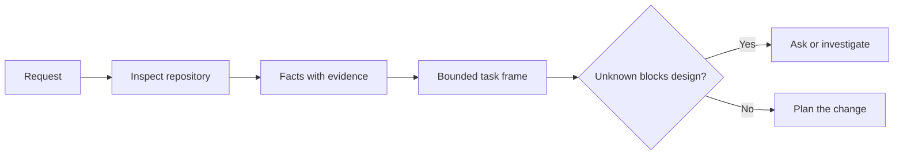

# 在代理编写代码之前, 制任务

> 编码代理可以快速执行一个清晰的任务. 它也可以快速执行一个不清晰的任务. 速度相同. 成本不一样.

**Type:** Learn + Build
**Languages:** Python (stdlib)
**Prerequisites:** Phase 14 lessons 31 and 36
**Time:** ~60 minutes

## 学习目标

- 在编辑之前将请求转换为有限任务框架.
- 独立的数据库数据与假设和公开问题.
- 定义允许的路径,禁止的路径,以及接受证据.
- 确定什么时候侦察足以开始工作.

## 昂贵的失败

添加重复电子邮件保护听起来是具体的.它不是. 独特性是否属于API,域服务或数据库?比较是否敏感?哪种错误形式已经公开?是否允许迁移?哪种测试证明了行为?

能否执行的操作程序,将会通过可行的选择来填补这些空白.

因此,编码代理工作的第一单元不是编辑,而是由存储证据支持的任务框架.

## 任务框架

有效的框架有六个领域:

| Field | Question |
|---|---|
| Goal | What observable behavior must change? |
| Repository facts | What did you verify in code, tests, config, or history? |
| Allowed paths | Where may the change land? |
| Forbidden paths | What must remain untouched? |
| Acceptance evidence | Which commands or observations prove the goal? |
| Unknowns | Which decisions still need evidence or human judgment? |

文件需要收件. API使用409为重复文件是没有事实,直到你可以指向现有测试或处理器.一个文件路径和行是足够的.一个命令结果更好,当行为重要.



## 认识是寻找限制

查找限制变更的表面:

1. 现在的行为和它的调用者.
2. 最接近现有的测试.
3. 公共合同或序列化形状.
4. 项目指令,指导路径.
5. 建立和验证命令.
6. 类似的完成变化, 显示了当地模式.

停止当每一个计划的决定都被证据支持,明确委托,或列为未知的.

## 不知不觉的不是失败

无人是控制的空白. 假设是对空白的不受控制的答案.

分类每个未知的:

- **Discoverable:**存储库或运行系统可以回答.
- **Decidable:**任务合同赋予代理人选择权.
- **Human:**选择改变产品行为,成本,风险或公众兼容性.
- **Deferred:**选择是不属于这个部分的,属于非目标的.

代理应该继续通过可发现和委托的未知, 在选择被埋葬在代码之前,它应该停留在人类未知.

## 实施前接受

在补丁之前写出证据.

- 集中单位或集成测试指令;
- 浏览器行程,具有命名的视角码和预期状态;
- 通过电子邮件请求和准确响应合同;
- 具有门值的性能测量;
- 检查范围,确认没有相关文件发生变更.

测试通过不是一个证明计划. 举个证明性测试和它支持的要求.

## 建立它

实验室创造了一个`TaskFrame`证据和证据,并写道`outputs/task-frame.md`现在,我们要去.

运行从这个课程目录:

```bash
python3 code/main.py
python3 -m unittest discover code/tests -v
```

通过四种方式来解剖这个例子:删除目标,删除事实收件,重叠允许和禁止的路径,删除接受命令.验证器应以不同的原因拒绝每个框架.

## 用它在一个真正的库存

在要求代理编辑之前:

1. 写目标作为一种行为,而不是文件的变化.
2. 记录两三个事实,并提供准确的证据.
3. 指定最小的允许路径.
4. 给一个负空间明确的名称.
5. 写下完成任务的命令或观察.
6. 列出你还没有做过的决定.

框架应适应一个屏幕.如果不能,任务可能包含多个独立可验证的变化.

## 运动

1. 设置一个真实的错误从你的存储库之一,
2. 在框架中找到一个假设的说法,并用证据来取代它.
3. 加入一个未知的人类,他的答案会改变公共合同.
4. 开放一个宽的路径,进入最小的安全套.
5. 加入接受证书的范围收据.

## 进一步阅读

- [Nuseibeh and Easterbrook, Requirements Engineering: A Roadmap](https://www.cs.toronto.edu/~sme/papers/2000/ICSE2000.pdf)为了将实施与现实目标和不断发展的限制联系起来.
- [Yang et al., SWE-agent: Agent-Computer Interfaces Enable Automated Software Engineering](https://arxiv.org/abs/2405.15793)对于编码剂的界面改变其有效性,

## 你留下什么

保持`outputs/task-frame.md`作为下一个课程的输入,
