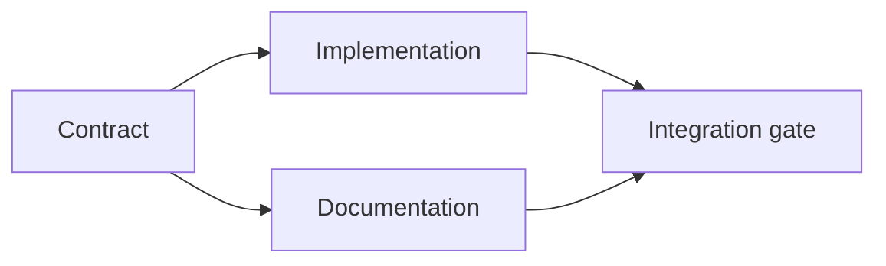

# 建立一个基于证据的执行计划

> 计划不是一个更漂亮的任务列表. 它是一个依赖图表,其中每个变化都有原因,每个终端节点都有证明.

**Type:** Learn + Build
**Languages:** Python (stdlib)
**Prerequisites:** Phase 14 lesson 43
**Time:** ~65 minutes

## 学习目标

- 转换一个任务框架成用证据和证据的工作项目.
- 模型的顺序是依赖性而不是散文序列.
- 在编辑之前,检测缺失的事实,未知的依赖性和周期.
- 单独的步骤可以一起运行,

## 代理计划为什么失败

软弱的计划将在未来重复请求:

1. 更新API.
2. 增加测试.
3. 更新文件.

没有什么在列表中说出发现了什么,为什么这些文件是正确的,哪个合同先改变,或者同时发生什么.

一个强有力的计划为每个工作项目作出了五项承诺:

| Commitment | Purpose |
|---|---|
| Identifier | Stable reference for dependencies and handoff |
| Change | The smallest behavior or contract change |
| Evidence | Repository facts that justify the change |
| Dependencies | Work that must be true first |
| Proof | The exact check that closes the item |

## 计划签订协议之前

当多个表面依赖于相同的行为时,首先定义行为.测试,实现,文档和集成可以分享一个合同,而不是发明四种版本.



合同的实施和文件可以在合同确定后一起进行. 整合等待两者.

## 证据改变了计划

存储证据不是装饰,它应该能够改变工作:

- 现有辅助者删除了计划的新抽象.
- 兼容性测试强迫迁移步骤.
- 部署限制将一个方案变化转移到另一个任务.
- 公共响应类型改变了实施和文档的顺序.

如果证据不能改变计划,那么这可能不是决定的证据.

## 设计用于中断

编码代理会议突然结束.可重复计划的工作项目足够小,以使另一个会议可以确定:

- 哪个项目已完整;
- 哪些证据被运行;
- 哪些文物发生了变化;
- 现在哪些依赖性已解锁;
- 接下来安全的东西是什么?

不要只在聊天室内的选项框中编码状态.

## 计划验证

在执行之前拒绝计划,如果:

- 标识符是复制的;
- 工作件没有证据;
- 工作件没有证据;
- 依赖性名称是未知的项目;
- 图表包含一个周期;
- 在解决相关不确定性之前,第一项不可逆转的行动发生.

首先,五项检查是机械的,最后一个检查需要判断,

## 建立它

`code/main.py`模型工作项目,验证其收据,计算执行波以拓类型,并写`outputs/evidence-plan.json`现在,我们要去.

运行:

```bash
python3 code/main.py
python3 -m unittest discover code/tests -v
```

具体情况是: 合同定义是第一,实施和文档是最后的,集成门是最后的.

## 用一个编码器

让代理人在改变文件之前制作计划.

1. 每个路径和行为要求都有存储收据.
2. 每个项目都有一个明确的完成证据.
3. 图表延迟昂贵或不可逆转的工作,直到它所依赖的不确定性得到解决.

批准计划,而不是保证要小心.

## 运动

1. 添加一个需要人明确批准的迁移项目.
2. 创造一个循环,并解释背后的隐藏产品分歧.
3. 分开一个有两个证明命令的项目.
4. 加入一个可以在第二波中运行的工作项目,而不需要触及任何现有分支.
5. 让计划作为Markdown,同时保留JSON作为真相来源.

## 进一步阅读

- [Nuseibeh and Easterbrook, Requirements Engineering: A Roadmap](https://www.cs.toronto.edu/~sme/papers/2000/ICSE2000.pdf)为了实现目标,规格,协议和进化之间的反复关系.
- [Barry Boehm, A Spiral Model of Software Development and Enhancement](https://dl.acm.org/doi/10.1145/12944.12948)对于规划风险解决方案而不是固定线性序列的发展.

## 你留下什么

保持`outputs/evidence-plan.json`在下课中,它成为代表合同.
