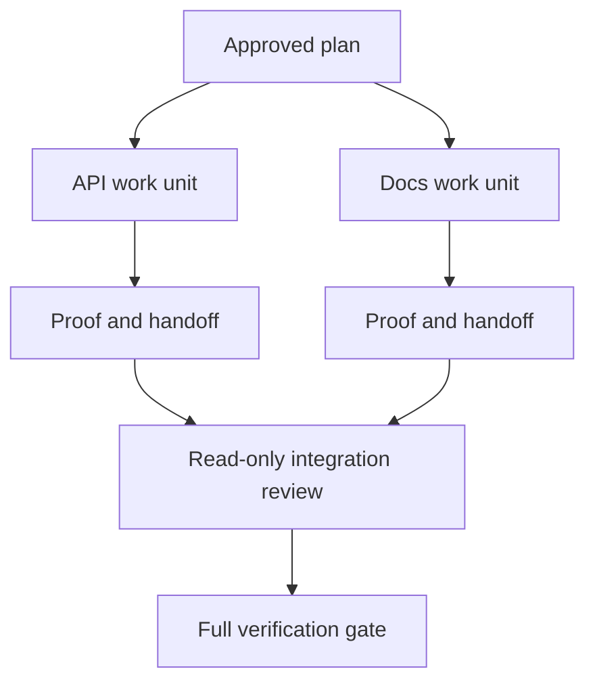

# 委托代理与隔离和合并合同合作

> 只有工作独立时才可以节省墙上的时间.否则,它们将一个清晰的任务转化为一个更快的失败率的协调问题.

**Type:** Learn + Build
**Languages:** Python (stdlib)
**Prerequisites:** Phase 14 lessons 39 and 44
**Time:** ~70 minutes

## 学习目标

- 决定是否由真正的独立性证明授权是合理的.
- 给每一个工人独家文件所有权和明确的证据.
- 计算执行波来自依赖.
- 设计一个合并合同,以安全地结合代理工作.

## 并行性测试

没有其他代理人可以委托,但至少有一个是真的:

- 两项调查可以独立回答不同未知的问题;
- 两个实施机构的文件和合同是分离的;
- 审查员可以在不改变完成的文物进行检查;
- 在本地工作继续时,可以进行缓慢的外部检查.

工作要保持序列,当代理人需要相同的文件,相同的未解决的决定,或相同的可变环境.

## 一个工作单位是一个合同

每个委托单位需要:

| Field | Meaning |
|---|---|
| Goal | One observable result |
| Owner | One accountable worker |
| Paths | Exclusive write ownership |
| Dependencies | Completed units required before starting |
| Proof | Exact evidence returned to the integrator |
| Handoff | Files changed, decisions made, remaining risk |

处理后端不是一个工作单位. 执行复制检查.`app/accounts.py`通过专注的账户测试证明它是.

## 隔离有三个层

1. **Filesystem isolation:**单独的工作树或沙盒可以防止意外共享编辑.
2. **Ownership isolation:**合同阻止两个工人故意编辑相同的路径.
3. **State isolation:**单独的日志和输出防止一个工人覆盖其他工人的证据.

文件系统隔离不能解决所有权.两个干净的工作树仍然可以产生相互矛盾的设计.合并合同必须在工作开始之前解决共享接口.



## 整合者不会重建工作

集成器应:

1. 确认每次交付符合其分配范围;
2. 阅读证明结果,而不仅仅是工人摘要;
3. 结合依赖顺序的变化;
4. 运行整个跨单位门;
5. 拒绝隐藏范围扩展;
6. 记录冲突作为新的决定,而不是默默的编辑.

如果整合需要重写一个工人的大部分结果,那么原始的分解是错误的.

## 人和代理人的角色

委托并不能消除人类的判断力.人类仍然拥有改变公共行为,风险,权威或不可逆转的成本的选择.代理人可以拥有有限的调查,实施,验证和审查.

这是一种校准自主性:系统在证据和反弹强度的情况下给予自由,并且在后果很高的情况下需要检查点.

## 建立它

实验室检查路径重叠,验证依赖性,计算安全执行波,并写`outputs/delegation-plan.json`现在,我们要去.

运行:

```bash
python3 code/main.py
python3 -m unittest discover code/tests -v
```

换个医疗单位,`app/`计划应该被阻止,因为这个母路线覆盖了API单元.

## 运动

1. 分解一个真正的变化成两个独立的工作单位和一个集成器.
2. 找到一个拟议的平行分区,看起来只独立.
3. 添加一个只读的研究人员,其输出是一个事实表.
4. 添加一个合并门,检查最后的更改文件组与所有单元合约.
5. 确定一个因依赖无效的工人取消规则.

## 进一步阅读

- [Reid Smith, The Contract Net Protocol](https://doi.org/10.1109/TC.1980.1675516)为了早期正式处理分布式任务分配和结果报告.
- [Eric Horvitz, Principles of Mixed-Initiative User Interfaces](https://dl.acm.org/doi/10.1145/302979.303030)机器人应该何时行动,何时将控制权归还给一个人.

## 你留下什么

保持`outputs/delegation-plan.json`它记录了分离是为什么安全的,每个路径是谁的,以及必须获得哪些证据的集成.
