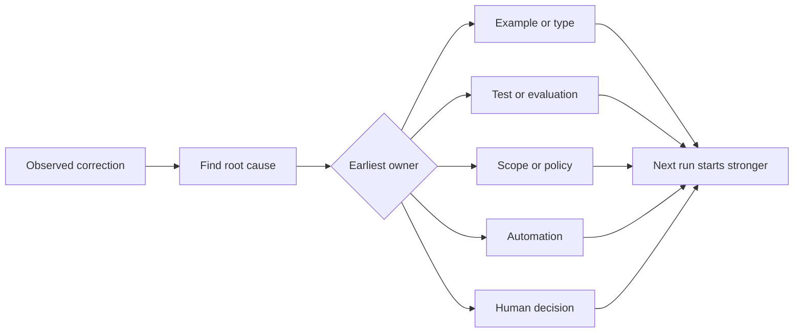

# 让每一个代理纠正都变成一个系统改进

> 只有在聊天中存在的修正,只能修复一个运行.

**Type:** Learn + Build
**Languages:** Python (stdlib)
**Prerequisites:** Phase 14 lessons 37 to 41
**Time:** ~65 minutes

## 学习目标

- 转换对应剂为耐用控制.
- 设置每个控制器在最早的层,以防止重复.
- 通过稳定的指纹复制重复课程.
- 退休控制器不再保护真正的风险.

## 纠正是证据

当你告诉代理人不要编辑该文件时,你已经知道范围界限是无法执行的.当你说出输出形状是错误的时,你已经知道一个例子或测试缺失了.当设置再次失败时,你已经知道环境知识属于自动化.

处理纠正是关于工作系统的观察,而不是简单的写作失败.

## 提升到最早的有效层

使用以下顺序:

| Recurring failure | Durable destination |
|---|---|
| Wrong result or regression | Test or evaluation |
| Off-scope or unsafe action | Scope or permission policy |
| Repeated setup or command mistake | Automation or tool |
| Repeated output-format mistake | Canonical example plus validator |
| Ambiguous local convention | Instruction with a scenario check |
| Product disagreement | Human decision record |

早期的控制更便宜.防止不有效状态的类型比后来发现的评论更强大. 专注测试比要求代理记住的段落更强大.



## 拉切记录

捕获:

- 症状;
- 根本原因;
- 结果;
- 复发数量;
- 选择的控制;
- 进行检查;
- 拥有者;
- 审查或退休日期.

避免每一次偏好,而是在复发或后果证明永久复杂时,促进纠正.

## 原因与症状的分别

 编辑的README是症状. 可能的原因包括:

- 任务允许存储器根;
- 文件被隐含认为安全;
- 计划的综合执行和文档;
- 两名工人拥有重叠的财产.

每个原因都属于不同的控制. 只是重复症状的规则,

## 控制也在衰退

旧控制器可能会发生冲突,膨胀的环境,并编码已经不存在的系统.每一个推广的规则都需要退休检查.

- 基础架构发生了变化;
- 强大的可执行控制取代了它;
- 由于未经经过任何有效的窗口出现故障,
- 控制的摩擦比它所防止的风险更大.

目标不是最长的指令文件,而是最小的系统,

## 建立它

实验室将纠正分类,将它们推广为控制,`outputs/feedback-ratchet.json`现在,我们要去.

运行:

```bash
python3 code/main.py
python3 -m unittest discover code/tests -v
```

添加两个不同的编写,相同的原因的纠正. 改善正常化,直到它们崩成一个控制器,而不会崩的不相关的故障.

## 运动

1. 根据最近的编码会议的五项修正,
2. 换一个散文规则一个可执行的测试.
3. 增加后果权重,以便立即促进严重的第一次发生.
4. 添加一个所有者和退休日期到实验室输出.
5. 检查现有代理指令,并仅在证明有更强的控制后删除.

## 进一步阅读

- [Basili, Caldiera, and Rombach, The Goal Question Metric Approach](https://www.cs.toronto.edu/~sme/CSC444F/handouts/GQM-paper.pdf)目标将目标转化为问题和操作测量.
- [Shinn et al., Reflexion](https://arxiv.org/abs/2303.11366)通过反痕迹来改善后期决策,而不会改变模型重量.
- [Madaan et al., Self-Refine](https://arxiv.org/abs/2303.17651)对于任务循环内部的反和修改.

## 你留下什么

保持`outputs/feedback-ratchet.json`作为助理工程的终结,它是未来工作台变化的输入.
