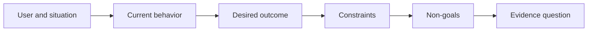

# 在选择产品之前,先确定结果

> 快速执行增加了选择错误的问题的惩罚.

**Type:** Learn + Build
**Languages:** Python (stdlib)
**Prerequisites:** None
**Time:** ~60 minutes

## 学习目标

- 写出一个结果框架,而不是命名一个解决方案.
- 识别用户,情况,当前的行为,以及所需的变化.
- 具体说明限制和非目标.
- 在溶液硬化到范围之前检测到溶液泄漏.

## 产出不是结果

构建一个事件助理命名输出. 它不说明谁需要它,什么变得更好,或者什么必须保持安全.

结果框架说:

> 随着生产警报的到来,现场工程师在两分钟内确定故障服务和安全下一步行动,而诊断仍然仅可读和可审计.

通过软件,运行簿,数据维修或更小的界面更改,

## 六部分框架

| Part | Question |
|---|---|
| User | Who experiences the problem directly? |
| Situation | When and where does it occur? |
| Current behavior | What happens today, including workarounds? |
| Desired outcome | What observable state should improve? |
| Constraints | Which safety, policy, cost, or compatibility limits are fixed? |
| Non-goals | What tempting adjacent work is excluded? |



## 找出解决方案

结果声明在包含未经证据获得的产品形式,界面,模型选择,框架或架构时泄漏解决方案.

- 用户收到每周的AI总结泄漏总结和序列.
- 用户在批准之前了解账户变化表示结果.
- 部署一个向量数据库泄漏基础设施.
- 审查期间可获得相关政策证据指出能力.

限制可以命名技术,当兼容性真正解决它.

## 限制保护结果

限制不是执行细节,而是现实目标的一部分:

- 在诊断期间没有产品写作;
- 应对事件时间预算内;
- 目前的审计活动仍然具有权威性;
- 没有新的运行时间依赖性;
- 访问性行为仍然不变.

通过违反限制而达到结果的建设并没有达到结果.

## 没有目标是限制的

没有目标阻止一个有用的片子变成平台.好的没有目标足以拒绝工作:

- 没有自动补救;
- 没有新的警报路由系统;
- 没有取代事件指挥官;
- 没有历史分析.

## 建立它

实验室验证了`OutcomeFrame`他写了`outputs/outcome-frame.json`现在,我们要去.

```bash
python3 code/main.py
python3 -m unittest discover code/tests -v
```

使用事件助理.验证器应标记拟议输出泄漏到结果中.

## 运动

1. 作为结果框架,将您的后期记录中的功能请求重写.
2. 增加一个限制,改变哪些解决方案仍然是可能的.
3. 加入两个非目标,保持第一块小.
4. 确定最早的观察,可以驳斥所需结果.
5. 写出三种不同的结果,可以满足相同的结果.

## 进一步阅读

- [Nuseibeh and Easterbrook, Requirements Engineering: A Roadmap](https://www.cs.toronto.edu/~sme/papers/2000/ICSE2000.pdf)对于对待现实目标而言,
- [Dardenne, van Lamsweerde, and Fickas, Goal-Directed Requirements Acquisition](https://doi.org/10.1016/0167-6423(93)为了使高层目标变得有限和运营要求.

## 你留下什么

保持`outputs/outcome-frame.json`下一堂课试验了人们实际的工作流程.
