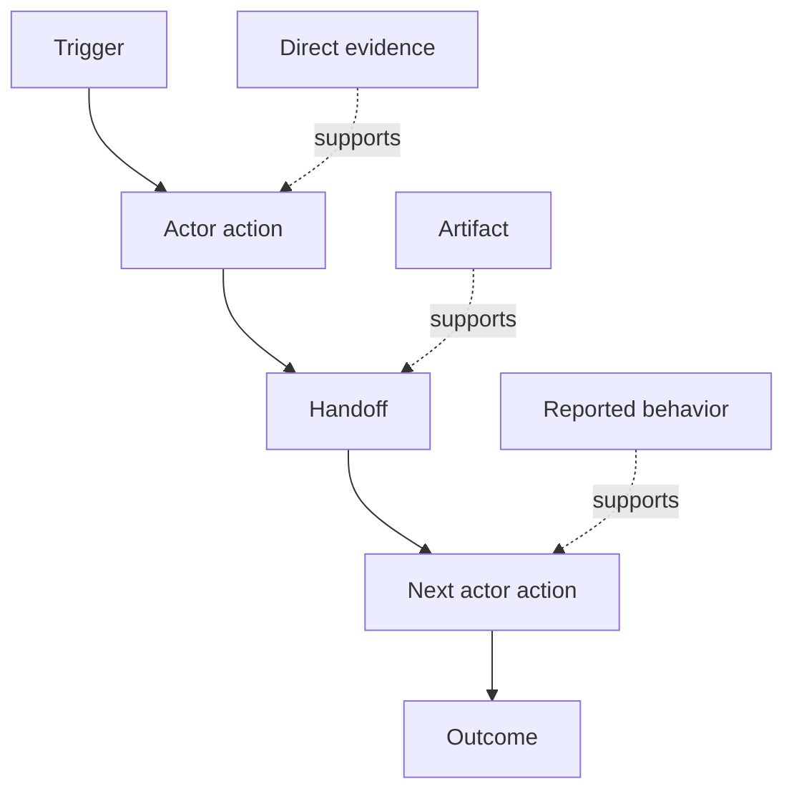

# 发现人们实际上做什么工作流程

> 要求不是在会议上等待收集,而是分散在行动,解决方案,记录和分歧中.

**Type:** Learn + Build
**Languages:** Python (stdlib)
**Prerequisites:** Phase 14 lesson 47
**Time:** ~70 minutes

## 学习目标

- 模型当前工作流程作为有序的行动,有证据.
- 单独的直接观察与报告或推断行为.
- 找出摩擦,交手,权威和隐藏状态.
- 让不确定的要求显而易见,而不是把它们变成要求.

## 开始使用当前系统

首先不要问人们想要什么特征,而是重新构建现在发生的事情.

记录每一步:

| Field | Example |
|---|---|
| Actor | On-call engineer |
| Trigger | Production alert arrives |
| Action | Opens alert, then searches dashboards |
| Input | Alert payload and deployment record |
| Output | Candidate service and owner |
| Friction | Context switching across three tools |
| Authority | Incident commander approves a write |
| Evidence | Screen recording, incident log, runbook |

工作流程比屏幕更大,包括等待,复制粘贴,侧路,批准,错误恢复以及人们已经停止注意到的步骤.

## 证据有实力

通过简单的证据梯度:

1. **Direct behavior:**观察,追踪,记录或系统事件.
2. **Artifact:**票,运行簿,日志,表格或完成输出.
3. **Reported behavior:**一个人描述他们的行为.
4. **Inference:**团队得出可能发生的事情的结论.

只有前两种直接证明当前的行为. 标签剩下的,这样信心不会沉默地膨胀.



## 寻找四件事

- **Friction:**复制努力,延迟,重新进入或恢复.
- **Hidden state:**记忆,聊天或个人笔记中的事实.
- **Authority:**允许人或系统进行后续变化.
- **Exceptions:**正常工作流程不再正常的情况.

由于幸福之路是唯一的道路,所以人工智能的特征在交付和例外时经常失败.

## 不要把分歧视为平凡

两个用户可以做不同的工作流程,有充分的理由.

- 不同角色;
- 风险水平不同;
- 遗产和当前流程;
- 专业知识差异;
- 实际的政策分歧.

平均工作流程无法描述任何人.

## 建立它

实验室存储了工作流程的每一步的证据,验证了订单和信任,计算了直接证据的比率,`outputs/workflow-evidence.json`现在,我们要去.

```bash
python3 code/main.py
python3 -m unittest discover code/tests -v
```

添加一个缺失部署记录的例外路径. 保持主序完整,并记录分支开始的地方.

## 运动

1. 没有人接受采访.
2. 面试用户,并标记所有仍缺乏直接证据的指控.
3. 增加一个权限界限和一个失败恢复步骤.
4. 没有合并的两个工作流程变体模型.
5. 确定一个提议的特征,它可以删除可见的步骤,但不影响隐藏的工作.

## 进一步阅读

- [Nuseibeh and Easterbrook, Requirements Engineering: A Roadmap](https://www.cs.toronto.edu/~sme/papers/2000/ICSE2000.pdf)尤其是它对诱导的处理,作为解释,建模和验证而不是简单的捕获.
- [Gotel and Finkelstein, An Analysis of the Requirements Traceability Problem](https://doi.org/10.1109/ICRE.1994.292398)要求与其来源之间的关系难以维持.

## 你留下什么

保持`outputs/workflow-evidence.json`观察到的摩擦和不确定性将在下课中变成一个假设地图.
