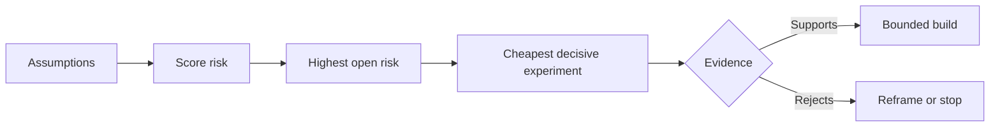

# 绘制假设,首先解决最危险的假设

> 路线图隐藏了某些特征的不确定性.

**Type:** Learn + Build
**Languages:** Python (stdlib)
**Prerequisites:** Phase 14 lesson 48
**Time:** ~65 minutes

## 学习目标

- 将拟议的工作转化为明确的假设.
- 分别评分影响,不确定性和不可逆转性.
- 选择下一个实验,以风险而不是热情.
- 取代经过测试的假设,用证据和决定.

## 每个建筑都包含了注

事件工具可能取决于所有这些都是真的:

- 警报环境包含足够的信息来识别服务;
- 工程师相信他们自己没有得到的建议;
- 需要的响应时间在运营方面是重要的;
- 要求的数据可以在不安全的权威的情况下访问;
- 工作流程发生的频率足以证明维护是合理的.

这些不是执行任务,而是构建的条件,使其具有价值,可用,可行和安全性.

## 假设类

| Class | Question |
|---|---|
| Value | Will the outcome matter enough? |
| Usability | Can the user understand and act on it? |
| Feasibility | Can the system produce it with available data and constraints? |
| Viability | Can the organization sustain cost, ownership, and operation? |
| Safety | Can it fail without unacceptable consequence? |

该功能是有用的不能测试的. 十名电话工程师中八名通过只读取结果更快地识别正确的服务.

## 风险不是一个数字

实验室使用1到5的三维度:

- **Impact:**如果假设是错误的,损害.
- **Uncertainty:**目前证据的弱点.
- **Irreversibility:**承诺后学习成本.

结果是为了让团队解释为什么一个未知的问题应该在另一个问题之前解决.



## 设计一个实验,而不是一个确认仪式

有用的测试包括:

- 可能是错误的索赔;
- 人口或现实样本;
- 观察到的结果;
- 在结果之前确定的门;
- 接下来决定通过,失败,以及模糊的证据.

避免测试,只能证明团队能够构建这个想法.

## 逆转性改变了秩序

具有高效性,不可逆转的选择需要早期的证据.只读的重播可以先于生产集成.临时适配器可以先于数据迁移.人类批准的建议可以先于自动行动.

建筑的形状应该遵循不确定性的形状.

## 建立它

实验室将假设排名, 区分测试的和开放的要求, 选择最高的开放风险,`outputs/assumption-map.json`现在,我们要去.

```bash
python3 code/main.py
python3 -m unittest discover code/tests -v
```

改变最高风险假设的证据,观察下一次实验的变化.

## 运动

1. 写出你想要构建的功能的五种假设.
2. 添加一个安全假设,您的功能列表遗漏.
3. 设定一个限制,让你停止建造.
4. 换一个大型实验,一个更便宜的决定性实验.
5. 比较风险排名与路线图优先级,并解释不匹配情况.

## 进一步阅读

- [Barry Boehm, A Spiral Model of Software Development and Enhancement](https://dl.acm.org/doi/10.1145/12944.12948)对于一个以风险为导向的发展周期,在更深入的承诺之前,解决不确定性.
- [Dardenne, van Lamsweerde, and Fickas, Goal-Directed Requirements Acquisition](https://doi.org/10.1016/0167-6423(93)通过"化"的方法,可以在消除障碍和限制的情况下实现目标.

## 你留下什么

保持`outputs/assumption-map.json`下一堂课时,我们用它来选择最小的证据.
