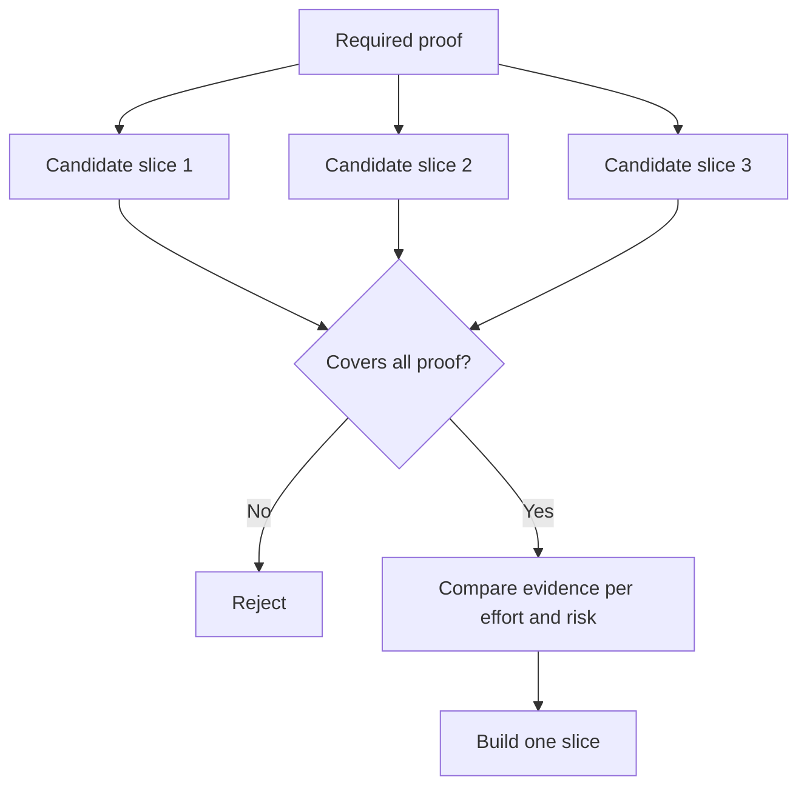

# 选择最小的部分,可以改变决定

> 只有当它证明了重要的事情时,一个小的构建才会改变下一个决定,只是不完整.

**Type:** Learn + Build
**Languages:** Python (stdlib)
**Prerequisites:** Phase 14 lesson 49
**Time:** ~65 minutes

## 学习目标

- 根据它证明的假设来定义一个部分.
- 均衡结果价值,减少不确定性,努力和后果.
- 偏爱可逆证据,而不是早产承诺.
- 拒绝省略工作流程的危险部分的切片.

## 垂直的证据 终结到终结

实用切片可以通过观察结果所需的最小实际工作流程.它可能是用户,数据,持续时间和能力的狭窄.它不应该通过消除你需要测试的确切不确定性来缩小.

举个例子:

- 通过10个真实事件进行阅读的重播,测试服务的身份和运营商的信任.
- 合成数据上的抛光仪表板可以测试理解性,但不能测试数据可行性.
- 生产自动调整器一次性测试一切,

## 首先确定所需的证据

假设是最有风险的,并将其转化为所需的证据集.

然后将可接受的片段进行比较:

| Dimension | Direction |
|---|---|
| Outcome value | More is better |
| Uncertainty reduced | More is better |
| Effort | Less is better |
| Consequence | Less is better |
| Reversibility | More is better |

实验室的成绩是故意简单的.



## 常见的虚假最低限度

- **The UI-only minimum:**消除数据和运营不确定性.
- **The infrastructure-only minimum:**证明技术可能性,而无用户价值.
- **The happy-path minimum:**没有任何例外,
- **The demo minimum:**能产生一种说服力的器件,但没有可重复的测量.
- **The platform minimum:**在一个工作流程获得之前,建立可重复使用的机器.

## 添加一个停止规则

在执行之前,写下如果切片失败发生什么情况:

- 放弃结果;
- 改变目标用户或情况;
- 测试不同的机制;
- 收集更好的证据;
- 进一步限制权力.

如果每一个结果都导致了保持建筑,那么切片不是实验.

## 建立它

实验室通过必要证据来过候选人,`outputs/slice-decision.json`现在,我们要去.

```bash
python3 code/main.py
python3 -m unittest discover code/tests -v
```

加入一个只证明一个要求假设的更便宜的候选人.即使其数值得高,它也应该不合格.

## 运动

1. 设计三片片,以达到不同的效果水平.
2. 在打分之前,请说明所需的证据.
3. 删除一个能力,同时保留决定性证据.
4. 给失败的飞行员添加一个停止规则.
5. 确定可重复使用的平台组件,该组件应等到切片完成后.

## 进一步阅读

- [Barry Boehm, A Spiral Model of Software Development and Enhancement](https://dl.acm.org/doi/10.1145/12944.12948)为了使每个发展周期与必须解决的风险相匹配.
- [Lenarduzzi and Taibi, MVP Explained: A Systematic Mapping Study on the Definitions of Minimal Viable Product](https://arxiv.org/abs/1609.07592)软件产品实践中最小和可行的模糊性.

## 你留下什么

保持`outputs/slice-decision.json`它记录了为什么这个片子是最小的改变决定.
