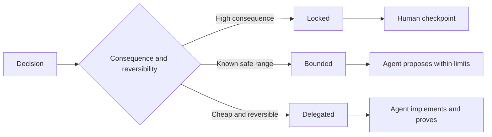

# 写出保存判断的具体说明

> 有用的规格可以修复变量和证据,同时让可逆的实施选择保持开放.

**Type:** Learn + Build
**Languages:** Python (stdlib)
**Prerequisites:** Phase 14 lesson 50
**Time:** ~75 minutes

## 学习目标

- 单独的结果,不变量,例子,非目标和证据.
- 标记决定为被锁定,限制或委托.
- 保持代理判断力,在选择便宜和可逆的情况下.
- 要求人检查点,

## 两种极端的恶性

过度指定任务要求代理猜测系统,过度指定任务要求它转载可能已经错误的设计.

有效的中位是可执行的合同:

| Surface | Purpose |
|---|---|
| Outcome | The observable result |
| Invariants | Conditions that must always remain true |
| Examples | Concrete cases that reveal intent |
| Non-goals | Adjacent behavior intentionally excluded |
| Decision policy | Which choices are locked, bounded, or delegated |
| Proof | Evidence required before completion |

## 三种决策方式

- **Locked:**代理人不得选择使用,用于公共兼容性,权威性,安全性,不可逆转的成本或产品承诺.
- **Bounded:**代理可以在明确的限制内选择.用于搜索预算,重复计算,允许的依赖性或已知界面家族.
- **Delegated:**经理拥有选择,必须解释它. 用于本地结构,名称,可逆的回变器和实施细节.



## 通过例子说明行为

  强,  生产准备的是无法执行的.一个小组的正常,边缘,失败和禁止的例子给了构建者和验证者都具备了具体的东西.

没有任何例子可以取代不变的元素.

## 证据必须与说法相匹配

- 一个单位测试证明了本地函数合同.
- 电线测试证明了序列化和运输行为.
- 浏览器的旅行证明了接口路径.
- 复制集证明了对代表性案件的行为.
- 审计日志证明了权限限制.

应不要接受低层作为高层的证据.

## 故意保存未知的东西

具体说明可以说: 执行程序可以选择任何在预算内返回的只可读的来源.

根据证据的变化,规格应不断变化. 保持锁定和限制的选择背后的原因,以便后来的团队可以在没有考古学的情况下修改它们.

## 建立它

实验室验证了每一个合同表面,检查了决策模式,`outputs/executable-specification.json`现在,我们要去.

```bash
python3 code/main.py
python3 -m unittest discover code/tests -v
```

移动生产写决策从锁定到委托.解释为什么方案接受值,而产品风险不接受.

## 运动

1. 转换一个后期票到六个规格表面.
2. 取代三个执行说明一个不变和两个例子.
3. 记住每一个决定,并证明每个被锁定或限制的选择是正确的.
4. 添加每一个不变的证明收据.
5. 消除没有证据或风险合理性的限制.

## 进一步阅读

- [Nuseibeh and Easterbrook, Requirements Engineering: A Roadmap](https://www.cs.toronto.edu/~sme/papers/2000/ICSE2000.pdf)对于目标,精确规格,验证,一致性和进化之间的关系.
- [Zave and Jackson, Four Dark Corners of Requirements Engineering](https://doi.org/10.1145/267895.267896)对于环境假设,要求和规格的分离.
- [Gotel and Finkelstein, An Analysis of the Requirements Traceability Problem](https://doi.org/10.1109/ICRE.1994.292398)为了保护要求的存在和来源.

## 你留下什么

保持`outputs/executable-specification.json`编码代理人和人类审查员的合同.
