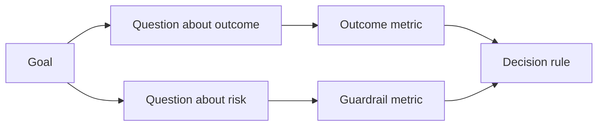

# 在结果出现之前设计成功指标

> 测量应该回答一个决定,而不是装饰仪表板. 首先要从目标开始,提问,然后选择回答这些问题的最小指标.

**Type:** Learn + Build
**Languages:** Python (stdlib)
**Prerequisites:** Phase 14 lessons 47 and 51
**Time:** ~70 minutes

## 学习目标

- 根据一个结果目标来提取问题和指标.
- 在观察结果之前,定义门,窗户,来源和方向.
- 结合结果指标与防护和反指标.
- 评估证据与建筑必须支持的决定相匹配.

## 目标,问题,指标

开始一个目标:

> 减少确定受影响服务的时间,而不会增加不安全的行动.

导出问题:

- 如何快速确定正确的服务?
- 检测到的服务是正确的多么频繁?
- 诊断是否只能读取?
- 工作流增加了警报的解雇或操作员的工作负载吗?

然后选择运行这些问题的指标.



## 测量需要合同

每个标准需要:

| Field | Example |
|---|---|
| Name | `median_identification_seconds` |
| Direction | at most |
| Threshold | 120 |
| Window | ten incident replays |
| Source | replay event log |
| Population | on-call engineers in the pilot |
| Kind | outcome or guardrail |

没有源头和窗口,一个数字不能复制.

## 结果,防护轨道和反测量

- **Outcome metric:**想要的状态有没有改善?
- **Guardrail:**一个固定的限制是否仍然是真的?
- **Counter-metric:**地方改进的转移成本或损害在其他地方吗?

对于一个事件工作流程,速度不够. 正确性,生产写作,操作员工作负载和错过的警报保护于快速但不安全的结果.

## 线上和在线证据

线下重播对于重复性和边缘覆盖性有用.一个有限的试点对于真实行为,信任和工作流的影响是有用的.

仅仅因为实施已经准备好,不要暴露真正的用户.

## 在你测量之前,做出决定

在看到结果之前,写出通过,失败和模糊的路径.否则团队将移动门以保护构建.

举个例子:

- 通过:正确的服务速度至少为0.9秒,平均时间最多为120秒;
- 产品输出或正确率低于0.75的任何产品输出率;
- 模糊:较小改进,变异很大,需要更大的重播集.

## 建立它

实验室验证了测量计划,评估包括在内的门值,记录缺失值,并写下`outputs/measurement-report.json`现在,我们要去.

```bash
python3 code/main.py
python3 -m unittest discover code/tests -v
```

删除防护轨迹指标,观察计划的无效性,即使结果指标仍然存在.

## 运动

1. 根据一个目标,可以提取三个问题.
2. 增加一个反衡量,以捕捉转移到另一个角色的成本.
3. 定义每个指标的来源,人口和窗口.
4. 在生成值之前,写出通过,失败和模糊的决定.
5. 确定一个容易收集的指标,但不能改变决定.

## 进一步阅读

- [Basili, Software Modeling and Measurement: The Goal/Question/Metric Paradigm](https://drum.lib.umd.edu/items/8119803a-362b-42ec-b6ce-2311713e7236)通过明确的目标来推导运营测量.
- [Basili, Caldiera, and Rombach, The Goal Question Metric Approach](https://www.cs.toronto.edu/~sme/CSC444F/handouts/GQM-paper.pdf)对于应用该方法作为反和改进系统.

## 你留下什么

保持`outputs/measurement-report.json`确定原型,试点或生产阶段的证据门口.
