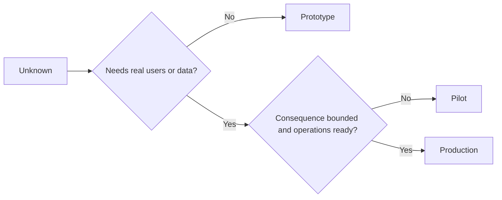

# 故意选择原型,试机或生产

> 选择一个可以对目前未知的情况进行反应的阶段,

**Type:** Learn + Build
**Languages:** Python (stdlib)
**Prerequisites:** Phase 14 lessons 50 to 52
**Time:** ~70 minutes

## 学习目标

- 选择一个不知名的构建阶段, 观众,数据,后果和准备.
- 确定具体阶段的控制和退出标准.
- 防止原型然变成生产系统.
- 延迟真正的权威,直到证据和操作证明它是合理的.

## 三个不同的问题

| Stage | Primary question |
|---|---|
| Prototype | Can this mechanism produce the evidence at all? |
| Pilot | Does it work safely with a bounded real audience and real conditions? |
| Production | Can we own it continuously at the promised reliability and risk level? |

试点可以使用生产数据,但观众和权威仍然有限. 当组织接受持续责任时,生产开始.

## 标型

使用原型,当未知不需要真正的用户或真正的数据时.

- 可拆除;
- 隔离;
- 行为有限;
- 关于学习问题的明确性;
- 没有虚假的运营保障.

在机器获得另一个阶段之前,不要优化架构.

## 飞行员

使用试点,当未知需要实际行为,现实数据或实际工作流程,但后果或准备尚未与广泛发布相容时.

飞行员需要:

- 已指定的观众;
- 人类所有者;
- 限期和权限;
- 审计和反弹;
- 输出和防护门值;
- 扩大,修改或停止的退出标准.

## 生产

生产需要不仅仅是部署:

- 服务水平目标;
- 电话及事件的所有权;
- 安全和隐私审查;
- 成本和容量控制;
- 逆转和恢复;
- 持续监测;
- 退休的路径.



## 阶段漂移

标记原型和试点界限,配置,访问控制,远程测量和文档.一个警告标志不够.

系统本身可以观察到这个阶段.

## 建立它

实验室从决策背景中选择一个阶段,返回所需的控制,并写下`outputs/stage-decisions.json`现在,我们要去.

```bash
python3 code/main.py
python3 -m unittest discover code/tests -v
```

试点例子将运行准备性降低到低效率,说明生产是否有其他证据.

## 运动

1. 根据学习阶段,而不是部署状态,分类三个当前项目.
2. 写出包括停止决定的试点退出标准.
3. 添加技术控制,防止原型达到生产数据.
4. 确定构建生产的第一项运营责任.
5. 设计一个对边界飞行员的回滚收证.

## 进一步阅读

- [Barry Boehm, A Spiral Model of Software Development and Enhancement](https://dl.acm.org/doi/10.1145/12944.12948)为了使每次代的承诺与解决风险相匹配.
- [Fagerholm et al., Building Blocks for Continuous Experimentation](https://doi.org/10.1145/2601248.2601276)对于持续运行实验所需的组织和技术条件.

## 你留下什么

保持`outputs/stage-decisions.json`它记录了每一个阶段是为什么合理的,以及哪些控制必须在下一个阶段之前存在.
