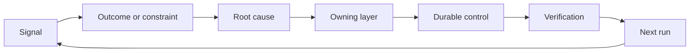

# 建立一个反机,拥有和退休

> 运输关闭一个构建循环,打开学习循环. 证据必须改变系统,否则它会变成无人拥有的远程测量.

**Type:** Learn + Build
**Languages:** Python (stdlib)
**Prerequisites:** Phase 14 lessons 46 and 53
**Time:** ~75 minutes

## 学习目标

- 让事件,评估,用户行为和纠正成为自己的行为.
- 调向每个信号的背景,评估,政策,运行时间或后期.
- 根据重度和频率优先考虑重复.
- 给所有控制者一个退休条件.

## 反是基础设施

团队可以收集痕迹,评估,支持票和事件日志,而不会从其中任何一个学习.缺失的机制是促进:从观察到持久变化的定义路径与所有者和证据.

循环是:

1. 观察一个具体的信号;
2. 连接到结果,约束或假设;
3. 确定最早的系统层,它是原因的;
4. 创造一个有限的变化;
5. 检查复发的可能性变得较小;
6. 审查是否应该继续进行控制.

## 进入拥有者层的路

| Signal | Destination |
|---|---|
| False positive, regression, wrong result | Evaluation or test |
| Missing context, duplicate work, stale fact | Context source or retrieval route |
| Unsafe action or authority gap | Policy or permission boundary |
| Timeout, retry storm, unavailable dependency | Runtime control |
| New product need or unresolved tradeoff | Shaped backlog item |

检测或许可可能使失败成为不可能时,不要再添加另一个提示段落.



## 拥有权是控制权的一部分

每个子行动都需要:

- 一个所有者;
- 基于后果和重复的优先事项;
- 变更的文物;
- 证明变化的验证;
- 审查或过期窗口;
- 退休条件.

没有任何改进,就是一个更好的格式化观察.

## 退休的常规控制

反系统会积累政策. 这种政策可能会变得矛盾和昂贵.

- 建筑或工作流程的变化;
- 低级不变量取代了高级指令;
- 已选定的窗口中未出现受保护故障;
- 控制阻碍合法工作的频率比防止伤害更高.

退休还需要证据. 不要因为它感觉老了而删除一个控制器.

## 连接构建和编码代理反

两条轨道都用同一条子:

- 产品证据改变了结果框架,假设,切片或测量计划.
- 编码代理的纠正改变了测试,背景,范围,自动化或转发.
- 事件可以改变产品界限和代理工作台.

这就是为什么构建不是在编码之前结束的阶段. 它在每一个被接受的变化中继续.

## 建立它

实验室分类信号,创建自己的动作,优先考虑它们,并写下`outputs/feedback-backlog.json`现在,我们要去.

```bash
python3 code/main.py
python3 -m unittest discover code/tests -v
```

添加运行时间停机信号,确认它将路由到运行时间而不是一般的滞后.

## 运动

1. 让一个事件和一个用户投诉变成刺行动.
2. 提前列出哪个可以防止每一次重复.
3. 添加验证命令或观察到实验室输出.
4. 确定保险规则的退休条件.
5. 追踪一个接受的纠正回到下一个任务框架.

## 进一步阅读

- [Basili, Caldiera, and Rombach, The Goal Question Metric Approach](https://www.cs.toronto.edu/~sme/CSC444F/handouts/GQM-paper.pdf)通过目标定向的测量来进行组织学习.
- [Fagerholm et al., Building Blocks for Continuous Experimentation](https://doi.org/10.1145/2601248.2601276)技术和组织循环,将证据与继续产品开发联系起来.
- [Nuseibeh and Easterbrook, Requirements Engineering: A Roadmap](https://www.cs.toronto.edu/~sme/papers/2000/ICSE2000.pdf)系统生命周期中不断发展的要求.

## 你留下什么

保持`outputs/feedback-backlog.json`产品判断和交付路径的结尾文物,以及进入下一个结果框架.
