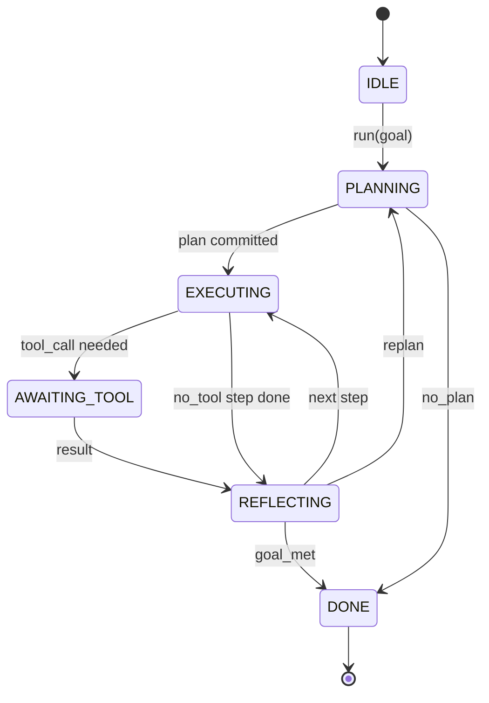

# 代理杆合同

> 导弹是代理,模型是共处理器,这个课程结了任何模型的循环合约.

**Type:** Build
**Languages:** Python
**Prerequisites:** Phase 13 lessons 01-07, Phase 14 lesson 01
**Time:** ~90 minutes

## 学习目标
- 指定一个代理圈作为一个明确过渡的确定状态机.
- 运营商将电线政策,远程测量和防护线路纳入的10个生命周期曲主题.
- 定义两个拉点,循环将控制权返回调用者,并在新输入中恢复.
- 执行每次会议预算 (转换,工具调用,墙钟) 并且不过度时会泄露部分状态.
- 发出11种事件类型的输入流,以便下游UI和跟踪器可以订阅,而不直接检查循环.

```figure
cf-loop-contract
```

## 框架

编码代理四十轮无监督运行,不是聊天循环.它是一个状态机,操作员可以拦截节点,操作员可以审计边缘.一旦你写下合同,交换模型,工具或政策不再是重构者.它变成了注册电话.

这一课构建了合同.我们命名了六个州,十个子主题,两个拉点,十一个事件类型,一个预算包裹. 工具登记器,JSON-RPC运输,发送器,规划器) 其他所有东西都插入了这个形状.

## 美国

循环有6个状态,5个状态是活跃的,一个状态是终端的.



`IDLE`只有一个合法入口点.`DONE`只有法律办法.`AWAITING_TOOL`只有一个引力点,其他转变都是内部的.

状态机是确定性的. 给出相同的事件日志,带重返相同的状态. 这种属性是允许你重播调试,而不需要重新调用模型.

## 子的主题

子是操作员的连接. 连接器开火十个主题. 每个主题都接受任何数量的订阅者.订阅者按注册顺序开火.订阅者可以改变有效载荷,升级取消转换,或返回哨兵跳过下一步.

```text
before_plan         after_plan
before_tool_call    after_tool_call
before_step         after_step
on_error
on_pause
on_budget_exceeded
on_complete
```

模板反映了2025年中旬的克劳德代码,库尔索和开源代码的融合.这些名称是功能性的,而不是标志性的.`rm -rf`住在`before_tool_call`子可以运送开放电气跨度.`after_step`一个恢复停顿的子生活在`on_pause`现在,我们要去.

## 引力点

循环给出了两次控制.`AWAITING_TOOL`没有工具的结果,它无法取得进展.`on_pause`预算耗尽,或者一个子明确要求人力审查.

拉动点不是例外,而是回报. 呼叫者检查了带状况,拿出了带要求的东西,然后打电话.`resume(payload)`带从停留的地方恢复. 这与Python发电机相同的形状. 运输在拉点是你的选择. 在TUI中,它是键盘. 在MCP上,它是`tools/call`在排队里,这是一个工作调查.

## 事件流程

循环将事件添加到合同中特定点的输入流中.该流只添加,用户可以从任何偏移中重播.实施的十一种事件类型是:

- `session.start`发射一次,当`run(goal)`称为
- `plan.draft` 发出计划者返回计划草案时
- `plan.commit` 作为活动计划的承诺后发行草案
- `step.start`每一步执行的开始发射
- `step.end`每一步执行结束时发放
- `tool.call`在需要工具的步骤给调用者提供控制时发射
- `tool.result` 发出简历,并附工具结果
- `tool.error`在简历上发出错误或断电话时
- `budget.warn`在预算限制达到时发行
- `session.pause`当循环在暂停时产生 (预算或)
- `session.complete`当循环达到时发射一次`DONE`

事件不会重复杆有效载荷.杆是必不可少的 (变化,中断).事件是观测 (记录,船).把它们视为直角.

## 预算包裹

一个会议包含三个限制.转数,工具调用数,墙钟秒.每轮增长一次.每次工具调用增长一次.墙钟在每次状态过渡时检查.当达到任何限制时,循环启动.`on_budget_exceeded`发射`budget.warn`之后转向`IDLE`在下一个拉动点上,

预算不是杀号开关,而是收益,调用者决定是否延长预算,恢复,还是关闭会议.

## 这一课不做什么

它不调用模型,它不注册真正的工具,它不实现运输.这是下一个四个课程.

确定性规划者在`main.py`它们是一个替代程序. 它返回一个硬码的计划,三个步骤,其中两个需要工具结果.

## 如何读取代码

`HarnessLoop`火,发射活动.`Budget`追踪限制.`Event`的字体是输入的字体.`HookRegistry`现在,我们要把它放在机上.`_transition`状态变化是唯一的函数,所以状态机的变化不变在一个地方.

阅读`main.py`读一读.`code/tests/test_loop.py`测试记录了每一个转移和每一个子发射命令.

## 走得更远

制造一个带的最困难部分不是国家机器.它使合同可执行.合同必须存活于规划器的热重装.它必须存活于一个返回错误的JSON的工具.它必须存活于一个子.`before_tool_call`试验中,这些试验都在执行失败模式,运行它们,打破它们,增加案例.

接下来课程将添加工具登记库.之后,JSON-RPC运输.之后,发送器.到第二十四课时,这个文件中的循环将与实际工具进行真正的计划,实际预算被执行.
