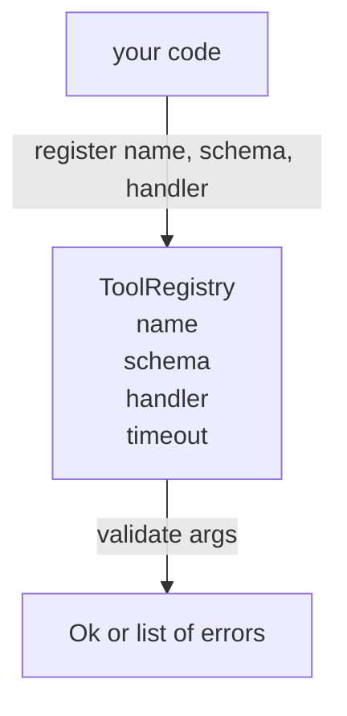

# 工具注册表与方案验证

> 工具不能验证的工具是代理不能调用的工具. 在构建工具之前,建立注册表和方案检查器.

**Type:** Build
**Languages:** Python
**Prerequisites:** Phase 13 lessons 01-07, Phase 14 lesson 01
**Time:** ~90 minutes

## 学习目标
- 保持一个输入的工具名称 → schema → 处理器登记,发送者可以一次询问,然后信任.
- 实现一个JSON Schema 2020-12子集,涵盖了工具调用中90%的关键字.
- 返回精确的,Json指针形状的错误路径,以便模型在一次回路中自行纠正.
- 拒绝重新注册,没有明确的覆盖,因为无声覆盖是生产工具目录的流动方式.
- 保持验证器纯净 (无输入/运输,无时间,无全球)

```figure
cf-registry-validate
```

## 为什么注册表在工具之前

2026年,编码代理的注册工具超过模型可以在单一的文本窗口中合适的数量. 无关紧要的带将记录200个工具,在任何转折时,表面上出现10到40个. 记录是"有什么工具","他们的论点有什么形状",以及"我叫什么处理器".

我们避免的错误是没有计划的运输手机,或者没有验证的运输手机.这两者都是共同的.这两者都将下一个层 (第23课中的发送器) 变成了一个猜测游戏,唯一的失败模式是从处理器那里的堆痕迹.

## 工具记录是什么样子

```text
ToolRecord
  name        : str          (unique, lowercase alphanumeric and underscore segments separated by dots, e.g., snake_case.segment.case)
  description : str          (one line, shown to the model)
  schema      : dict         (JSON Schema 2020-12 subset)
  handler     : Callable     (async or sync, returns Any)
  idempotent  : bool         (dispatcher uses this for retry decisions)
  timeout_ms  : int          (override per-tool dispatcher default)
```

验证器触摸的仅一个是该方案.处理器对此不透明.我们故意将它们分开.该方案是数据.处理器是代码.将它们混合诱惑你将验证逻辑放入处理器中,这是我们正在阻止的错误.

## 基于 JSON 方案 2020-12 的子集

整个2020-12规范是一篇论文.我们需要八个关键字.

```text
type           string / number / integer / boolean / object / array / null
properties     map of property name -> schema
required       list of property names
enum           list of allowed primitive values
minLength      integer, applies to strings
maxLength      integer, applies to strings
pattern        ECMA-262-compatible regex, applies to strings
items          schema applied to every array element
```

对于一个工具API所需要的内容来说,这足够了.我们不添加的关键字 (oneOf, anyOf, allOf, $ref,条件) 在生产方案中是有效的,但将验证器转化为一个循环的树步行器.我们正在构建一个注册表,而不是一个JSON方案引擎.

## 标志器错误路径

当验证失败时,验证器返回错误列表.每个错误都带有json指针路径进入输入.指针是属性名称和数组指数的斜率先定序列.

```text
{"a": {"b": [1, 2, "x"]}}
                    ^
                    /a/b/2
```

如果一个方案要求 模型读错误路径比它读句子更好.`args.user.email`如果模型通过整数,则错误应该是`/user/email`随着`expected_type: string`模型在下一次电话中没有自然语言的解决方案.

## 登记和过失

`register(name, schema, handler, **opts)`默认拒绝重新登记.`override=True`两个部分的代码库默默地注册相同的工具名称是生产中需要一周的错误.

登记库揭示了三种阅读方法.`get(name)`报价或升级.`validate(name, args)`返回一个`Ok`没有任何错误.`names()`返回工具名称以注册顺序.

## 验证器是什么,不是什么

它是单次通过图案树,复制性. 它是纯的. 它不调用处理器. 它不强迫类型 (一个字符串)`"42"`没有通过一个数字方案.

经验证通过后,恶意处理器仍然可能会行为不当.第二十三课中的发送器添加时间限和沙盒层.登记器添加形状.

## 形状



## 如何读取代码

`code/main.py`定义`ToolRegistry`现在`ToolRecord`现在`ValidationError`验证器发送在`schema["type"]`(或处理一个方案`enum`任何类型验证器都会返回一个空清单或一个列表`ValidationError`顶级步行器将错误连接在一起,并随着下降预先将路径段段.

`code/tests/test_registry.py`覆盖注册,过失,验证成功,验证失败,路径以及子集中的每个关键字.

## 走得更远

两次扩展将需要一旦这个课程落地`$ref`解决一个地方定义区块的问题,`additionalProperties: false`它们都很小,随着工具目录的增长,它们都增加了50个工具.

下一堂课 (二十二) 构建了JSON-RPC工作室运输,该系统将该注册表显示给模型客户端.
