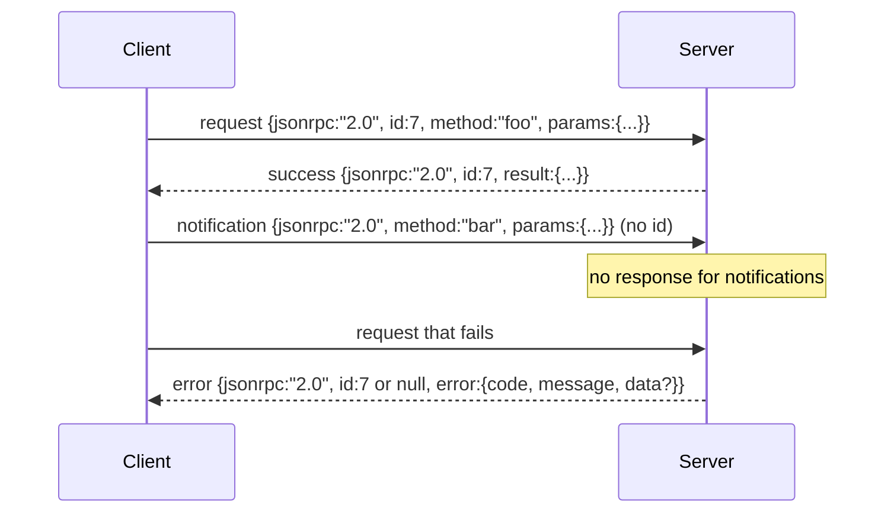

# 通过新线-限定的音频

> 模型客户端和工具服务器之间的运输是通过工作室进行JSON-RPC. 一旦手动滚动它,你会学到每个框架层都为什么付费.

**Type:** Build
**Languages:** Python
**Prerequisites:** Phase 13 lessons 01-07, Phase 14 lesson 01
**Time:** ~90 minutes

## 学习目标
- 采用JSON-RPC 2.0作为新线程的JSON框架,在 stdin 和 stdout 上.
- 绘制五个标准错误代码 (-32700, -32600, -32601, -32602, -32603) ,并用正确的语义来表现它们.
- 区分请求,响应,通知和批量,而不发明新的包裹密钥.
- 处理每行一个解析错误,而不致害其他流.
- 通过 io.BytesIO 构建一个自杀式演示,

```figure
cf-jsonrpc-frames
```

## 为什么JSON-RPC仍然是语言法语

2026年,一个编码代理会在一次会议中与12个工具服务器交谈. 每个服务器都是一个独立的进程或远程终端. 电线格式自2013年以来一直是相同的. 两个页面的规格. 它存活着,因为替代方案 (gRPC,每次呼叫的HTTP,定制二进制) 都会施加交易, 通过 stdio,sockets,websocket和HTTP,JSON-RPC是对称的,并且客户端可以驱动一个未见过的服务器,如果两者都尊重规格.

根据本课程的定义,我们可以使用一个字符串,一个字符串,一个字符串,一个字符串,一个字符串,一个字符串,一个字符串,一个字符串,一个字符串,一个字符串,一个字符串,一个字符串,一个字符串,一个字符串,一个字符串,一个字符串,一个字符串,一个字符串,一个字符串,一个字符串,一个字符串,一个字符串,一个字符串,一个字符串,一个字符串,一个字符串,一个字符串,一个字符串,一个字符串,一个字符串,一个字符串,一个字符串,一个字符串,一个字符串,一个字符串,一个字符串,一个字符串,一个字符串,一个字符串,一个字符串,一个字符串,一个字符串,一个字符串,一个字符串,一个字符串,一个字符串,一个字符串,一个字符串,一个字符串,一个字符串,一个字符串,一个字符串,一个字符串,一个字符串,一个字符串,一个字符串,一个字符串,一个字符,一个字符串,一个字符串,一个字符串,一个字符,一个字符串,一个字符串,一个字符串,一个字符号,一个字符串,一个字符串,一个字符号,一个字符号,一个字符号,一个字符,一个字符号,一个字符号,一个字符号,一个字符号,一个字符号,一个字符号,一个字符号,一个字符号,一个字符号,一个字符号,一个字符号,一个字符号,一个字符号,一个字符号,一个字符号,一个字符号,一个字符号,一个字符号,一个字符号,一个字符号,`\n`现在,我们要去.

## 电线的形状

客户端发言,服务器发言,



没有通知`id`如果服务器回复通知,客户端无法将其连接到呼叫站点. 这一单一规则使框架数学保持简单.

批量是请求或通知的JSON阵列.服务器以任何顺序的响应阵列回复,每一个不通知输入.如果批量的每个输入都是通知,服务器不会回复任何信息.

## 五个错误代码

```text
-32700  Parse error      JSON could not be parsed
-32600  Invalid Request  Envelope shape is wrong
-32601  Method not found
-32602  Invalid params
-32603  Internal error
```

服务器定义错误的代码为-32099 之间的代码.其他的所有内容都是应用定义的.课程坚持于五.如果你的处理器升级,运输将其包装为-32603 含有例外类名在`data.exception`现在,我们要去.

分析错误有一个特殊的规则.`id`答案是`null`由于请求从来没有被足够分析,

## 新线框和BytesIO演示

运输器一次读一行. 一行是直达包括在内的字节.`\n`如果不能解析一条线, 运输器会写出32700的答案`id: null`流量没有被毒害,下一条线被清新分析.

为了结束课程,我们要做一个`io.BytesIO`服务器读取请求到EOF,为每个请求写回复,然后返回.客户端读取回复.没有进程产生的.没有时间.运输行为与真正的子进程管道相同,因为Python的`io`接口呈现相同的`.readline()`其他`.write()`合同.

## 方法发送

运输机不知道哪些方法存在.`handler(method, params)`操作员返回结果或提高. 三类例外表现特定代码.

```text
MethodNotFound -> -32601
InvalidParams  -> -32602
Anything else  -> -32603 with exception name in data
```

运输器从来没有看到工具注册表. 记录器位于处理器后面. 这就是我们想要的层次化. 运输器说JSON-RPC. 记录器说工具形状. 发送器 (课二十三) 接它们.

## 流动错误行为

```text
client writes              server reads             server writes
---------------            -----------              -------------
{...valid request...}      parses ok                {...response, id matches...}
{...broken json...         parse fails              {id:null, error: -32700}
{...valid request...}      parses ok                {...response, id matches...}
{...missing method...}     invalid envelope         {id:X, error: -32600}
```

没有一个缺失的字符.`method`运输器继续读到EOF. 运输器将继续读到EOF.

## 通知和不对称流动

通知是放弃和忘记.该带使用进展事件,取消信号和日志行的通知.通知是长期运行的工具如何在每个工具中流动状态更新而不需要回路.

课程将实施一个出发通知助理,`write_notification`服务器使用它在请求飞行时发出进展.演示显示模式:请求进入,处理器发出两个进展通知,然后写出最终回复.

## 如何读取代码

`code/main.py`定义`StdioTransport`分析助手 (`parse_request`),三位写作助手 (`write_response`现在`write_error`现在`write_notification`),以及发送循环`serve`错误代码常量在模块范围下.

`code/tests/test_transport.py`包含五个错误代码,通知 (没有写回复),批量 (排列,排列,通知跳过),破碎的JSON (解析错误然后继续),以及处理器在调用中写通知的不对称流程.

## 走得更远

输出运输增加了三个东西. 相关性ID字段,在转发中存活 (您的`id`取消通道 (如:`$/cancelRequest`并且是内容类型的谈判握手,这样一个插座可以说JSON-RPC和流式HTTP.
