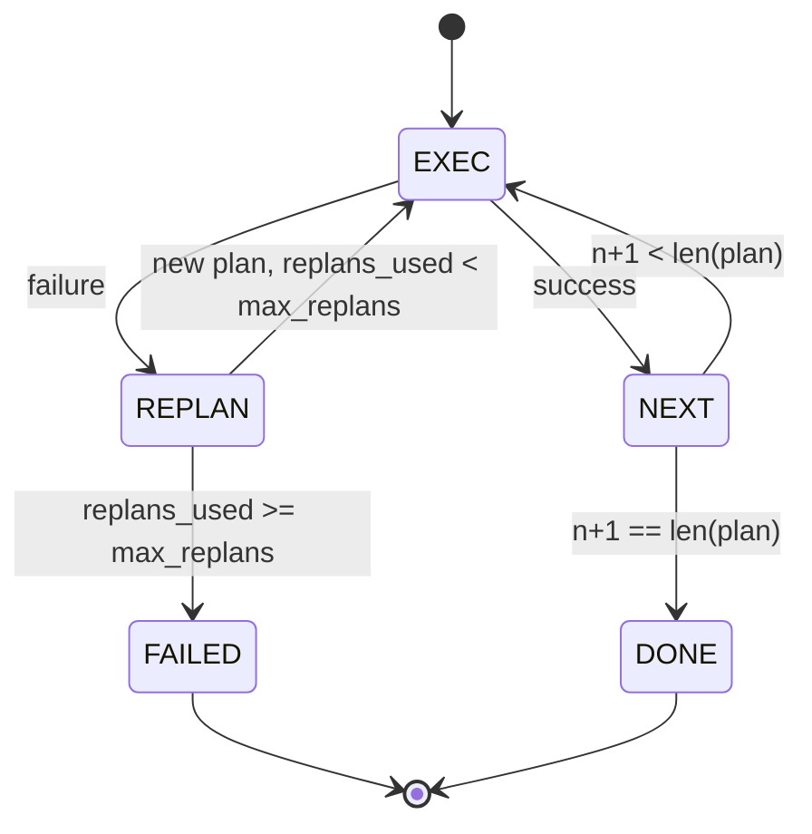

# 计划执行控制流量

> 一个无法生存的计划是脚本,一个能够重建的脚本是代理.

**Type:** Build
**Languages:** Python
**Prerequisites:** Phase 13 lessons 01-07, Phase 14 lesson 01
**Time:** ~90 minutes

## 学习目标
- 描述一个计划作为编写步骤的顺序列表,以便执行者可以考虑进展和结果.
- 执行步骤顺序,控制失败转移到规划器.
- 根据当前的线索标记,重新编写前一个错误,以便通知下一个计划.
- 每次修改时发出一个计划差异,以便下游追踪器或UI可以显示为什么计划改变.
- 执行两个预算:一个硬步骤天花板和一个硬重建天花板.

```figure
cg-plan-replan
```

## 计划和执行,而不是思考链

链思维代理发出代币,让循环猜测工具调用结束的地方.一个计划执行代理首先发出结构化计划,然后确定性地执行每个步骤.计划是数据,带可以内视.执行是通过发送器运行数据的带.

计划的执行者,执行者,执行者,执行者,执行者,执行者,执行者,执行者,执行者,执行者,执行者,执行者,执行者,执行者,执行者,执行者,执行者,执行者,执行者,执行者,执行者,执行者,执行者,执行者,执行者,执行者,执行者,执行者,执行者,执行者,执行者,执行者,执行者,执行者,执行者,执行者,执行者,执行者,执行者,执行者,执行者,执行者,执行者,执行者,执行者,执行者,执行者,执行者,执行者,执行者,执行者,执行者,执行者,执行者,执行者,执行者,执行者,执行者,执行者,执行者,执行者,执行者,执行者,执行者,执行者,执行者,执行者,执行者,执行者,执行者,执行者,执行者,执行者,执行者,执行者,执行者,执行者,执行者,执行者,执行者,执行者,执行者,执行者,执行者,执行者,执行者,执行者,执行者,执行者,执行者,执行者,执行者,执行者,执行者,执行者,执行者,执行者,执行者,执行者,执行者,执行者,执行者,执行者,执行者,执行者,执行者,执行者,执行者,执行者,

```text
1. Abort         (return failed, surface the error)
2. Skip          (mark step failed, continue with the rest)
3. Replan        (hand the error to the planner, get a new plan from the cursor)
```

复原是把剧本变成一个代理的.

## 步骤的形状

```text
Step
  id              : int           (monotonic within a plan revision)
  tool_name       : str
  args            : dict
  expected_outcome: str           (planner's stated success condition)
  result          : Any | None
  error           : str | None
```

`expected_outcome`计划器在修改计划时读取它;事件流则发出它,以便追踪器可以显示"这个步骤应该做X".

## 规划器的形状

```python
def planner(goal: str, history: list[Step], last_error: str | None) -> list[Step]:
    ...
```

纯粹的功能.`goal`对于用户来说,`history`是已经执行的步骤 (填写结果和错误).`last_error`计划器将从线索开始返回下一个计划.

计划者不知道执行者,他不知道重试,他不知道时间限制,他制造了一个计划.

## 执行者

执行器是一个小状态机器.每一步都通过发送器.结果是三个事情之一:成功,失败可重复计划,失败可致命.重复的失败将归还给规划师.致命的失败 (预算超出,重复计划天花板撞击) 返回一个`FAILED`会议结果.



## 计划的修改不同

计划后,执行者发出一个`plan.diff`活动有三个场地.

```text
removed: list of step ids that were in the old plan and are not in the new
added  : list of step ids in the new plan that were not in the old
revised: list of step ids whose tool_name or args changed
```

追踪器或UI可以将此作为删除步骤的突破和添加步骤的突出. 问题不是不同格式. 问题是修改是一个可见的事件,而不是一个默默的重写.

## 两项预算,两项预算都很难

`max_steps`根据第一个规则,执行者将拒绝重新规划并返回失败. 执行者将拒绝重新规划并返回失败.

`max_replans`设置后,计划器调用了第一个计划后的次数.默认是五次.这是更重要的限制.一个计划器连续五次返回相同的破产计划,否则会循环直到步骤预算抓住它.设置后的重新计划使故障更快,原因更清楚.

## 在这个课程中,确定性规划者

我们在这个课程中不称作模型.课程运输一个决定性规划者,`last_error`现在,我们要去.

```text
last_error is None    -> emit a four-step plan
last_error matches X  -> emit a three-step plan that routes around X
last_error matches Y  -> emit a two-step plan that gives up gracefully
otherwise             -> return [] (signals nothing to replan)
```

这足以测试执行者的行为在每个过渡路径:成功,重复计划一次,重复计划两次,重复计划耗尽,

## 结果形状

```text
SessionResult
  status      : "completed" | "failed"
  reason      : str     ("goal_met" | "step_budget" | "replan_budget" | "no_plan")
  history     : list[Step]
  revisions   : list[PlanDiff]
  events      : list[Event]
```

课二十节的带链循环可以直接读取.课二十三节的发送器是执行每个步骤的.课二十一节的注册表验证每个步骤的 args.课二十二节的输送将将整个流程通过JSON-RPC向模型客户端表面.

## 如何读取代码

`code/main.py`定义`PlanExecuteAgent`现在`Step`现在`PlanDiff`现在`SessionResult`执行者是单独的.`run(goal)`返回一个方法`SessionResult`计划差异通过比较步骤ID和`(tool_name, args)`两.

`code/tests/test_agent.py`计划中失败一次重新规划,重新规划退出的疲劳`failed:replan_budget`计划差异事件格式.

## 走得更远

首先,部分计划缓存:当一个计划成功的第三个六步骤,然后失败,你不想重新运行第三个.执行器已经保存历史;规划器只需要阅读它.第二,并行分支:当前执行器是严格的序列.一个发射独立分支的规划器 (`gather_step`没有`next_step`) 可以通过发送器同时进行两个工具调用.

两者都增加了真正的复杂性. 一旦把线性执行器固定起来,两者都更容易增加.
