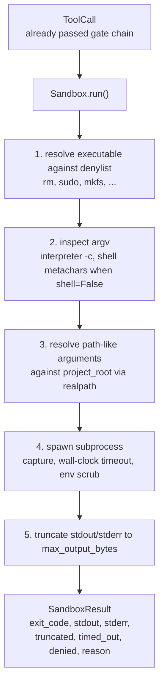
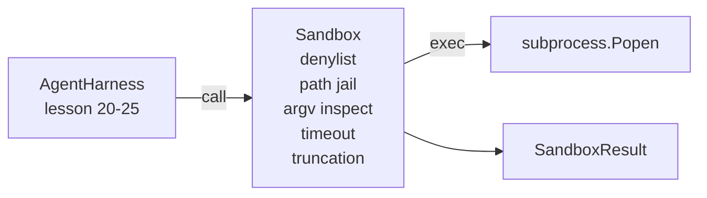

# 石头课26: 沙盒跑步者与丹尼尔斯和路径监狱

> 验证门决定是否应运行工具调用. 沙盒决定什么会发生. 这一课将运行一个子进程运行器,拒绝危险的执行器,拒绝危险的Argv形状,将每个文件路径关在项目根, 它是模型和操作系统之间坐落的两个层中的第二层.

**Type:** Build
**Languages:** Python (stdlib)
**Prerequisites:** Phase 19 · 25 (verification gates and observation budget), Phase 14 · 33 (instructions as constraints), Phase 14 · 38 (verification gates)
**Time:** ~90 minutes

## 学习目标

- 建立一个`Sandbox`班级包装`subprocess.run`随着时间的延期,捕获,和短节.
- 拒绝指令,以名义对抗一个丹尼尔斯特,而以结构对抗一个阿尔格维检查员.
- 拒绝任何在声明的项目根之外解决的路径参数.
- 当模式关闭时,拒绝子的元字符.
- 返回一个结构化`SandboxResult`能吸收下游可观和评估带.

## 问题

编码代理可以在一个转折中安装后门,除钥匙,造开发人员笔记本电脑,并起云账单.最不昂贵的防御是不给它.第二最不昂贵的是一个对一个精确的模式列表表示不愿意的沙盒.

经纪人痕迹中出现了三类失败.

首先是危险的执行工具. 一个压力下的模型来解决路径问题将试图`sudo`现在`chmod -R 777`现在`rm -rf`现在`mkfs`现在`dd`丹尼尔人以姓名和名捕获他们.

没有子的模型会通过解释器进行攻击:`python3 -c "import os; os.system('rm -rf /')"`现在`bash -c '...'`现在`node -e '...'`现在`perl -e '...'`沙盒需要知道任何翻译都用一个`-c`- - 像旗只是一个号,还有额外的步骤.

第三个是逃走路.`./src/main.py`而是读到`../../etc/passwd`沙盒通过解决每一个路径争论,将其锁定在牢房里.`os.path.realpath`并且说出前.

沙盒不是操作系统的安全界限. 具有代码执行的确定攻击者仍然可以爆发.沙盒是开发时间的防护轨道:它使常见故障模式响,并阻止代理因纯粹的不善行为而造成破坏.

## 概念



沙盒有四个拒绝轴:名称, argv,路径,结构.每个轴是调用的纯函数,尚未出现子进程.每个轴经过后,子进程只会产生.

其他`SandboxResult`退出码是常规的: 0 成功,非零失败,加上3个拒绝 (-100),时间_out (-101) 和缩短的哨兵码 (退出码是真实的,有标志设置). 下游课程读取了这个结构化结果而不是解析 stderr.

```figure
cg-path-jail
```

## 建筑



丹尼尔名单是可执行的基名列表.`/bin/rm`现在`/usr/bin/rm`) 所有的解析都以相同的基名. argv 检查员知道解释器的形状:任何 argv[0]是解释器的 argv,任何后来的 arg 始于 `-c`或`-e`子的特征 (`;`现在`|`现在`&`现在`>`现在`<`背部,`$()`) 要求拒绝,如果呼叫没有明确要求收购.

路径监狱是最微妙的部分.`project_root`任何看起来像一个路径的论点 (包含`/`通过 标准化,`os.path.realpath`结果是通过查看真路,而不是字面路径,阻止了Symlink逃离尝试 (项目根中的一个向外指的符号链接).

## 你会建造什么

实施是`main.py`另外还有一次测试.

1. `SandboxResult`数据类:出口_代码,stdout,stderr,缩短,时间_out,拒绝,理由,持续时间_ms.
2. `SandboxConfig`数据类:项目_root, max_output_bytes,时间_秒,丹尼尔列表,解释器_区块.
3. `Sandbox`类:`run(argv, *, shell=False, cwd=None)`返回一个`SandboxResult`现在,我们要去.
4. 内部拒绝助手:`_check_executable_denylist`现在`_check_argv_interpreter`现在`_check_shell_metachars`现在`_check_path_jail`现在,我们要去.
5. 通过清晰的输出切割`truncated`捕获的流域中的旗和标记线.
6. 下面的演示:一系列合法和反抗的呼叫.

沙盒使用`subprocess.run`随着`shell=False`默认的`capture_output=True`墙钟时间使用了`timeout`关于`TimeoutExpired`通过使用""的方法,

## 为什么这不是一个真正的沙箱

课堂沙箱不使用名字空间,cgroups,seccomp,gVisor,Firecracker或任何核层次的隔离.任何子工艺可以做的事情,沙箱可以做.保护是结构性的:代理被拒绝最常见的危险调用,而响亮的拒绝进入可观察性而不是沉默运行.

对于生产代理,你将层次上层:运行在一个不受特权的Docker容器里,运行在一个microVM里,放下功能,安装项目根只读写和一个划痕写读写,设置内存和CPU的限制,将环境扫描到一个已知安全的白清单. 第29课可以做一些.操作系统隔离是这个课程的范围之外.

## 运行它

```bash
cd phases/19-capstone-projects/26-sandbox-runner-denylist
python3 code/main.py
python3 -m pytest code/tests/ -v
```

演示程序创建了一个临时目录,将一个清洁的文件放入其中,然后运行电话的电池. 合法通话成功. 拒绝通话返回 SandboxResult`denied=True`时间限制是回来的.`timed_out=True`切割套件`truncated=True`测试将打印一个JSON结果表,然后输出零.

## 如何与A轨道的其他部分相结合

课25产生了门链.课26是门允许后运行的执行器.课27的评估利用比较了沙箱的结果与每个任务的预期出口代码.课28发出一个`gen_ai.tool.execution`跨度在每一个`Sandbox.run`课29的端到端演示线程通过两个层来传输一个真正的编码代理.
