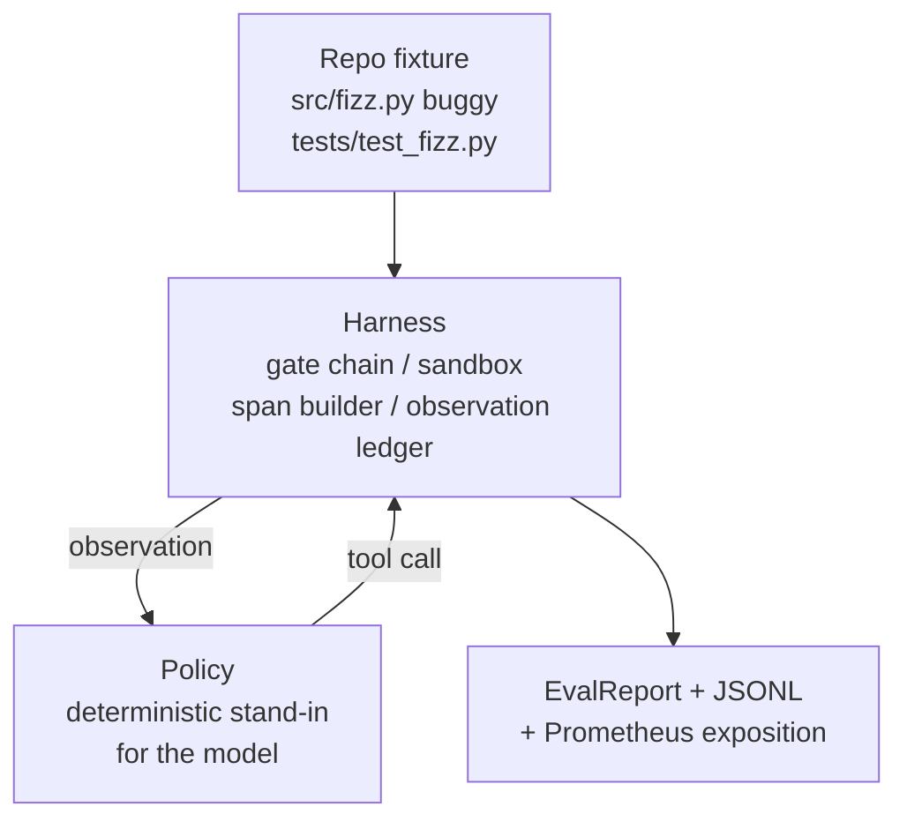
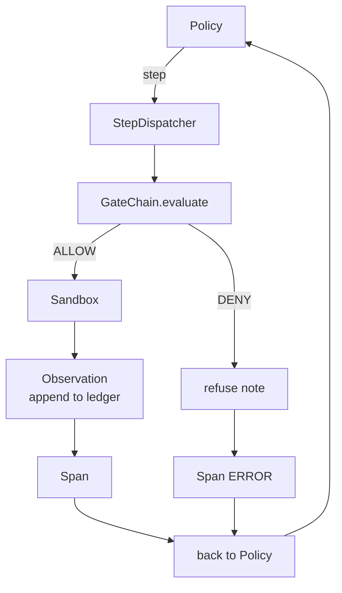

# 石29课: 终端编码剂在上

> 追踪A的回报. 这一课将门链,沙盒, eval 带,和OTel 扩展到一个工作编码代理, 代理是一个确定性政策,而不是一个 LLM; 替代使课程可复制, 合同是相同的:一个真正的模型插入了政策接.

**Type:** Build
**Languages:** Python (stdlib)
**Prerequisites:** Phase 19 · 25 (verification gates), Phase 19 · 26 (sandbox), Phase 19 · 27 (eval harness), Phase 19 · 28 (observability), Phase 14 · 38 (verification gates), Phase 14 · 41 (workbench for real repos), Phase 14 · 42 (agent workbench capstone)
**Time:** ~90 minutes

## 学习目标

- 组建门链,沙盒,评估带,和跨度构建器成一个单个代理循环.
- 执行一个确定性政策,使用 read_file, run_tests和 write_file来修复一个固定错误.
- 执行全球步骤预算加上观察代币预算在一段终端运行中.
- 发出完整的OTel GenAI痕迹和Prometheus指标,以实现完整运行.
- 检查代理在不到12个步骤中解决了问题, 没有任何法律工具的关门.

## 问题

许多代理演示都独立工作:一个沙盒,一个评估带,一个跨度发射器.它们看起来很好.

门链说允许,但沙箱拒绝, 评估器记录了通行,但Otel的范围说,门拒绝了代理声称使用的工具. 预测计器应增加两次, 监测预算超出了,但代理人继续继续,因为预算被追踪在链上,

这一课是整条轨道的整合测试. 经理必须做四件事:阅读项目,运行测试,识别测试失败的错误,写作修正,重启测试,停止. 每个操作都通过门链. 每个工具执行都通过沙盒. 每一步都包裹在一个跨度. 评估带在最后得分整个东西.

## 概念



代理的政策是州机器.

`SURVEY`项目列表:经纪人读取项目列表. 下一个状态是RUN_TESTS.

`RUN_TESTS`测试机器成功停止,否则下一个状态是INSPECT.

`INSPECT`接下来是FIX.

`FIX`接下来是 VERIFY.

`VERIFY`试验命令再次执行. 如果测试通过,停止成功.否则停止失败.

每个状态都与工具调用相匹配. 每个工具调用通过门链. 如果一个工具调用被拒绝,代理在追踪中报告拒绝并停止.

设备的错误是个单独的`fizz.py`确定性政策通过regex检测失败消息检测到错误并发出纠正的文件.将该政策取代为LLM不会改变使用合同.

```figure
cg-harness-weave
```

## 建筑



每个前课原始的每一个课程都在最小的规模上重新实施.`main.py`它们的名称与25-28课程相匹配,所以概念地图是明确的.

## 你会建造什么

`main.py`船舶:

1. 简单的带原始, 复制与25-28课程相同的名字:`GateChain`现在`Sandbox`现在`ObservationLedger`现在`SpanBuilder`现在`MetricsRegistry`现在,我们要去.
2. `CodingAgentPolicy`五个状态的状态机.
3. `Repo`助手:用捆绑的车装置做出痕.
4. `AgentRun`类:驱动保险,通过带,返回一个`AgentRunReport`现在,我们要去.
5. 捆绑式装置 (`fixture_repo/`) 配合 src/fizz.py, tests/test_fizz.py,以及预期的/对 eval 带的树.
6. 演示:从端到端运行政策, 打印一步一步的跟踪, 确认通过, 打印指标.

组装的固定件与27课任务结构相同的形状:一个buggy文件和一个测试文件.测试失败消息包含足够的信息,使得确定性政策能够识别解决方案.一个真正的LLM将做同样的工作,慢慢和更广泛的回忆,但它不会改变带的期望.

## 为什么政策不是法定士

实际的LLM需要API密钥,网络调用,以及无法验证的 stochasticity. 带是课程关心的部分. 确定性政策中 Subbing 允许课程在任何开发者笔记本电脑上运行,并且允许测试套件确切地计算步骤.

课程的政策是一个严格的子集,一个LLM代理所做的.政策阅读了备忘录,看到失败的测试,识别了线路,并发出了修正.一个LLM通过相同的循环与相同的使用合同;会计是相同的.

## 演示所说的

测试组将程序性地重新确认它们.

政策在不到12步的时间里解决了这个问题.

观察预算从未过度过.

没有人能说,我在这个问题上,

每一步都在线路上有相应的跨度.

普罗梅泰斯的展览包含一个`tools_called_total{tool="read_file"}`进入和一个`tool_latency_ms`瘤图

## 如何与A轨道的其他部分相结合

这一课是集成. 第25课写了门链. 第26课写了沙箱. 第27课写了评估带. 第28课写了可观性. 第29课证明它们作为系统工作. 从这里开始,一个真正的代理带延伸到:换取确定性政策为模型,换取捆绑的固定物为实体复制任务,换取JSONL出口者为OTLP.

## 运行它

```bash
cd phases/19-capstone-projects/29-end-to-end-coding-task-demo
python3 code/main.py
python3 -m pytest code/tests/ -v
```

测试打印每步的跟踪,最终评估报告和Prometheus曝光.出口代码为零.测试涵盖政策状态转变,合成工具调用的门拒绝,捆绑的装置的端到端运行和步骤预算不变.
