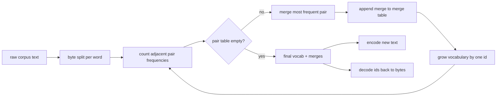
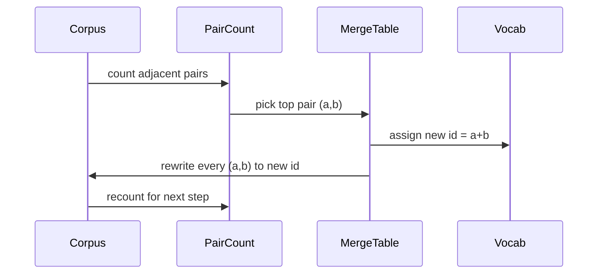

# 从零开始的BPE标记器

> 构建每个现代文本模型仍然从哪里开始的代币.

**Type:** Build
**Languages:** Python
**Prerequisites:** Phase 04 lessons, Phase 07 transformer lessons
**Time:** ~90 minutes

## 学习目标
- 通过重复合并最常见的邻近符号对来从原始文本体中训练字节对编码词汇.
- 实现确定性结合表,并将其应用到新文本中,以生成子词ID的流.
- 无需输入信息,即可输入信息.
- 储备和保护特殊代币 (`<|endoftext|>`现在`<|pad|>`它们可以生存在训练和解码中.
- 为什么字节级字母是一般用途代码符号的合适地板.

```figure
cap-bpe-merge
```

## 框架

语言模型从来没有看到文本. 它看到整数. 从字符串到整数列表的地图,然后是代码符号. 错误地理解这个层,训练过程中的每个损失曲线都测量了错误的东西.

对于一般文本模型的子词代码符号的主要家族是字节对编码. 这个想法很小.从已知字母开始.在训练组中最常出现的相邻符号对找出.将其融合到一个新的符号中.重复直到词汇达到目标尺寸.编码新文本使用相同的并列列.

我们将构建字节级别的变体.字母是256个原始字节,而不是Unicode代码点.这个选择是允许代币器处理任何UTF-8输入,而不需要回到未知的代币.

## 管道



训练侧和推理侧共享 merge 表. 合同是共享. 如果在推理时改变 merge 顺序,你将解码一个不同的 ID 流.

## 字节字母

首先,256个ID为原始字节0x00到0xFF保留.这保证每个输入字符串在任何合并发生之前可以在词汇中表达.在字节块之后,我们为特殊代币保留了一个小范围.训练循环从来没有提出这些ID作为合并目标,因为我们完全将它们排除在预定的流中.

预测器在训练之前将体积分为白空间和点击界限.没有这种分离,BPE 合并步骤会很高兴地学习跨越词界限的合并,词汇库充满了整个普通短语.随着分离,合并留在一个词内,结果将通用化.

## 训练循环

循环对每一步进行了三项操作.它在体积中走过每一个词,并计算出每个相邻的当前符号的出现频率,按词本身的出现频率进行权重.它选择了最高数量的对.它将该对的每一个出现重写成一个新的符号,其ID是词汇中的下一个自由插槽.然后记录了合并.



每一步的成本是以象征序列列列表表达的体积为线性的.对于百万个字和一万个标识的目标词汇,循环在几秒钟内完成,因为随着合并而降落,象征序列缩小.

## 编码新文本

推理不调用合并计数器.它用它学习的顺序来应用合并表.对于一个新词,编码器从字节分区开始.它扫描当前的序列,寻找最低排名的合并 (最早的应用).它执行该合并.它再次扫描.循环结束时没有合并在表中适用于当前的序列.

排列排列是使编码确定性和匹配相同输入的训练行为的属性.首先学习的结合位于表顶部,然后首先应用.如果两个结合可以在同一位置应用,则较低排列的结合赢得.

## 特殊代币

特殊代币是字节流永远无法生成的ID. 我们将它们手动预备.两个足够用于这个课程.

- `<|endoftext|>`预训练期间将文件分开. 它告诉模型"一个新的文件从这里开始,不要让前一个文本的背景泄露.
- `<|pad|>`子可以是矩形子,而损失面具在训练期间隐藏它.

编码器接受一个旗,允许输入中的特殊代币.`<|endoftext|>`其他`<|pad|>`字符串将被将其标记为标记字节,并且不会被任何一个字符串合并.

## 往返保证

编码后,解码必须返回输入字节.解码器将每个 id 的字节扩展连接.由于每个 id 是原始字节或是以前已知的两个 id 的连接,复式扩展总是以原始字节结束.解码后返回这些字节拼写的 UTF-8 字符串.

在本课程的测试套件检查了这个属性,在一个未见的句子上,在一个用 Unicode 符号表情符号的句子上,`<|endoftext|>`标志.

## 这一课不做什么

它不会按照最大的生产代币器的风格建造以regex驱动的预代币器. 预定式是一个小的白色空间和分区. 只有在一个小的培训组中进行合理的合并,与其他课程链的合同保持不变. 下一堂课将代币器视为一个黑盒子,

字符串的数值不等于对数.在Python中,一个循环在几千个字体上完成在不到一秒钟.对于较大的字体来说,显而易见的举动是平行计算每个字的对,然后减少.

## 如何读取代码

`main.py`定义了四个对象.`BPETokenizer`包含词汇库,合并表和特殊标志表. `train`训练循环.`encode`论的路径.`decode`底部的演示符号将一个小型代币器在内置的体积上训练,编码一个长期的句子,解码了ID,然后打印了两者.`code/tests/test_bpe.py`定回路属性,特殊代币预订,并购订单.

运行演示. 然后将演示中的目标词汇大小从300变为600,看看被保留的句子的编码长度如何下降.
