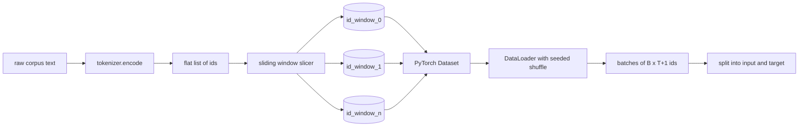
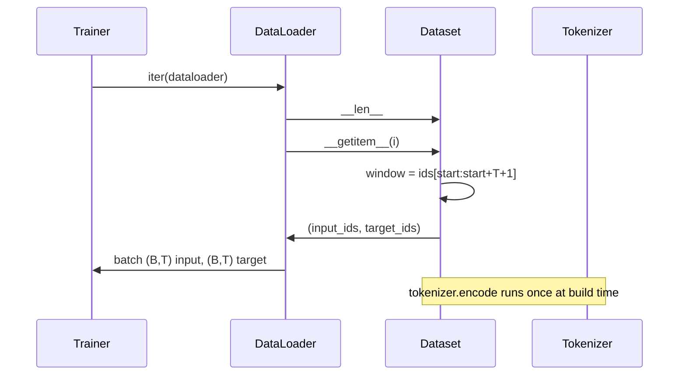

# 随着滑动窗口的代码数据集

> 预训练运行是从代币ID到梯度的函数. 这一课构建了输送器,

**Type:** Build
**Languages:** Python
**Prerequisites:** Phase 04 lessons, Phase 07 transformer lessons, Lesson 30 of this phase
**Time:** ~90 minutes

## 学习目标
- 通过一次打电话给代币器,将原始的代码转换为代码身份证.
- 切割 id 流成固定长度的窗户,设置可重叠的步骤.
- 建立一个 PyTorch 数据集,以返回输入和目标数,以预测下一个代码.
- 包装数据集在数据载体中,以每个时代种植的确定性混动.
- 关于步伐,冗余性和有效数据集规模之间的交易理由.

```figure
cap-sliding-window
```

## 框架

预训练运行一次读取一批代币ID,并更新模型.每个批次的形状由训练合同确定.对于因果语言模型,批次保持`(B, T)`输入身份证`(B, T)`目标ID是一个被一个移动的输入.数据管道的工作是从可能数千兆字的原始文本中,以确定性和可复制的方式,根据需求生成该合同.

通过一个自动滑动窗口将这些列表切成训练示例.一个定制数据集将这些示例作为子暴露出来.一个数据载体将它们分组并将它们混入一个已知种子.

## 形状合同

因果性LM消耗形状的ID`(B, T)`在哪里`B`是批量大小和`T`目标在位置`t`是位置的输入`t+1`这意味着每一个训练例子都包括`T+1`窗口步数控制连续示例之间存在多少重叠.



如果最后一个窗口没有足够的身份证,`T+1`子在子上,把它放下.`<|pad|>`对于这个课程,我们放弃了.

## 为什么有滑窗?

如果模型只看到不重叠的窗户,每个训练示例都会教它同样.`T`调整步骤将这些边界移动,使模型看到更多的不同预测下一个代码任务.

一步的步骤`T`它们的窗户是不重叠的.`T // 2`它们的数据集是可靠的,`1`产生的最大重叠和增加数据集的因子`T`预训练跑步的步骤大多是与文本长度相同,因为体积已经比模型在一个时代完成的更大,因此边界多样性论点较弱.

## 数据集类

 PyTorch 数据集需要两个方法. `__len__`返回了示例数量. `__getitem__`输入到它中将窗口的开始计算在飞行中,因此内存成本是 id 流的一副本,无论步骤产生多少个例子.



变量发生在内部.`__getitem__`数据集返回`(input, target)`在哪里`input = window[:-1]`其他`target = window[1:]`训练循环将它们视为地面真理.

## 确定性混动

具有数据载荷器`shuffle=True`通过通过一个明确的`torch.Generator`没有种子,两个运行看到数据在不同的顺序,损失曲线因与变化无关的原因而分离. 没有种子,两个运行看到数据在不同的顺序,损失曲线因变化而分离.

在这堂课中,种子合约很简单.`epoch_seed = base_seed + epoch_index`基础种子在建造过程中传递. 时代指数由训练师在每个时代的顶部增加. 运行一次与相同的基础种子时刻都会看到相同的顺序.

## 批量样本器

在 PyTorch 中,默认样本器随机选择标志,并非取代.这是我们需要的预训练.在一个小数据集上,合同是相同的.`__getitem__` `B`由于每个例子的结构长度都相同,所以不需要填充逻辑.

课程是持续的`num_workers=0`在生产中,工人将生产的过程与工人相对.`__getitem__`由于工作只是内存子的一部分, 但相同的数据集API支持工人清洁.

## 计数例

对于一个长度的ID流`N`文本长度`T`,一个步骤.`S`其他例子`max(0, 1 + (N - (T + 1)) // S)`课程将此计算作为数据集上的静态方法,以便教练可以计算每个时代的总步骤,而不需要再演变.

## 这一课不做什么

对于数百万个ID的体积,它远不到一百兆字节,并且是课程的正确形状. 磁盘流是一个独立的问题,它通过更换存储器来插入,但保留数据集合约.

它不处理多份文件. 集体被视为一个连续的 id 流. 下一个文件边界是通过插入编码的.`<|endoftext|>`模型学会在边界周围预测.

## 如何读取代码

`main.py`两个类和一个助手.`SlidingWindowDataset`光电数据集`make_dataloader`返回一个配置的数据载体,并使用种子生成器. `_encode_corpus_to_ids`底部的演示程序构建一个小型的代币器,编码一个内置的体积,构建数据集和数据加载器,打印一个批量,并确认形状合约.`code/tests/test_dataset.py`定窗口数值公式,一个对一个的转移属性,确定性混合和步骤交换.

运行演示. 然后从16变为32的文本长度,看看每时代的例子数量如何下降.
