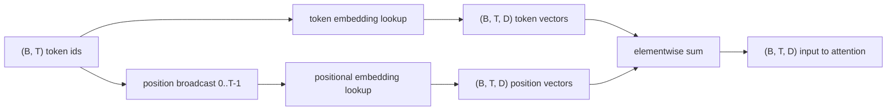
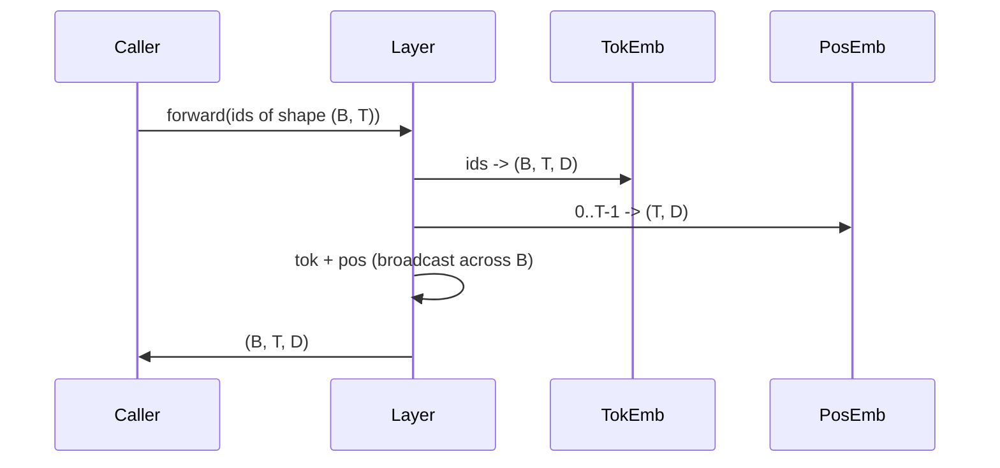

# 标志和位置嵌入

> 模型需要向量.两个查找表坐在他们之间,选择位置的一个塑造模型可以学习什么.

**Type:** Build
**Languages:** Python
**Prerequisites:** Phase 04 lessons, Phase 07 transformer lessons, Lessons 30 and 31 of this phase
**Time:** ~90 minutes

## 学习目标
- 建立一个嵌入符号的搜索表,将词汇标识映射到密集向量.
- 建立一个按位置索引的学习位置嵌入式查找表.
- 建立一个固定的鼻状位置嵌入,按位置索引,没有参数.
- 组合代币和定位嵌入式为变压器块的单个输入.
- 长度概括和参数数数的对比学和阴影形嵌入式.

```figure
cc-embedding-lookup
```

## 框架

模型与代币ID的第一个接触是代币嵌入矩阵中的一行查找.矩阵每个词汇ID有一个行,每个模型维度有一个列.查找返回一个向量,其余模型将其视为代码的意义.后方向更新了前进传递中使用的行列.在训练中,这些行列的几何学学会在方向中编码相似性.

只有代币身份证就没有序列. 模型需要第二个信号,告诉它位置1与位置17不同. 对于该信号的两个主要选择是学习的位置嵌入 (第二个查找表,每位置一行) 和固定的鼻状位置嵌入 (没有参数的数学公式). 这种选择有后果. 学习表是一个参数,由模型训练的最大文本长度来界定. 理论上,一个阴影形表是没有参数的,公式扩展到任何位置,但这门课程是`SinusoidalPositionalEmbedding`预计一个固定表在`max_context_length`其他`forward`模型可能仍然在经历训练长度,即使表是足够大的以索引.

这一课构建了两者,并将它们构成一个单个输入符号,

## 形状合同

嵌入阶段的输入是一个批量形状的标志 ID `(B, T)`输出是形状子`(B, T, D)`在哪里`D`任何批量元素的背景长度都相同`T`每个位置都有相同的向量尺寸`D`现在,我们要去.



总结是总和,而不是连接.`D`通过网络的恒定,使模型根据每个特征决定符号意义或位置是否在每个层中占主导地位.

## 符号嵌入矩阵

符号嵌入是形状参数子`(V, D)`在哪里`V`字母是字体的尺寸.`nn.Embedding(V, D)`在 init 中,输入是从小的高斯式中得到的,传统上是平均零和标准偏差大约`0.02`对于变压器尺度模型来说,精确的 init 比在运行中保持一致的更少.

向前传递是单次索引操作.`(B, T)` int64 个体`(B, T, D)`后行仅积累了触及前行的行列的梯度.两行从未出现在批量中得到的梯度是零的.

细节.模型末端的代币嵌入和输出投影通常共享重量 (重量绑定).当这种情况发生时,每次倒退的传递都通过输出侧触及嵌入的每一行.这里的课程都将它们作为单独的模块暴露出来,但同一矩阵可以在完整模型中发挥两个作用.

## 学习的位置嵌入

学习的位置嵌入是第二个`nn.Embedding`形状`(max_context_length, D)`搜索按位置ID键进行`0, 1, 2, ..., T-1`发射向前传输,将该位置向量传输到批量维度.

学习表的缺点是,它不能在位置上查询.`T`如果模型只训练到位置`T-1`仅使用这种方案的生产解码器模型将最大的文本长度放入了架构中,拒绝处理更长的输入.

## 状位置嵌入

位置向向量函数.`p`功能`i`产品

```python
angle = p / (10000 ** (2 * (i // 2) / D))
emb[p, 2k]     = sin(angle)
emb[p, 2k + 1] = cos(angle)
```

函数没有参数.每个位置都有一个独特的向量.波长在各个特征维度之间几何变化,因此较低维度编码粗大位置,较高维度编码细位置.

选择后的财产`sin`其他`cos`总体而言,在位置上的向量`p + k`是位置上的向量线性函数`p`这使得注意层能够学习相对位置偏移的简单途径.模型不需要单独的参数来表达"看五个代币".

课程计算了整体阴形表,在构建时,并将它指数列出在前面时间.

## 组成

输入管道排序上做了三个事情.阅读代币ID,查找代币向量,添加位置向量,返回总数.



总体阶段的广播重复了`(T, D)`随着波动的尺寸,PyTorch自动处理,因为位置子有形状.`(1, T, D)`在不挤后.

## 对比分析

课程将两种变体都运行在同一输入上,

首先是参数数. 学习的变体添加了`max_context_length * D`符号嵌入的参数上方. 阴影形变体增加了零.

第二个是,在邻近位置的嵌入式之间的共数相似性. 由于功能是连续的,而突形变体具有平滑且可预测的衰变. 在初始化时,学习的变体几乎随机相似,因为行列是独立地绘制的. 训练后,学习的变体通常会发展出类似的光滑结构,但它必须从数据中发现这种结构.

## 这一课不做什么

它不构建旋转位置编码 (RoPE) 或AliBi.这些是生产变压器的现代选择.它们都遵循如本文嵌入式一样的形状合约 (应用位置依赖的变化到形状向量`(B, T, D)`接下来的课程构建了注意力区块,一个可选的扩展是将旋转折叠到查询键投影中.

训练需要一个损失,需要一个模型输出,需要注意力和一个LM头.这是下一个课程,然后一个.

## 如何读取代码

`main.py`定义了三个模块.`TokenEmbedding`包裹`nn.Embedding(V, D)`现在,我们要去.`LearnedPositionalEmbedding`包裹`nn.Embedding(L, D)`现在,我们要去.`SinusoidalPositionalEmbedding`预计表,并将其作为缓冲器.`EmbeddingComposer`图表下面的示范图印制了形状,参数数和邻居位置相似性诊断.`code/tests/test_embeddings.py`形,广播行为,参数数量和鼻状公式.

运行演示,然后更改模型尺寸.`D`通过 64 个到 32 个,观察阴道波长带的变化.
