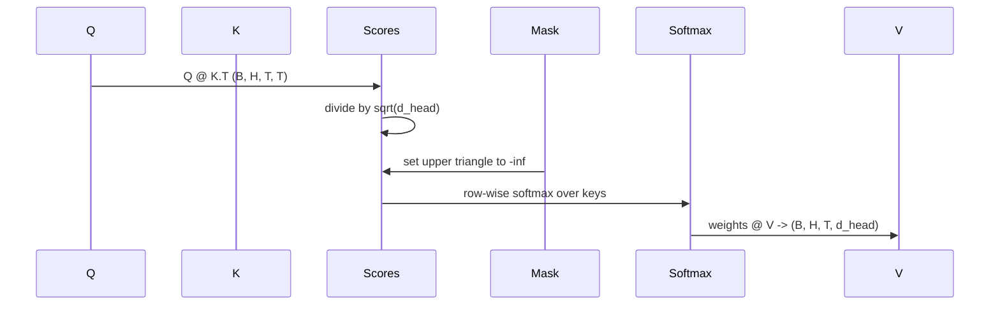

# 多头自律

> 一个线性投影,三个视图,H平行头,一个面具.

**Type:** Build
**Languages:** Python
**Prerequisites:** Phase 04 lessons, Phase 07 transformer lessons, Lessons 30 through 32 of this phase
**Time:** ~90 minutes

## 学习目标
- 执行批量查询/关键/值投影,作为一个单一线性层分为H头.
- 计算点产品关注量度,使用正确的正常化和d型处理.
- 应用因果化面具,防止位置在未来位置上进行处理.
- 检查每头注意力重量,以确定每个头的输入和理由.
- 训练一个小的注意力块在玩具任务和看损失下降,

```figure
cap-multihead-attention
```

## 框架

注意是允许代币的表示从同一序列中的其他代币中获取信息的函数.自我注意意味着查询,键和值都来自同一输入.多头意味着投影被分为H平行注意问题,其输出是连锁和投影回来的.

有效的实施模式是从 `D`为了`3 * D`然后将其切成三个视角,然后再塑造成H尺寸的头.`D // H`,软max和重量总数都会发生在批量子操作中,

通过这个课程,它构建了这个块.它还添加了因果化面具,所以同样的代码就像一个单独解码语言模型中的注意层一样工作.下一个课程将块堆积成一个完整的变压器,然后课程将它训练.

## 形状合同

输入是`(B, T, D)`输出量是`(B, T, D)`面具是`(T, T)`在区块内,中间子有形状.`(B, H, T, d_head)`在哪里`d_head = D // H`限制是`D % H == 0`现在,我们要去.

```mermaid
flowchart LR
    A["(B, T, D) input"] --> B[Linear D -> 3D]
    B --> C["split into Q, K, V"]
    C --> D["reshape to (B, H, T, d_head)"]
    D --> E["scores = Q @ K.T / sqrt(d_head)"]
    E --> F[apply causal mask]
    F --> G[softmax over keys]
    G --> H["context = weights @ V"]
    H --> I["reshape to (B, T, D)"]
    I --> J[output Linear D -> D]
    J --> K["(B, T, D) output"]
```



两个线性层 (QKV投影和输出投影) 是区块中的唯一参数.面具,软max,和重塑都是没有参数的.

## 车分裂

简单的实现有三个单独的线性层,每个层为Q,K和V.`3 * D`两个数学上相当,因为三个分别的矩阵乘法为`(D, D)`重量是正确的一个矩阵乘以一个`(3D, D)`他们被重量堆积.

效率更快,因为加速器启动一个matmul而不是三个.它也更容易初始化,因为三个子矩阵生活在相同的参数子,可以一起初始化.

## 头部的形状

后的分离,Q,K,V的每个是`(B, T, D)`为了把这变成H平行注意力问题,我们重新塑造为`(B, T, H, d_head)`转移到`(B, H, T, d_head)`现在头部的尺寸就在批量尺寸旁边,所以PyTorch把每头的注意力视为一个批量操作.`B * H`独立的实例.

总体的尺寸保持在最后,所以分数是相对的`Q @ K.transpose(-2, -1)`结果是:`(B, H, T, T)`平均注意力.

## 规模化

结果分为`sqrt(d_head)`没有这种扩展,点产品会增长`d_head`它们的度是微小的,学习的位. 分为`sqrt(d_head)`总体而言,在头部尺寸中,

## 原因面具

只有解码器语言模型才能在预测下一个代币时只能根据过去进行条件. 面具强制执行这一点. 具体来说,在软max之前,每一个输入都在线角上.`(T, T)`结果矩阵被负无限取代.



面具是面具的结构,它是面具的结构,它是面具的结构,它是面具的结构.`(T, T)`角落.

## 输出预测

按头的文本向量`(B, H, T, d_head)`我们将其转移到`(B, T, H, d_head)`改造成`(B, T, D)`通过最后的`(D, D)`没有它,H头只会通过后层重新结合,块将会被人工限制.

## 注意重量检查

课程揭示了`return_weights=True`按前进传输的标志. 当设置时,块返回每头的注意重量.`(B, H, T, T)`显示器将一个头的重量图打印在一个短输入中,以便你能看到因果三角形结构和每位重点.

在训练模型中,不同头脑学习不同的模式.有些头脑关注直接前面的符号.有些头脑关注序列的开始.有些头脑几乎均地传播注意力.检查是解释性工作的入口点.

## 训练演示

底部的演示`main.py`导线注意区块到一个小的LM头,并训练整个东西重复任务.输入的每个行是整个文本中复制的单个随机ID.目标是一个转移的输入,所以模型必须学习下一个代币与前一个代币相同.损失是交叉.H=4,D=32,T=12,和64的词汇,损失从随机 (约`log(64) ~ 4.16`) 低到很低`1.0`在CPU上使用了3个时代.

演示的目的不是训练一个有用的模型. 目的是确认梯度通过每块块流动,

## 这一课不做什么

实际模型中的变压器层是注意力,其次是两个层的MLP,每个层周围有剩余连接和层规范.下一个课程增加了这些.

它不实现旋转或AliBi定位编码.这两者都适用于同一块的QKV投影阶段,但它们是一个独立的教学单位.在这里构建的块是通过在matmul之前转换Q和K相容的.

它不实现KV缓存推理.在前进传递中缓存键和值是使自动降解快速的优化.它改变K和V子上的形状合约,但不是Q上的.它属于推理课程.

## 如何读取代码

`main.py`定义`MultiHeadSelfAttention`现在,我们要去. 课程有两个线性层和一个注册的面具缓冲器. 通过前进的项目,重塑,分数,面具,软件,重量,重塑,再重塑. 下面的演示模型建立了一个小模型,它用符号和位置嵌入和LM头来吸引注意力, 测试在`code/tests/test_attention.py`定形状合约,因果性属性,软max属性,头分的属性和梯度流量.

运行演示,然后增加`n_heads`保持 `d_model=32`现在,`d_head=4`) 并观察热图的变化.
