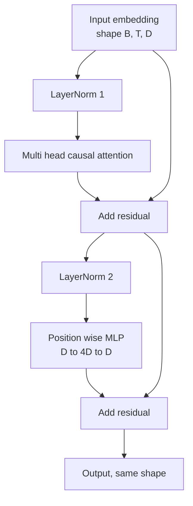
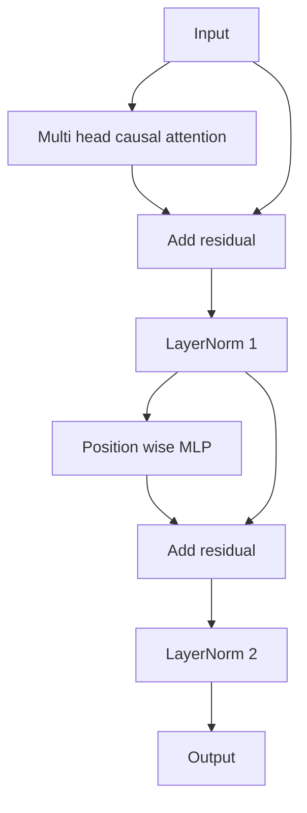

# 变压器从零开始

> 一块是每个现代解码器LLM的单位.层规范,多头注意,残余,MLP,残余.LN前变体稳定地没有加热.LN后变体是原始纸运输的.这堂课构建了两者,并显示在普通学习速度下,哪个能够存活12层堆.

**Type:** Build
**Languages:** Python
**Prerequisites:** Phase 19 lessons 30 to 33 (tokenizer, embeddings, attention math, batched data loader)
**Time:** ~90 minutes

## 学习目标

- 在 PyTorch 中构建一个变压器块,从四个移动件中:LayerNorm,多头因果注意力,残留连接,位置智能MLP.
- 设置LayerNorms在两个配置 (LN前和LN后) 并解释为什么一个火车稳定地没有加热.
- 实现因果化掩饰在多头注意力中,所以标志性`i`没有看到代币`j > i`现在,我们要去.
- 追踪梯度流动在12层堆上的两种变体,并读取结果,而不挥手.
- 在下一个课程组装12400万参数GPT时,再用块作为一个落入单位.

## 问题

变压器是重复一个块. 错误的块一次,重复12次,你将运送一个模型,在第一时代分歧或需要升温的黑客. 在这门课中,你会看到的两个失败模式并不奇怪. 学生第一次起块时,它们就会出现. 一是关注未来的注意力层. 另一种是LayerNorm放置在它不能制在深度的残留信号.

现在,我们可以看到一个小块,它是机械的. 块有两个剩余路径和两个正常化位置.

## 概念

每个解码器只有变压器块,都是一个形式数的函数.`(batch, sequence, embedding)`在内部,两个子层做了这项工作.



现在,它是LN前的变体. LayerNorm位于残留分支内,在子层之前.残留连接将非正常信号传递到前面.

后LN变体将LayerNorm移动到剩余添加后.



形状是相同的.训练行为不是.在LN后,流回剩余路径的梯度必须通过LayerNorm.在深度十二和学习速度.`3e-4`预-LN 让残余路径不正常,所以渐变率在嵌入层上清洁传播.预-LN 是GPT-2前进船的配置.

### 原因多头注意

关注子层将输入投射到查询,关键和值数器中.`(B, T, D)`为了`(B, H, T, D/H)`在哪里`H`标点产品注意力计算`softmax(Q K^T / sqrt(d_k))`按头,将上方三角形掩盖到负无限,通过软max应用面具,然后乘以`V`头部被连接到一个单个`(B, T, D)`面具是唯一使模型因果的部分.忘记面具,你训练一个欺骗的模型.

### 农业发展部

位置智能MLP独立地将相同的两个层网络应用于每个代币.隐藏宽度是嵌入宽度的四倍,激活是GELU,而下列线性则会出现中断.在MLP内部没有代币彼此交谈.所有代币混合都在注意力中发生.

### 剩余的连接可以做两件事

它们使梯度路径在深度上变量,从而保持梯度标准在尺度中通过十二层.它们还让每个块学习运行表示的增量更新而不是完全的替代.这两个效果是区块尺度的原因.

```figure
cc-transformer-block
```

## 建立它

`code/main.py`执行:

- `class LayerNorm`具有可学习的规模和转移,偏向的eps,按代币向量应用.
- `class MultiHeadAttention`随着`num_heads`现在`head_dim = d_model // num_heads`化QKV投射,注册因果面具,注意力和残留脱节.
- `class FeedForward`两层线性,GELU激活,脱落.
- `class TransformerBlock`具有一个`pre_ln`两种变体之间转换的旗.
- 构建一个6层前LN堆和一个6层后LN堆的演示,具有相同的输入和打印 (a) 出口形状, (b) 后退的传输后嵌入式的梯度标准.

运行它:

```bash
python3 code/main.py
```

输出:两堆的形状检查,梯度规范一边.LN前堆的嵌入梯度是与LN后堆大于相同的学习速度,这是没有加热的LN前火车的经验信号.

## 堆

- `torch`对于数数学,自格级,`nn.Module`管道.
- 没有.`transformers`没有预训练的重量. 区块是从原始的实现.

## 野生生产模式

三个模式将教科书块变成可以运送的东西.

**Fused QKV projection.**单独的线性层成本是三个核发射和三个.`3 * d_model`合路径在每个加速器上更快,并且匹配GPT-2,LLaMA和Mistral的参考实现.

**Registered causal mask buffer.**面具只依赖于最大的背景长度.`register_buffer`忘记这一点将面具变成一个分配器热点在长文中.

**Dropout in two places, not three.**沉积在注意力软max (注意力沉积) 和 MLP (残留沉积) 的第二线性之后.残留物上的沉积本身破坏了让梯度流动在深度的添加身份.一些早期的实现错了这一点,并通过脆弱的训练支付了.

## 用它

- 在第35课中,这个课程的块直接连接到GPT组件中,没有修改.
- 之前LN变体是每个现代开放权重LLM使用的.后LN变体是原始2017年注意力纸使用的.知道这两种是足够的阅读任何你会遇到的解码架构.
- 换GELU为SiLU,就会有LLaMA家族激活,换LayerNorm为RMSNorm,就会有LLaMA家族正常化.

## 运动

1. 添加一个`bias=False`现在,我们可以在线上测量一个线性模型,然后我们可以测量一个线性模型中的数量.
2. 取代`nn.LayerNorm`通过手动滚动RMSNorm,检查输出形状没有变化.
3. 添加一个标志,返回注意力重量为第一头作为一个`(B, T, T)`按上方三角形图,确认它是零的,
4. 建立一个健康检查,`(2, 16, 384)`子的子`H=6`通过两种变体和断言,前进输出是不同的 (例如,`not torch.allclose`) 时重量初始化相同,放弃设置为零.

## 关键词

| Term | What people say | What it actually means |
|------|-----------------|------------------------|
| Pre-LN | "Pre norm" | LayerNorm inside the residual branch, before each sublayer; the residual carries the unnormalized signal |
| Post-LN | "Post norm" | LayerNorm after the residual add; what the 2017 paper shipped and what needs warmup |
| Causal mask | "Triangle mask" | The upper triangle of the attention logits set to negative infinity so token i cannot read token j when j is greater than i |
| Fused QKV | "Combined projection" | One linear of width 3D instead of three linears of width D; one kernel, one matmul |
| Residual stream | "Skip connection" | The unnormalized tensor that flows top to bottom through every block; what each block adds to |

## 进一步阅读

- 阶段7课程02 (自从零开始注意) 为这个区块下面的注意力数学.
- 阶段7课05 (全变压器) 对同一骨架的编码解码版本.
- 阶段10课04 (预训练小GPT) 对于该区块所涉及的培训程序.
- 阶段19课35 (本轨道) 将这两个块堆积成GPT模型.
