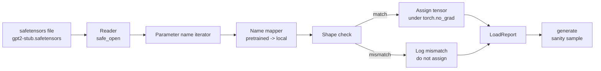

# 装载训练过的重量

> 从零开始训练1200万参数模型是一个预算决定;加载已发布的检查点是星期二.本课程将预训练的GPT-2风格重量从安全感器文件中加载到35课时的确切架构中,并将参数名称映射片段进行散步,智能产生了继续证明负载工作.没有网络,没有第三方加载器,没有不透明的魔术.

**Type:** Build
**Languages:** Python
**Prerequisites:** Phase 19 lessons 30 to 36
**Time:** ~90 minutes

## 学习目标

- 阅读一个安全感应器文件`safetensors`检查子名称和形状.
- 根据教程35GPT模型,每个预训练的参数名称都将被映射到一个参数中.
- 处理公布的GPT-2重量和该轨道中的模型之间的两个名称公约: `wte/wpe/h.N.attn.c_attn/c_proj`其他`mlp.c_fc/c_proj`根据当地名称`tok_embed/pos_embed/blocks.N.attn.qkv/out_proj`其他`mlp.fc1/fc2`现在,我们要去.
- 在任何重量分配发生之前,检测和拒绝与明显错误的形状不匹配.
- 生成加载权重的短续集,并确认代币来自加载分布,而不是随机初始化.

## 问题

发布的权重不适用于您的架构.它们包含原始实现使用的名称.预训练文件有`transformer.h.0.attn.c_attn.weight`形状`(2304, 768)`您的模型预计`blocks.0.attn.qkv.weight`形状`(2304, 768)`(在不同的布局会议中相同的矩阵) 或您的模型使用`nn.Linear`输入的矩阵存储.同一个参数显示出三个微妙不同的身份 (名称,形状,字节布局),加载器必须协调所有三个.

随着一个模块的复制,它将正确的子放在错误的地方,你得到了一个模型,它产生了无稽之谈.一个模块拒绝复制,但没有记录任何东西,让你猜测哪个子没有降落.`LoadReport`总结了击中,错失和形状不一致,

## 概念



名称地图表只是一个从字符串到字符串的函数.形状检查是一个如果. 赋值发生在内`torch.no_grad()`报告中包含了每个名字的结果.

### 基因二级命名公约

发表的GPT-2权重以以下名称命名:

| Pretrained name | Shape | Meaning |
|-----------------|-------|---------|
| `wte.weight` | (50257, 768) | Token embedding |
| `wpe.weight` | (1024, 768) | Position embedding |
| `h.N.ln_1.weight` | (768,) | LayerNorm 1 scale at block N |
| `h.N.ln_1.bias` | (768,) | LayerNorm 1 shift at block N |
| `h.N.attn.c_attn.weight` | (768, 2304) | Fused QKV linear weight |
| `h.N.attn.c_attn.bias` | (2304,) | Fused QKV linear bias |
| `h.N.attn.c_proj.weight` | (768, 768) | Attention output projection |
| `h.N.attn.c_proj.bias` | (768,) | Attention output projection bias |
| `h.N.ln_2.weight` | (768,) | LayerNorm 2 scale |
| `h.N.ln_2.bias` | (768,) | LayerNorm 2 shift |
| `h.N.mlp.c_fc.weight` | (768, 3072) | MLP fc1 weight |
| `h.N.mlp.c_fc.bias` | (3072,) | MLP fc1 bias |
| `h.N.mlp.c_proj.weight` | (3072, 768) | MLP fc2 weight |
| `h.N.mlp.c_proj.bias` | (768,) | MLP fc2 bias |
| `ln_f.weight` | (768,) | Final LayerNorm scale |
| `ln_f.bias` | (768,) | Final LayerNorm shift |

两次惊喜计划.`c_attn`现在`c_proj`现在`c_fc`线性图像是存储的,与矩阵相对的转移.`nn.Linear.weight`运载器在分配过程中转移.LM头根本不在文件中;模型依赖于重量绑定.`wte`现在,我们可以把头部设置为一个字母.`wte`接地.

### 地方命名大会

在此轨道中的模型使用描述名称:

| Local name | Meaning |
|------------|---------|
| `tok_embed.weight` | Token embedding |
| `pos_embed.weight` | Position embedding |
| `blocks.N.ln1.scale` | LayerNorm 1 scale at block N |
| `blocks.N.ln1.shift` | LayerNorm 1 shift |
| `blocks.N.attn.qkv.weight` | Fused QKV |
| `blocks.N.attn.qkv.bias` | Fused QKV bias |
| `blocks.N.attn.out_proj.weight` | Attention output projection |
| `blocks.N.attn.out_proj.bias` | Output projection bias |
| `blocks.N.ln2.scale` | LayerNorm 2 scale |
| `blocks.N.ln2.shift` | LayerNorm 2 shift |
| `blocks.N.mlp.fc1.weight` | MLP fc1 |
| `blocks.N.mlp.fc1.bias` | MLP fc1 bias |
| `blocks.N.mlp.fc2.weight` | MLP fc2 |
| `blocks.N.mlp.fc2.bias` | MLP fc2 bias |
| `final_ln.scale` | Final LayerNorm scale |
| `final_ln.shift` | Final LayerNorm shift |

图表是一个固定函数,课程将它作为一个命令,

### 子固定

实际GPT-2重量为0.5GB.演示程序不下载它们;它在首次运行时生成一个小的安全感应器装置,与精确的GPT-2命名公约和适合d_model 192的12块模型的形状而不是768.该装置具有适当的结构来执行加载器中的每个代码路径.将该装置换为实际文件,加载器无需修改.

```figure
cc-weight-remap
```

## 建立它

`code/main.py`执行:

- 经历了这段经验.`GPTModel`所以这门课程是自封的.
- `make_pretrained_to_local(num_layers)`通过此,我们可以扩大每个层次的输入.
- `load_safetensors(model, path)`它们可以进行代码,绘制它们,检查形状,转换 conv1d式的权重,并分配在`torch.no_grad()`返回一个`LoadReport`现在,我们要去.
- `make_stub_safetensors(path, cfg)`它们可以生成一个具有精确预先训练的命名规则的固定文件.
- 创建一个演示`outputs/gpt2-stub.safetensors`在第一次运行时,构建一个新型模型,从随机 init生成的连续性录取,加载了,捕获了另一个连续性,打印了两者,并验证了两者是否不同 (负载实际上改变了模型).

运行它:

```bash
python3 code/main.py
```

输出:固定路径,每名负载日志, a `LoadReport`总结,在负载前的延续,在负载后的延续,以及在单个故意被注入装置中的坏子上出现的形状不匹配,从而实现故障路径.

## 堆

- `safetensors`对于磁盘格式和流媒体读器.
- `torch`对于模型和任务数学.
- 没有.`transformers`没有`huggingface_hub`没有网络通话.

## 野生生产模式

只有三个模式使载体能够与你不创造的重量接触.

**Always validate the file before any assignment.**打开文件,列出每个子名称及其dtype和形状,运行完整的映射,并只在成功后开始分配.

**Log every assignment with the source name and the destination name.**记器告诉你哪个子落在哪里; 替代方法是读取六.`LoadReport`在本课程中,数据类 `loaded`现在`missing`现在`unexpected`其他`shape_mismatch`列表并在结尾打印总结.

**The LM head is a weight tying alias, not a separate copy.**设置`model.lm_head.weight = model.tok_embed.weight`装载后`tok_embed`复制嵌入矩阵成一个新的图案.`lm_head.weight`参数打破结合, 静静地加倍参数数.

## 用它

- 载体可以用于使用预训练命名公约的任何安全传感器文件.真正的GPT-2文件 (小/中/大/xl) 没有代码更改工作;只有模型配置不同.
- 根据该规则,在使用该规则的基础上, 测量量量和测量量量量均保持相同.
- 负载后的智能生成是一个快速的门户:如果负载后的样本看起来像负载前的样本,负载没有改变模型,这意味着地图静默错过了每个子.

## 运动

1. 添加一个`dtype`对于载体来说,每个子被投向目标d类型的参数 (`bfloat16`现在`float16`现在`float32`) 在任务期间. 确认`float32`模型可以降低到`bfloat16`并且仍然产生.
2. 添加一个`expected_layers`拒绝加载一个检查站的论点`h.N`指数不符合模型的指数`num_layers`现在,我们要去.
3. 插入载体到课35代函数中,并生成两个侧面的样本:一个来自随机 init,一个来自载体.
4. 添加出口路径:使用预训练命名公约将当前模型状态写入新型安全感器文件. 循环访问加载器并确认报告没有任何形状不一致.
5. 延长时间`NAME_MAP`处理LLaMA命名公约 (无偏见,RMSNorm,合并的qkv布局) 并重新运行加载器在您生成的LLaMA固定器上.

## 关键词

| Term | What people say | What it actually means |
|------|-----------------|------------------------|
| Name map | "Key remapping" | The function from pretrained tensor names to local parameter names; usually a literal dict with one entry per layer index expanded over a loop |
| Shape mismatch | "Bad shape" | The pretrained tensor exists under the mapped name but its dimensions disagree with the local parameter; the loader refuses to assign and logs the pair |
| Transpose-on-load | "Conv1d layout" | Published GPT-2 stores attention and MLP projections in the transpose of what nn.Linear expects; the loader transposes during assignment |
| Weight tying alias | "Shared LM head" | Setting model.lm_head.weight = model.tok_embed.weight so the head and embedding share storage; the head is not in the file because of this |
| Load report | "Coverage summary" | A small dataclass that tracks loaded, missing, unexpected, and shape_mismatch lists; printing it is how you tell whether the load succeeded |

## 进一步阅读

- 阶段19课 35 对于接收重量的建筑.
- 训练循环的第19阶段课程36:
- 阶段10课时,我们将对记忆紧张时的载重进行量化.
- 第十阶段课程13 (构建一个完整的LLM管道)
