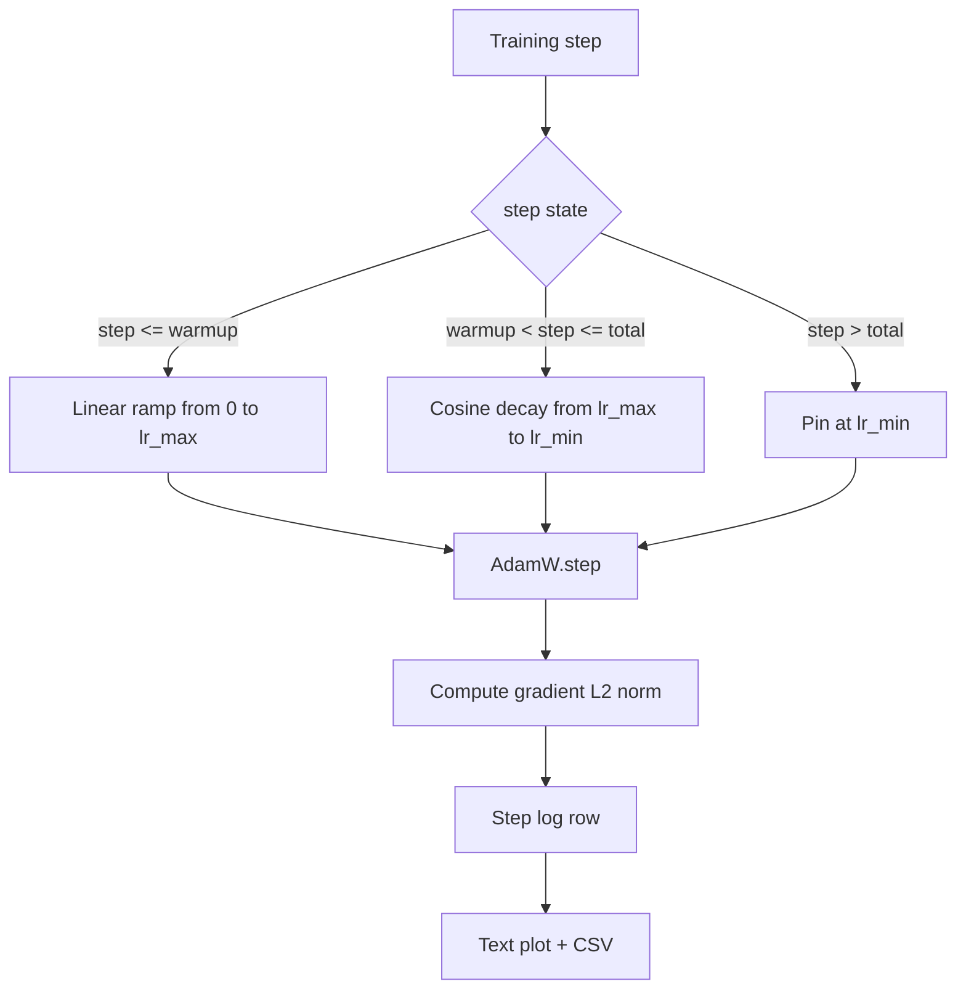

# 具有线性变暖的可西因LR

> 学习率表是损失函数之后的第二大决定. 随着可西因衰退和线性升温,这是现代语言模型训练的默认,因为它允许模型在脆弱的第一千次更新中看到一个小的有效步骤尺寸, 这一课程建立了时间表,绘制了训练步骤的曲线,记录了时间表旁边的梯度规范,

**Type:** Build
**Languages:** Python
**Prerequisites:** Phase 19 lessons 30-37
**Time:** ~90 minutes

## 学习目标

- 实现一个与线性加热的可西因学习率时间表连接的AdamW优化器.
- 计算每一步的时间表的精确值,而不会在跑步中漂移浮点.
- 记载梯度 L2 标准与学习速度相结合,因此训练健康可以观察.
- 让时间表变成一个可以读到的文字图片,

## 问题

训练的第一千次更新是最的. 模型的重量仍然接近初始化. 优化器的运行第二时刻估计尚未稳定. 梯标准很大,很. 如果这些更新期间学习率达到顶峰,模型要么完全偏离,要么落入一个失败平原, 两个已知修正是梯度剪辑,这是第19阶段的课程45的主题,

热量节目有三个区域.`warmup_steps`学习率从零到配置的峰值直线上升`lr_max`从步骤开始`warmup_steps`走进`total_steps`学习率遵循一个曲线上半部分,从`lr_max`为了`lr_min`在之后`total_steps`学习率是固定在`lr_min`没有一个错误的教练, 过失的教练, 没有默默地离开时间表.

构建问题是,时间表很容易被一个人误解. 排行性显示出6个小时后的训练运行,学习率在模型开始过度适应时是1%高或低,除非时间表在边界上被彻底测试,否则是不可见的.

## 概念



### 热化公式

为了`step`在`[0, warmup_steps]`随着`warmup_steps > 0`学习率是`lr_max * step / warmup_steps`退化者`warmup_steps = 0`时间表直接从`lr_max`测试带通过了一些测试带.`warmup_steps = 0`查看时间表仍然产生可用的曲线.

### 子公式

为了`step`在`(warmup_steps, total_steps]`学习率是`lr_min + 0.5 * (lr_max - lr_min) * (1 + cos(pi * progress))`在哪里`progress = (step - warmup_steps) / max(1, total_steps - warmup_steps)`在`step = warmup_steps`值值为`cos(0) = 1`通过`lr_max`热点完全匹配.`step = total_steps`值值为`cos(pi) = -1`通过`lr_min`完全符合衰变的终点.

由于两个终点的连续性不是偶然的,`step`接的时间表第一次输出一个边界`lr_max`现在,我已经改变了.

### 楼层后的全部步骤

为了`step > total_steps`学习率保持在`lr_min`合同明确:计划不会错误,也不会外出,它会在地板上,让教练记录一个警告.需要延长训练的教练人员会改变计划的时间表.`total_steps`没有循环.

### 随着速度的分数标准记录

训练周期是训练健康的一半.梯度标准是另一半.训练循环每步都记录.一个分离训练运行显示了梯度标准的升,然后损失;一个调整良好的加热保持了与速度相对的水平;一个过于侵略性的峰值显示为一个高的标准,在加热后保持高.`step, lr, grad_l2_norm, loss` CSV 是唯一的持久记录.

```figure
cap-cosine-warmup
```

## 建立它

`code/main.py`执行:

- `CosineWithWarmup`- 无国籍函数`lr(step) -> float`根据设置的时间表.
- `TrainState`- 包装一个模型,一个`AdamW`优化器,并将时间表变成一个单步的函数.
- `TrainState.step`- 运行一个前进,一个后退,记录梯度L2标准,并适用`lr(step)`给优化器.
- `plot_schedule_ascii`- 呈现时间表,作为一个可以读取的文字图.
- `write_schedule_csv`- 随着学习速度,每一步发射一行.

文件的底部的一个示范构建了一个小的`nn.Linear`模型,在固定输入批量上进行20步的列车,并打印每步学习速度,梯度规范和损失.

运行它:

```bash
python3 code/main.py
```

脚本从零开始,打印每一步的训练日志,加上时间表图.

## 生产模式

它们将时间表变成一个生产器件.

**Schedule lives in a config, not in code.**训练师说`warmup_steps`现在`total_steps`现在`lr_max`现在`lr_min`时间表可复制,因为配置内容为主;时间表可审计,因为配置是PR差的一部分.

**Step counter is monotonic and decoupled from epochs.**一些框架混了数据集分碎或数据加载器重新启动时的步骤和时代.`global_step`继续运行在正确的时间表位置,因为步骤计数是耐用轴.

**Schedule plot in the run directory.**每次训练都会写`outputs/lr_schedule.png`检查者可以检查时间表,而不需要再运行任何东西. 这可以在 PR 时捕获错误配置的时间表类型的错误.

**Log row schema is fixed.** `step, lr, grad_l2_norm, loss`后游笔记本或仪表板读取该方案;在不打破版本的情况下重新命名列,将所有现有的仪表板无效.

## 用它

生产模式:

- **Sweep peak before sweeping anything else.** `lr_max`首先,扫一扫一个小模型,最优的`lr_max`模型尺寸很弱,所以小模型扫描是一个强大的前景.
- **Warmup is a fraction of total steps, not an absolute count.**运动员在运动中进行了20000万步的运动,即时开始达到顶峰;运动员在运动中进行了20000步的运动,同时达到10%的运动.
- **`lr_min` is non-zero on purpose.**只有10%的楼层`lr_max`优化器在长尾中保持学习.`lr_min = 0`计划产生一个在图片上看起来很好的训练曲线,

## 运送它

`outputs/skill-cosine-warmup.md`如何使用全球计数器,以及什么`lr_max`扫描产生了部署的值.

## 运动

1. 加入一个逆方根变量,然后在200步的玩具训练运行中比较它.
2. 添加一个`--restart`标志增加了第二次加热`total_steps / 2`保护玩具运行过程中热重启是否改善或受伤.
3. 加入一个单元测试,即时间表是连续的:每一步`[0, total_steps]`差异`|lr(step+1) - lr(step)|`边界是`lr_max / warmup_steps`现在,我们要去.
4. 将时间表编写成一个`torch.optim.lr_scheduler.LambdaLR`课程使用简单的步骤函数,包装改变了什么?
5. 添加一个`--plot-png`通过印一个真正的情节的旗`matplotlib`辩护课程的文本图表或PNG是否是CI运行的默认更好的.

## 关键词

| Term | What people say | What it actually means |
|------|-----------------|------------------------|
| Warmup | "Slow start" | Linear ramp from zero to `lr_max` over the first `warmup_steps` updates |
| Cosine decay | "Smooth drop" | Upper-half cosine curve from `lr_max` to `lr_min` over the remaining steps |
| Floor | "After training" | The fixed `lr_min` value the schedule pins at past `total_steps` |
| Gradient norm | "L2 of grads" | The Euclidean norm of the concatenated gradient vector, logged each step |
| Global step | "Schedule axis" | A monotonic step counter that survives restarts and drives the schedule |

## 进一步阅读

- [Loshchilov and Hutter, SGDR: Stochastic Gradient Descent with Warm Restarts (arXiv 1608.03983)](https://arxiv.org/abs/1608.03983)- 科西斯时间表的参考文件
- [Loshchilov and Hutter, Decoupled Weight Decay Regularization (arXiv 1711.05101)](https://arxiv.org/abs/1711.05101)- 亚当W的参考文件
- [PyTorch torch.optim.lr_scheduler](https://docs.pytorch.org/docs/stable/optim.html#how-to-adjust-learning-rate)- 阶段函数与框架规划器的构成
- 阶段19 · 42 - 下载者,该时间表的体积消耗
- 时间表与数据加载器的共进
- 阶段19 · 45 - 梯度剪切和AMP,循环中的下一个层
