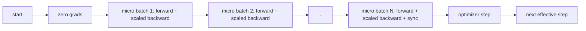
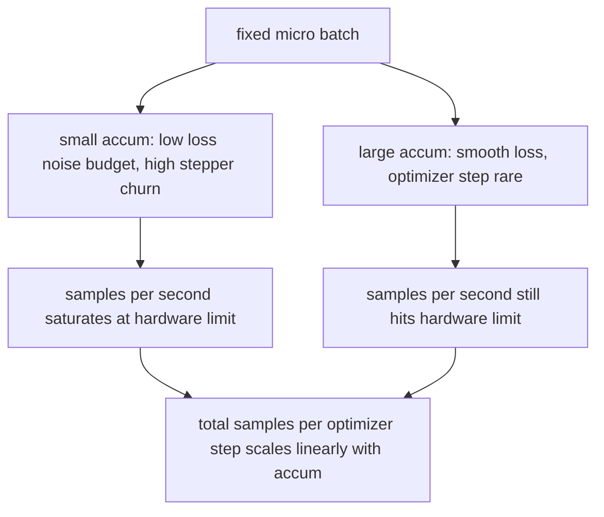

# 渐进积累

> 训练一个有效的批量,你不能负担,一个微批量.

**Type:** Build
**Languages:** Python
**Prerequisites:** Phase 19 lessons 42 to 45
**Time:** ~90 minutes

## 学习目标

- 取出有效批量身份: `effective_batch = micro_batch * accum_steps`现在,我们要去.
- 实现每微批量损失规模化,使累积的梯度与单个全批次回归相匹配.
- 跳过优化器同步到最后一批微量 (同步最后一步).
- 读取一个吞吐量与有效批量曲线相比,并解释降低回报率.

## 问题

由于损失曲线更平滑,而优化步骤在这个规模上更有意义. 在桌子上的加速器上,有32个例子, 两倍的批量不是一个选择. 减半模型不是一个选择. 现场在2017年实现的技巧是运行16次倒退传递,让梯度积累在参数缓冲器内,

没有扩展,梯度方向是正确的,但大小是错误的,优化步骤是16倍的太大.修复是一个分数.修复也是容易忘记的.

## 概念



合同很短.

- 每个微批次的损失分为 `accum_steps`在之前`backward()`电器将梯度总算为`param.grad`按默认情况下, 分割将运行总额推回正确的规模.
- 优化器步骤每次有效批次一次发射,最后一批微批次后退. 步骤中积累偏差每个参数,剩下的运行取决于.
- 优化器状态 (momentum buffers,Adam moments) 每个有效步骤都会一次进步,而不是每一个微批次.
- 在单个设备上,这是会计.在多级集群上,同样的模式将非最终的微批包裹在一个`no_sync`通过一个传输,最后一批微批减少了整个积累的梯度,而不是支付网络成本N倍.

### 代码中的等效证明

```python
loss = criterion(model(x_full), y_full)
loss.backward()
opt.step()
```

相当于

```python
for x, y in chunks(x_full, y_full, n):
    scaled = criterion(model(x), y) / n
    scaled.backward()
opt.step()
```

循环末积累的梯度缓冲器是单个全批后退产生的度.课程代码通过1e-4以下的最大abs差异来证明这一点.`equivalence_check`现在,我们要去.

### 价格上去哪里

每个微批量成本一个向前和一个向后. 随着积累,你会以时间换取内存.`outputs/accum-curve.json`显示有效批量在固定微批量上成长时发生什么:



没有免费午餐.`accum_steps`通过测试,我们可以将每个优化器步骤的墙时间翻一番. 变化是梯度估计的差异性:在同一墙预算中,你做了更少的优化器步骤,但每个步骤都在更多样本中平均. 文献将大批量和小批量视为不同的优化问题;这里的教训是机械的,而不是统计的.

```figure
cc-grad-accumulation
```

## 建立它

`code/main.py`它们可以执行三项操作.

### 步骤1:等效检查

`equivalence_check()`函数比较优化器步骤前的梯度缓冲器和后的参数. 断言是`max_abs_diff < 1e-4`现在,我们要去.

### 步骤2:最后步骤的同步模式

`train_one_optimizer_step`走微批次,除了最后一次进入`no_sync_context(model)`在单一过程中,文本是无操作的;在DDP上,这是降低所有的梯度被跳过的地方.`sync_counter`记录了我们离开了no_sync范围的数次;对于N微批次,数量为每个有效步骤的1次,而不是N.

### 步骤3:输出曲线

`sweep_effective_batches`运行相同的模型,具有固定微批量和积累步骤列表.

- `samples_per_sec`: 通过墙时间分为所见的样本总数
- `median_step_ms`:每一步有效的50个百分点
- `sync_calls`: 集体点
- `avg_loss`:扫描的优化步骤中平均

产量降落在`outputs/accum-curve.json`并且可从笔记本中重复使用.

运行它:

```bash
python3 code/main.py
```

脚本打印了等效差,然后扫描表,然后JSON路径.

## 用它

在生产训练中,梯度积累在一个后面.`accumulation_steps = effective_batch // (micro_batch * world_size)`您不允许使用的框架是相同的循环,但步骤是相同的:扩大损失,跳过非最终微信的同步,积累,步骤一次.

野生动物的三个模式:

- 微批量是为了和设备内存的选择.任何更小的东西会浪费加速器周期.任何更大的东西会崩.
- 有效批次是从学习率时间表中选择的.大型有效批次需要扩大学习率和加热;这是自2017年以来所讨论的线性扩展规则.
- 积累数量是两个和唯一的按之间的桥梁, 在运行时, 您可以调节,

## 运送它

`outputs/skill-gradient-accumulation.md`通过取食谱,一个同行可以将其放入一个新的 repo:`accum_steps`通过JSON,将优化器同步到非最终微信上,按有效批量进行一次优化器,将有效批量进行记录,以便交易可见.

## 运动

1. 再进行扫描`--num-steps 100`根据实际批量,每秒的图片样本.
2. 添加错误的扩展变量 (没有分区),并在步骤1显示参数diff与参考.
3. 换取ADMW的SGD,并确认优化状态的进步每一步一次,而不是每次微批次一次.
4. 引入一个真正的`DistributedDataParallel`包装和路线`no_sync_context`确认同步调用每批量下降为N-1.
5. 修改等效检查,将两个不同的微分区 (2 x 8 vs 4 x 4) 进行比较,并解释您需要放松的任何宽容.

## 关键词

| Term | What people say | What it actually means |
|------|-----------------|------------------------|
| Micro batch | The batch you forward | The slice that fits in memory in a single forward pass |
| Accum steps | Backward passes per step | Number of backwards summed before one optimizer step |
| Effective batch | The batch | Micro batch times accum steps times data parallel world size |
| Loss scaling | Divide by N | Per-micro-batch division so summed gradients match full batch |
| Sync on last | Skip the rest | Only run the gradient collective on the last backward in the window |

## 进一步阅读

- 关于Pytorch的文件`DistributedDataParallel.no_sync`对于生产版本的最后步骤同步技巧.
- 关于大型批次训练的线性扩展,
- 火器对梯度积累相互作用的发射跟踪器,并进行混合精度的不扩展.
- 第19阶段课程42至45课程涵盖了本课程所设的模型,数据加载器,优化器和培训者架构.
- 第19阶段课程47涵盖检查点和恢复,
