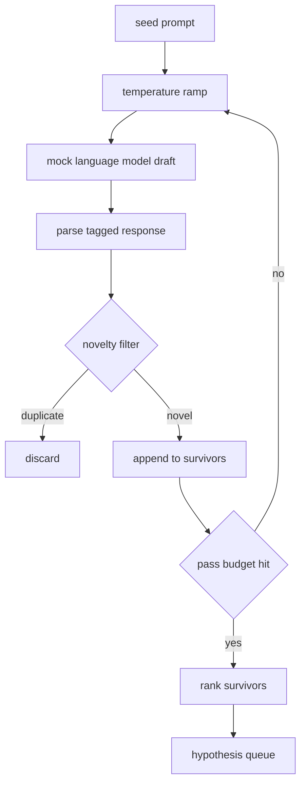

# 假设生成器

> 调查代理问同一问题两次,就是浪费代币. 技巧是迫使每一个项目到一个新的地方.

**Type:** Build
**Languages:** Python
**Prerequisites:** Phase 19 Track A lessons 20-29
**Time:** ~90 minutes

## 学习目标
- 驱动一个从种子提示的样本,将其输出转化为打字假设记录.
- 通过每次采样器温度,以便下一个抽象从最后一个抽象更远.
- 通过小型嵌入模型和可西因距离门进行接近重复的过.
- 根据新奇,特殊和可测试性的分数,
- 让每个步骤都确定性,所以同一种子总是产生相同的排队.

## 为什么生成,然后过

计划者一次问一个模型,就会得到一个假设.这对一个工作的例子来说很好.对于一个研究循环来说,它是错误的形状.循环需要一个排列的排列,深度,所以当第一个假设失败时,运行者没有支付另一个完整的样本通过,就有了下一个准备.

两个想法结合起来产生了这次队列.第一是温度升级:每次通过样品器升高温度一,因此后面的草图被鼓励漫步.第二是新奇的过:每次草图后,发电机测量了从每个之前幸存者内嵌入距离,并拒绝了集群内的任何东西.

课程中运输了一个模拟语言模型,用于固定提示返回脚本的代币序列.模拟足以执行整个路径:种子提示进入,温度坡道应用,候选人解析,新奇的过器运行,排队排队.

## 假设的形状

```text
Hypothesis
  id             : int           (monotonic within a run)
  text           : str           (the claim)
  variables      : list[str]     (what changes between conditions)
  metric         : str           (what the runner will measure)
  baseline_ref   : str | None    (which paper or run the comparison cites)
  draft_pass     : int           (which sampler pass produced this)
  temperature    : float         (the sampler setting at draft time)
  novelty_score  : float         (distance from prior survivors, 0..1)
  rank_score     : float         (weighted sum used for ordering)
```

`variables`其他`metric`解析器从标记的响应中抽取它们.课52中的运行者在构建实验配置时直接读取这些字段.

`baseline_ref`假设是可选的,但建议. 第53课中的评估者需要一个基线来进行比较. 如果假设省略一个,评估者会回到以前的测量量度上.

```figure
cg-novelty-ramp
```

## 建筑



圆是直向前的,有趣的是每个盒子都有一个硬合同.

## 温度

开始`t_min`结束在`t_max`步骤`(t_max - t_min) / (n_passes - 1)`每次传递都会在当前温度下调用样品,产生`n_passes`均的距离值`GeneratorConfig.schedule()`模拟模型通过切换一个小组按键键的脚本响应来尊重温度`(prompt, temp_bucket)`子是开放间隔的,因此温度的小变化会选择不同的子,产生不同的草图.`temperature=t`通过了.

默认时间表是6个通过从`0.2`为了`1.2`六个是足够的,以填补队列,而不会支付样品,`0.2`模型把种子放回了.`1.2`答案往往偏离主题,

## 新品过器

后每一个草图分析,生成器嵌入文本并与每个接受的假设进行比较.嵌入是一个小的哈希包的词代币,正常化为单位长度.两个单元向量之间的宇宙距离是`1 - dot(a, b)`如果它与任何前生存者之间的最小距离超过`novelty_threshold`默认是`0.25`现在,我们要去.

哈希嵌入式不太精致.它是确定性的,具有零依赖性,足以捕捉明显的情况:两个草案共享大部分名词.一个生产部署将在小句子模型中交换.接口保持不变.

## 排名分数

```text
rank_score = w_novelty * novelty_score
           + w_specificity * specificity_score
           + w_testability * testability_score
```

两个小分.`novelty_score`对于前者,最少的嵌入距离.`specificity_score`是假设中的具体变量数量,分为目标数量. `testability_score`如果假设指定了指标和基线,如果只有指标,则是半个,否则是零.

默认权重是`0.4`现在`0.3`现在`0.3`权重在发电机配置中,所以下游课程可以在不开代码的情况下转移它们.

## 假语模型

```python
class MockLLM:
    def sample(self, prompt: str, temperature: float, seed: int) -> str:
        ...
```

给定性为`(prompt, temperature, seed)`模拟器将一个脚本响应表按键开启`(prompt_signature, temperature_bucket)`如果表中没有键的输入,样本检测器会返回一个倒退结果,该倒退路由一个测试执行.

种子被混合到反应中,所以相同.`(prompt, temperature)`在测试中,我们将种子成,以保持结果可复制.在实际部署中,种子来自系统钟或计数器.

## 输出排列

输出是列表`Hypothesis`根据 排序的记录`rank_score`课52的跑者打了头,运行了实验,课53的评价者回复了判决.如果判决说假设是错误的,跑者打了下一个.

排队是有限的.当排队空时,乐队主持人可以扩大种子提示,再运行发电机,或者停止并报告预算耗尽.

## 如何读取代码

`code/main.py`定义`Hypothesis`现在`MockLLM`现在`HypothesisGenerator`发电机将暴露一个单个`run(seed_prompt)`返回排列的方法;通过数量从 读取`GeneratorConfig.n_passes`入是一个合的代币袋. 新闻过器是一个单一的函数. 排名分数是一个单一的函数. 没有什么取决于`numpy`实践的基础是纯粹的,所以课程仍然可移植.

`code/tests/test_generator.py`覆盖线路,复制拒绝路,解析器故障路,温度梯度界限和排列排序.

## 在哪里这个插槽

第五十课产生排队. 第五十一课采取排队的头部,并进行文献搜索以确认或驳斥它. 第五十二课采取相同的头部,并进行实际实验. 第五十三课阅读两种输出,并写出判决. 四个课程组成了一个没有人参与的研究循环;一个人可以在任何边界中进入.
