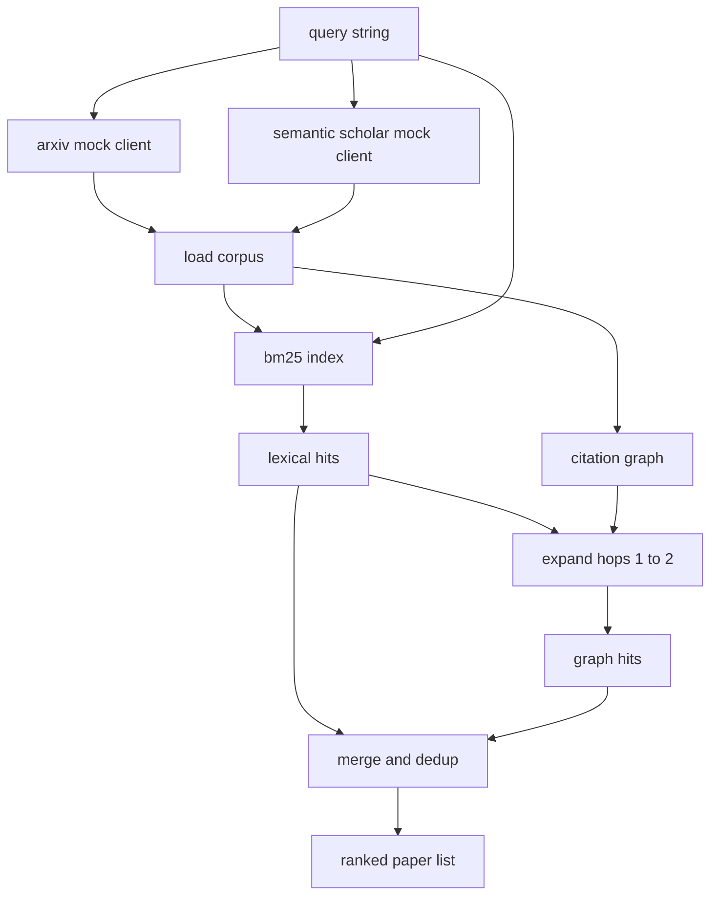

# 找回文献

> 假设是便宜的.知道有人是否已经证明了它是昂贵的部分. 在跑步者把沙盒翻到上面之前,建立一个回收层来回答这个问题.

**Type:** Build
**Languages:** Python
**Prerequisites:** Phase 19 Track A lessons 20-29
**Time:** ~90 minutes

## 学习目标
- 模拟一个小的纸张记录, 循环将下游读取的字段.
- 仅使用stdlib数据结构的摘要而建立BM25指数.
- 通过引用图表, 填写文件, 词汇搜索错过.
- 复制字母,图表通过稳定的纸标.
- 包裹两个假的外部API在一个客户端后面,以便当真正的终端点登陆时,上游调用站点保持相同.

## 为什么两个检索通过

总结中搜索关键字会返回与查询共享词汇的论文. 这覆盖了大部分表面. 没有两个案例. 首先是基础论文使用不同的词汇库;例如"稀疏注意"的查询错过了题为"变压器路由中的区块选择"的论文.

课程构建了两个传递.BM25在摘要中捕获了词汇的打击.引用图的穿越扩大了前后的种子,一个或两个跳跃.联盟由纸 ID 复制并由一个小的组合分数排名.

## 纸质的形状

```text
Paper
  id          : str           (stable identifier, "p001" for the mock corpus)
  title       : str
  abstract    : str
  year        : int
  authors     : list[str]
  references  : list[str]     (paper ids this paper cites)
  citations   : list[str]     (paper ids that cite this paper)
  source      : str           (which mock api supplied it, "arxiv" or "s2")
```

两个假 API 返回重叠但不相同的字段,因此体载体将它们结合在`id`现在,我们要去.

```figure
cg-citation-hops
```

## 建筑



检索客户端拥有通过和合并.调用者向其提交一个查询,并返回一个排名列表,每个输入包含每张纸质分数字段 (`bm25_score`现在`graph_distance`现在`recency_score`现在`final_score`) 解释了排名.

## 从零开始BM25

实现是标准 Okapi BM25 具有默认参数`k1=1.5`现在`b=0.75`索引是两个词典:`term -> doc_frequency`其他`term -> list of (doc_id, term_count)`文件长度是抽象的代号数量.平均文件长度在索引构建时间计算一次.查询的分数是查询术语的总和.`idf * tf_norm`在哪里`tf_norm`是标准BM25长度标准化术语频率.

标志者是`lower`产品系统将在一个小的选民中交换. 接口保持不变.

```text
idf(t)      = log((N - df + 0.5) / (df + 0.5) + 1.0)
tf_norm(t)  = (f * (k1 + 1)) / (f + k1 * (1 - b + b * dl / avgdl))
score(d, q) = sum over t in q of idf(t) * tf_norm(t)
```

## 引用图的穿越

图表是从体积中构建的.前边从纸到其参考.后边从纸到其引用.穿越是由顶部BM25击中种植的宽度首次搜索,在两个跳转上.

两个跳跃是故意的天花板.一个跳跃太浅;代理人经常想要直接的祖先或后代.三跳跃在连接的图表上爆炸结果大小,并倾向于偏离主题.课程暴露了跳跃极限作为一个配置按,因此下游循环可以紧缩它.

## 排名和排名

两张传递返回重叠的集合. 合并键在纸 ID 上. 每张纸的最终分数是权重的混合.

```text
final_score = w_bm25 * bm25_score_norm
            + w_graph * graph_score
            + w_recency * recency_score
```

`bm25_score_norm`是BM25分数,由合并集中的最大BM25分数 (所以该场在零到一中生活). `graph_score`现在,我们可以说,`0.6`对于一个跳跃,`0.3`两次跳跃,否则是零.`recency_score`是从零的线性坡道在体积最小年到最大的1年.

默认权重是`0.5`现在`0.3`现在`0.2`时代主题可能会调低近期,而快速移动的主题则会提升它.

## 假冒的体体

百份论文由由`build_corpus()`每篇论文都有五个主题中的一个手写标题和摘要:注意力稀缺性,检索增强性,低级适配器,数据集蒸和评估链.参考和引用是有线的,因此每个主题形成了一个连接的子图,有几个跨主题边缘.

两个假的API客户端 (`ArxivMockClient`现在`SemanticScholarMockClient`) 从同一组中读取,但暴露不同的领域.Arxiv返回标题,摘要,年份,作者.语义学者添加引用和引用.查找客户联盟在id;跨客户领域的不同意见处理被推迟到后续课程.

## 第52和53课中,我们读到什么?

五十二课中的跑者读`paper.id`现在`paper.title`试验的背景是抽象的前三句话.`paper.year`其他`paper.references`对于特定论文来说,

检索客户端返回一个`RetrievalResult`运行者记录这些数据,以便下游可观测度通过可以随时间来绘制质量.

## 如何读取代码

`code/main.py`定义`Paper`现在`ArxivMockClient`现在`SemanticScholarMockClient`现在`BM25Index`现在`CitationGraph`现在`RetrievalClient`模拟客户端和体积都在同一文件中,所以课程保持可移植.BM25实现是一个类,六十行.图形穿越是一个方法.

`code/tests/test_retrieval.py`包含词汇路径,图形路径,合并,减值和空查询.

## 在哪里这个插槽

第五十课产生假设. 第五十一课搜索文献,看看假设是否已经解决. 第五十二课运行实验,如果不是. 第五十三课阅读检索结果和实验指标,以写出判决.检索客户端是四个阶段中最便宜的,并在乐器中运行第一.
