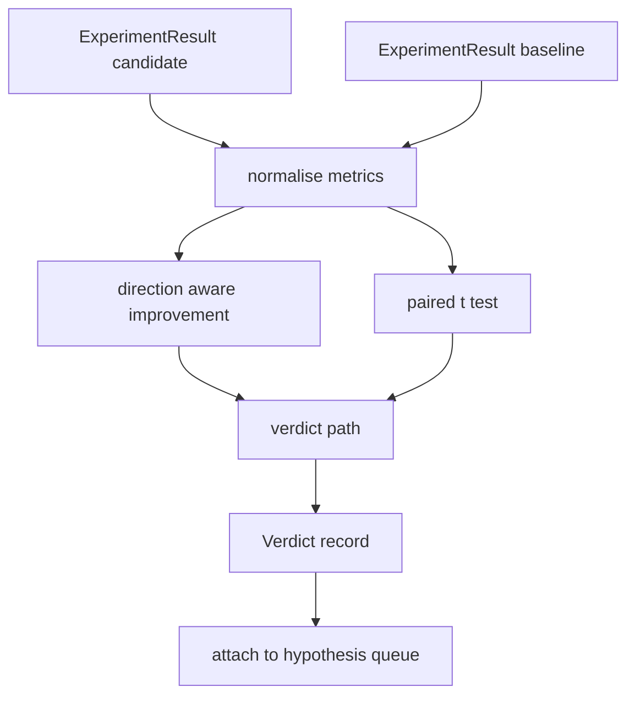

# 结果评估器

> 运行者产生了数量.评估者决定这些数量是否是改善,退缩或噪音. 构建判断路径,将测量量变成一个线路结论.

**Type:** Build
**Languages:** Python
**Prerequisites:** Phase 19 Track A lessons 20-29
**Time:** ~90 minutes

## 学习目标
- 根据方向意识的改善和固定门,将候选人运行与基线进行比较.
- 运行一个对 t 测试从零开始,然后读取结果的 p 值.
- 正常化日志规模的指标,以便下游报告可以将它们与线性指标结合起来.
- 根据假设,发出一个判决, 管弦乐员可以从第五十课中将其附加到排队.
- 保持每一步的纯度,这样同样的输入总是产生同样的判决.

## 为什么要做双重测试

只有一个数字,不能说明变化是真的. 种子的配置不同, 变化可能是噪音. 合适的比较是:相同的种子,相同的数据,一次与候选人进行了运行,一次与基线. 每种种子都会有所不同. 它们的平均差异是效果. 这些差异的标准错误是噪音地板.

课程从头开始执行测试.`scipy.stats`数学是足够小的,可以在一块屏幕上读.

```text
diffs    = [a_i - b_i for i in seeds]
mean     = sum(diffs) / n
variance = sum((d - mean) ** 2 for d in diffs) / (n - 1)
t_stat   = mean / sqrt(variance / n)
df       = n - 1
p_value  = two_sided_p(t_stat, df)
```

两个侧 p 值使用规范化不完整的beta函数.课程运行一个使用Lentz继续分数的小实现.整个东西是60行的 stdlib 数学.

## 方向意识的改善

一些指标随着上升 (精度,吞吐量) 改善,另一些指标随着下降 (损失,困难,墙时间) 改善.`direction`在每个指标上.

```text
if direction == "higher_is_better":
    improvement = (candidate - baseline) / abs(baseline)
elif direction == "lower_is_better":
    improvement = (baseline - candidate) / abs(baseline)
```

改进签署了.一个较高的负面改进是更好的指标,意味着候选人更糟糕.判决路径读取标志和大小.

均的门 (`improvement_threshold=0.02`根据该判断的"噪音"不论p值;循环不感兴趣用户无法测量的变化.

```figure
cg-paired-verdict
```

## 建筑



评估器执行三个独立的计算,并将它们结合在判决路径.每个计算都是没有共享状态的纯函数.

## 记录规范

乱是损失的指数量.损失的0.1下降是乱的更大的下降.直接对两个配置进行乱的比较是很好的,但将其与线性指标混合在单个报告中需要正常化.

课程将任何指标都正常化`scale`字段是`"log"`通过在计算改进之前取自然日志. 门值则在日志空间中应用. 复杂性从32降至28是`log(28) - log(32) = -0.133`在较低的水平上,更好的指标,远远超过2%的门.

```text
if scale == "log":
    a = log(candidate)
    b = log(baseline)
else:
    a = candidate
    b = baseline
```

与`scale="linear"`换代码路径处理两个.

## 每种种子对对测试

课52的跑者每次跑出一个最后的测量点.对对测试,评估员需要一个对候选人每种子,一个对基线的种子.调整员在两个配置下运行相同的实验,通过一个种子列表,并交给评估员两个种子列表.`ExperimentResult`记录.

评估者根据种子对应它们 (种子生活在`result.metrics["seed"]`) 并行走所要求的指标.如果两个列表中的种子不匹配,评估员将提升一个`PairingError`管家应该再跑.

## 判决的形状

```text
Verdict
  hypothesis_id          : int
  metric                 : str
  direction              : "higher_is_better" | "lower_is_better"
  scale                  : "linear" | "log"
  candidate_mean         : float
  baseline_mean          : float
  improvement            : float       (signed, fraction; see direction rules)
  p_value                : float | None  (None if n < 2)
  significance_threshold : float
  improvement_threshold  : float
  verdict                : "improved" | "regressed" | "noise" | "failed"
  rationale              : str
```

判决路径是一个小的决定表:

```text
1. If any candidate result has terminal != "ok": verdict = "failed"
2. else if |improvement| < improvement_threshold:  verdict = "noise"
3. else if p_value is None or p_value > significance: verdict = "noise"
4. else if improvement > 0:                          verdict = "improved"
5. else:                                             verdict = "regressed"
```

理性是一个单行的人类可读的句子,管弦乐器可以记录与假设 id.

## 如何读取代码

`code/main.py`定义`MetricSpec`现在`Verdict`现在`Evaluator`测试是纯粹的Stdlib数学中实现的; numpy仅用于阅读指标列表和计算手段和变异.

`code/tests/test_evaluator.py`覆盖改进路径,退回路径,噪音路径 (小改进),噪音路径 (低n),故障终端路径,日志正常化路径,对已知参考值的t测试和对配错误.

## 在哪里这个插槽

第五十课产生了假设队列. 第五十一课过了文献解决的任何东西. 第五十二课在种子中运行了候选人和基线配置下的实验. 第五十三课阅读了这些运行并写出判决. 管弦乐器将四个编织在一起:

```text
for hypothesis in queue:
    literature = retrieval.search(hypothesis.text)
    if literature_settles(hypothesis, literature):
        attach(hypothesis, verdict="settled")
        continue
    candidates = runner.run_all(specs_for(hypothesis))
    baselines  = runner.run_all(baseline_specs_for(hypothesis))
    metric_spec = MetricSpec("perplexity", direction=LOWER, scale=LOG)
    verdict = evaluator.evaluate(hypothesis.id, metric_spec, candidates, baselines)
    attach(hypothesis, verdict)
```

这位管弦乐器不在这个课程中;四个课程都在它中构成,
