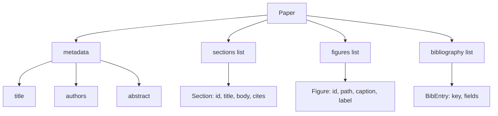
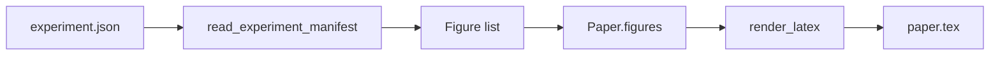
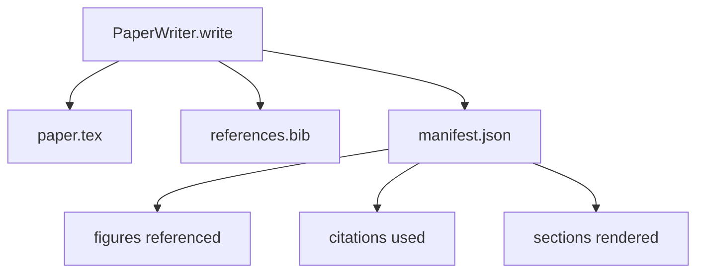

# 纸质写作

> 拉特克斯骨格是研究人员和打字符符符之间的合同.如果合同被打破,文档不会编译,故障很大.先构建骨格,然后填写它.

**Type:** Build
**Languages:** Python
**Prerequisites:** Phase 19 lessons 50-53
**Time:** ~90 minutes

## 学习目标

- 作为一个已知部分图的结构化文物,而不是一个自由形式的文档.
- 在任何散文写之前,生成一个拉特克斯骨格,
- 通过确定性槽机制将实验输出 (路径和标题) 的数字注入骨架中.
- 电线一个模仿的散文发电机,以从结构的轮中填满每个部分,
- 发出一个单机`paper.tex`加上一个`references.bib`附上一个列出所引用的每一个数字和所使用的引用.

```figure
ch-paper-skeleton
```

## 为什么要先做一个骨

文章的草稿以散文开始,积累了结构债务. 序言中增加了三个段落,应该在相关作品中写入. 在定义之前,引用一个数字. 书籍最终以同一篇论文的三个键结尾. 当作者注意到时,重写成本高于写费.

骨架会逆转. 结构是先前声明为数据. 部分是有名字和顺序的插槽. 数字是个字符和标题的插槽. 图书馆关键在顶部,并列出了它们指向的条目. 散文是每次生成到这些插槽. 在任何散文写之前, 连接器可以验证每个数字都有一个插槽,每个引用都有一个条目,

对于计划,工具调用和跟踪,这是以前所学到的学科.

## 纸质的形状



每个字段都是简单的Python数据. 染器是从 `Paper`带可以在染前内视纸张:计算部分,列出缺失的图像文件,检查每一个`\cite{key}`没有相匹配的`BibEntry`现在,我们要去.

## 交换合同

首先,骨架中的每一个图形插槽都会发出一个`\begin{figure}`单元的稳定标签`fig:<id>`第二,每一个部分都会发出一个`\section{}`具有稳定的表格标签`sec:<id>`其他研究人员也发现,`\bibliography`区块的`references.bib`文件上所声明的内容,不超过,不减少.

违反任何这些都是一个错误,而不是一个警告.

## 实验中的图像注射

在本曲目中,早期的课程产生了 JSON 演示的实验输出.每个演示包含了带有路径和短标题的文物列表.`Figure`记录.



插入是决定性的.图形 id 来自实验名称加上单调计器.标题来自表格.路径与纸张的输出目录相比正常化,因此Latex即使实验输出位于磁盘上的其他地方,也会编译.

## 刺的散文发电器

课程不需要一个模型.`MockProseGenerator`发射的表格是每节一个短字符串.生成器将该字符串扩展到两个短段落,部分标题被织在一起.生成的表格是表格声明时的数字和引用.

这足以测试作家的每一种行为.一个真正的实现将将发电机换成一个模型调用.周围的环节不会改变.这是宣布散文发电机作为可调用的价值:测试取代确定性,生产取代模型,其余的管道是相同的.

## 显现输出

编写者将三个文件发送到输出目录中.



简单是下游评价者或评论家循环读取的内容.它不解析Latex,它读取了简单.下一个课程,即评论家循环,将此简单作为输入,并产生反列表.这就是为什么简单是合同的一部分,而Latex不是.

## 验证门

写作者在写任何文件之前,会经过四个门.

1. 每个数字的身份证都在纸上是独一无二的.
2. 每个部分都在`cites`字段引用在文件上声明的图书馆关键.
3. 抽象是没有空的.
4. 标题是没有空的.

一个失败的门起了`PaperValidationError`没有部分写字:三文件都发射,或者没有.

## 如何读取代码

`code/main.py`定义`Paper`现在`Section`现在`Figure`现在`BibEntry`现在`PaperValidationError`现在`MockProseGenerator`现在`PaperWriter`其他`render_latex`它们的功能.`write`方法采用输出目录并发出`paper.tex`现在`references.bib`其他`manifest.json`现在,我们要去.`read_experiment_manifest`帮助者将实验表单转换为`Figure`记录.

`code/tests/test_paper_writer.py`封面:没有部分的骨格成像,两个部分和两个数字的完整成像,缺失引用口,重复数字的身份口,表现内容,以及LateX字符串合同 (每个部分发出一个`\section{}`每个数字都会发射一个`\begin{figure}`)

## 走得更远

实际实现需要两个扩展.`Paper`转换器成为一个战略.`Paper`编写者从引用键中获取BibTeX输入,因为有DOI的本地缓存.

骨架是投注. 部分,数字和引用被声明为数据,生成成插槽,与拉特克斯一起发射的表格.
