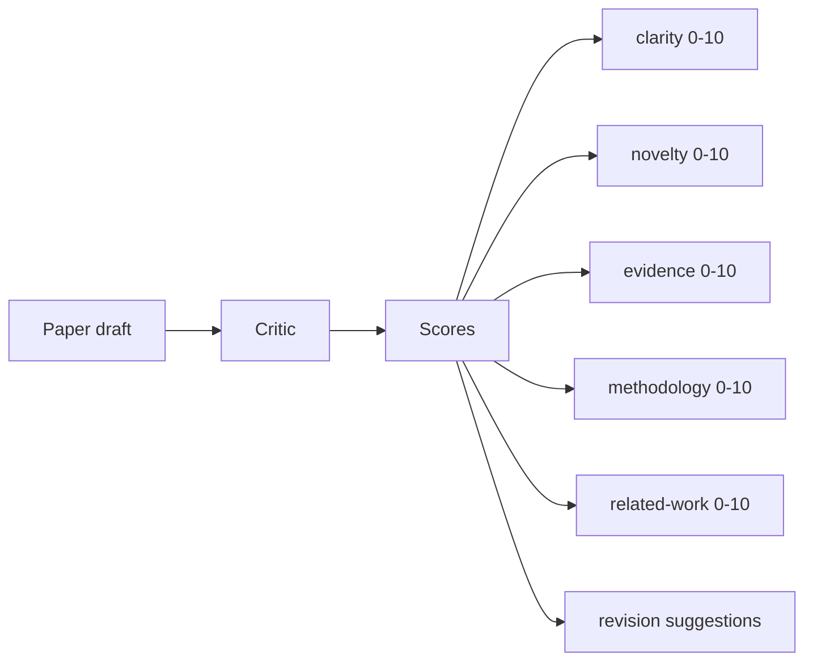
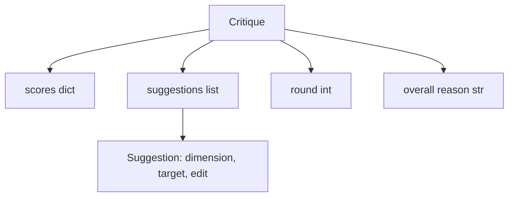
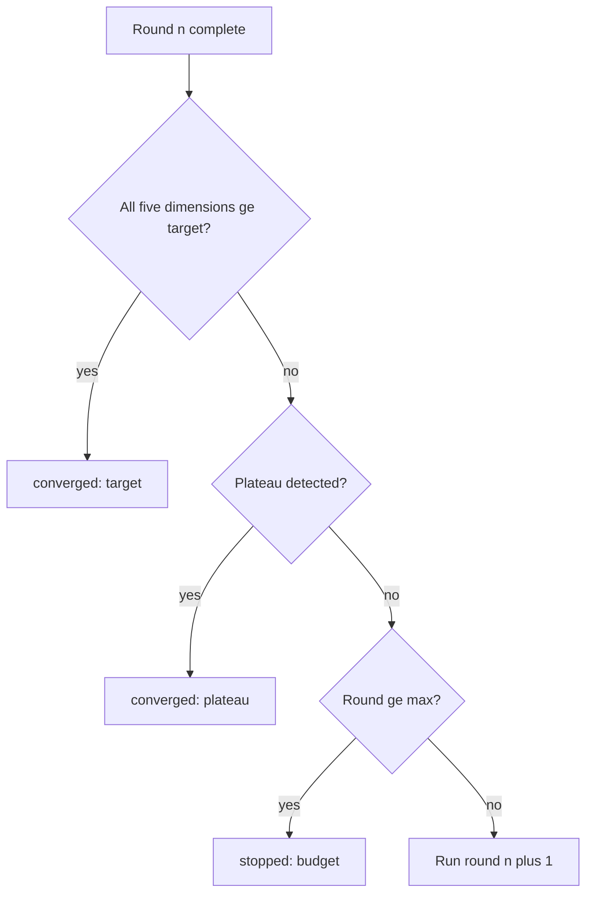
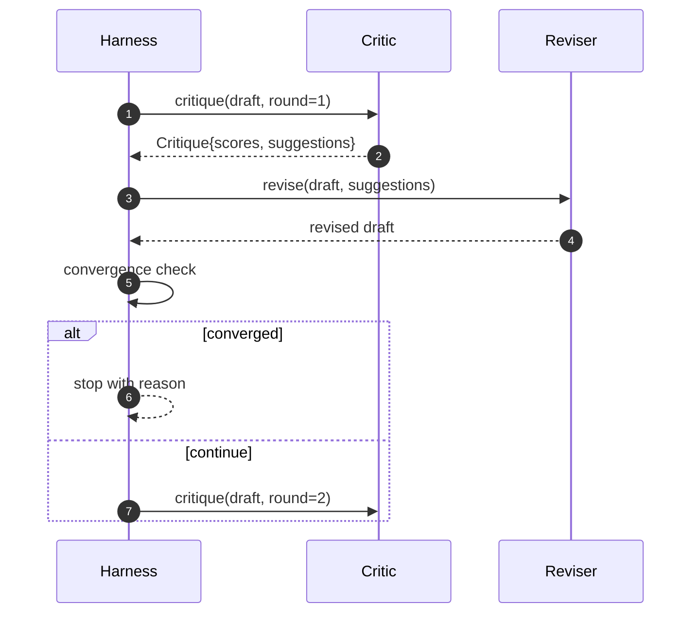

# 批评者循环

> 一个评论家回来"看起来很好"的第一次被打破了. 一个评论家总是回来"需要工作"的评论家被打破了. 有趣的评论家是那些融合,你必须设计融合.

**Type:** Build
**Languages:** Python
**Prerequisites:** Phase 19 lessons 50-53
**Time:** ~90 minutes

## 学习目标

- 通过五个固定维度进行纸质草案:清晰度,新奇性,证据,方法,相关工作.
- 应用每个轮的批评作为结构化修改差别而不是自由形式的重写.
- 通过比较轮子中的分数来检测到相近性; 停在高原,目标达到或预算耗尽.
- 限制使用最大的预算,所以一个不一致的批评者不会永远运行.
- 发出每轮的痕迹,以便仪表板或下一个阶段可以呈现得分轨迹.

```figure
ch-critic-converge
```

## 为什么五个固定尺寸

自由形式的评论家是一个回复建议段落的模型.下一轮的修订将段落视为环境环境.重写是否针对批评是无法验证的,因为批评从未有结构.

五维度给了带一个合同.



评分是一个向量. 带在轮子中监视每个维度. 修改提高了清晰度,但将证据储存,是证据的回归,并通过接近检查看到它. 仅仅是模型的批评者不能提供这种保证.

## 评论的形状



每个建议都包含了它改善的尺寸,它针对的部分,`edit`修改器可以应用指令.修改器也可以调用.课程发送一个确定性修改器,它将修改指令解释为一个附加到部分操作.一个模型驱动的修改器将解释同一个字段.合同不会改变.

## 汇率规则,按顺序

当任何三个条件发生火灾时,



目标是最严格的情况:每一个五个维度 (清晰度,新奇性,证据,方法,相关_工作) 都必须达到`>= target_score`(默认方式`8.0`) 循环返回成功之前.一个较高的平均值,一个较弱的尺寸不够.高原检测比较当前轮的平均值与前轮的平均值.如果改善低于`plateau_epsilon`(默认方式`0.1`) 连续两轮,循环从中出发.`plateau`预算是轮子上限 (默认)`5`) 及出口`budget`现在,我们要去.

如果第三轮在同一次代中击中目标,也会触发平原,结果是`target`没有`plateau`现在,我们要去.

## 为什么高原检测是两次的

一轮高原是噪音.一个真正的评论家即使在固定的草稿上都会回报每次代的点数,因为确定性得分仍然取决于哪些建议被应用和在哪种顺序下.需要连续的两个高原轮来过噪音.如果带报告高原,草稿实际上已经停止改善.

## 在这堂课中,确定主义的批评者

课程不需要模型. 发送的评论家是一个调用器,根据三个信号评分一个草案:平均部分体长度 (清晰度),数字数量和引用数量 (证据),`originality_tag`修改者知道如何将每个分数推向上方.

```text
clarity      grows when the average section body length increases
novelty      grows when originality_tag is set to "high"
evidence     grows when a section's figure_refs is non-empty
methodology  grows when a section titled "Method" exists with body
related-work grows when a section titled "Related Work" exists with body
```

修改器将每个建议解释为一个目标附加.在第一轮后,带可以观察得分上升.测试使用这种属性来证实循环减少差距.

## 完整循环合同



带拥有圆数,跟踪和融合检查. 评论家拥有分数. 修改者拥有差异. 三种都没有触及其他状态.

## 排行量

每轮发出一个跟踪事件,包括圆数,积分向量,建议数量和结判决.完整的跟踪记录在最终草案旁返回.下游仪表板可以呈现每轮的积分图表.下一个课程,即回复安排器,读取了跟踪记录,决定是否值得保留分支.

## 保护自己免受坏批评

评论家提出建议,但不会改善得分,他会把循环锁在最大的表达限度上.`budget`作为一个批评 bug,而不是一个草案 bug. 另一个,只出现最后的草案,隐藏了诊断. 追踪设计表面.

## 如何读取代码

`code/main.py`定义`Critique`现在`Suggestion`现在`Critic`协议`Reviser`协议`CriticLoop`其他`make_deterministic_critic_pair`对于这些问题,我们需要一个简单的方法.`Paper`形状是包含的,所以课程是独立的.

`code/tests/test_critic_loop.py`内容:第一轮后的单调调度改善,调整的草案上目标融合,两轮后的平原检测,没有建议改善时的预算耗尽,修改者提出的建议应用以及痕迹形状.

## 走得更远

实际实施需要两个扩展.第一,维度权重:一个研讨会的论文重量新性高于方法;一个期刊重量反之. 融合检查成为重量平均.第二,对评员:一个评员得分,第二个评员在修改者看到之前判断建议.`Critique`它们的形状.

一旦批评结构化,每次改进,融合规则,仪表板,对策者,都会没有改变循环.
