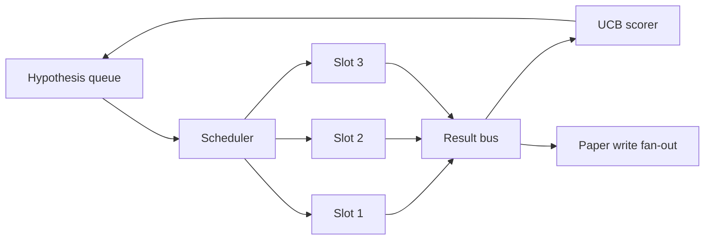
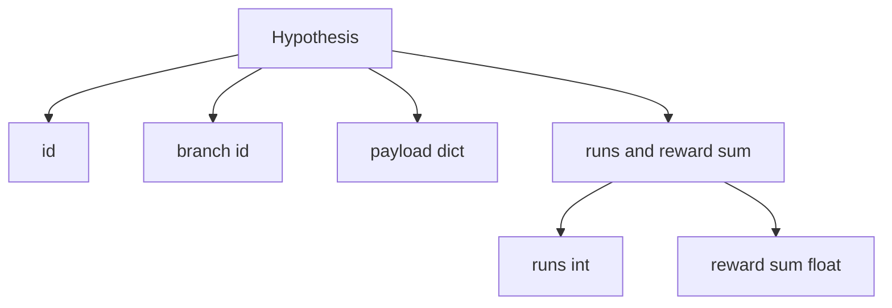
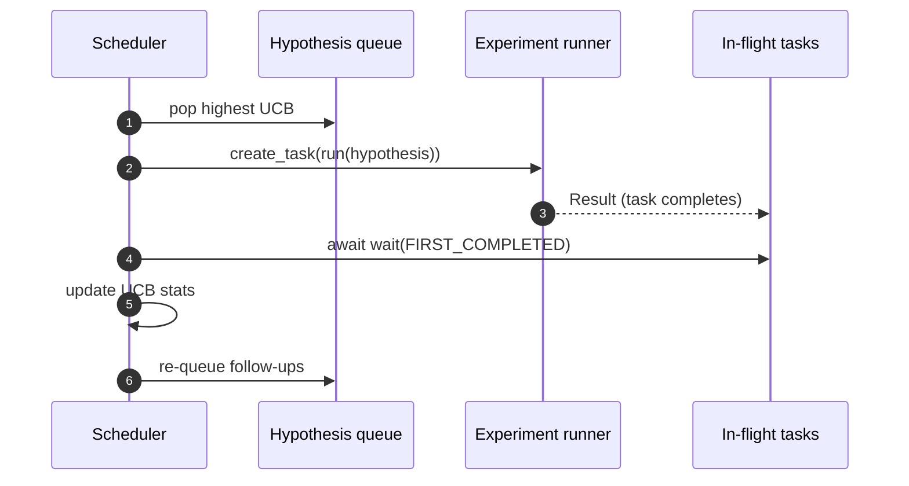

# 复制时间表

> 没有调度器的研究循环是有妄想的排队.调度器是循环决定什么停止探索的地方,

**Type:** Build
**Languages:** Python
**Prerequisites:** Phase 19 lessons 50-53
**Time:** ~90 minutes

## 学习目标

- 模型研究工作流程作为一个假设队列,以提供平行实验插槽,其结果反弹.
- 同时执行多次实验,以便调度器可以保持所有空中的繁忙.
- 通过 UCB 评分每个假设分支,以便安排人员可以在不放弃探索的情况下剪切低产量分支.
- 通过将完成的结果分发到纸上写作阶段和排队阶段,
- 填写一个反复的标记,分分分数,占用空间和剪裁决定.

```figure
ch-ucb-scheduler
```

## 为什么要安排时间,而不是工作列表

单一的工作列表以提交顺序运行工作.每一份工作都是独立的.研究不是独立的:从实验三中发现的结果改变了四和五的实验的优先级.一个编程程序员读取结果的粉丝并重新排列队列,每个计算单位都能完成更有用的工作.

设计的选择是得分规则.一个贪的得分者总是选择当前的领袖,从来没有探索.一个统一的得分者从来没有利用.UCB (上层信心限制) 是中间的途径:利用领袖,同时保留能力,用于未经尝试过的分支.

## 系统形状



排队包含假设.当一个插槽释放时,调度器选择最高的UCB假设.每个插槽都以异步运行实验.完成的实验将其结果传递到公共汽车上.公共汽车更新了 UCB的统计数据,并在分支收益超过门时将其更新到纸上写的阶段.

## 假设的形状



`branch`许多假设可能是分支 (分支是研究方向;假设是其中的一个试验).`runs`是该分支完成的实验数量,`reward_sum`美国央行读出了这两项.

## 欧元联储的分数

在本课中使用的UCB公式是经典的UCB1.

```text
ucb(branch) = mean_reward(branch) + c * sqrt( ln(total_runs) / runs(branch) )
```

`total_runs`是所有各个部门完成的所有实验的数量.`c`探索重量; 课程不符合`sqrt(2)`没有运行的分支得到了`+inf`因此未经测试的分支总是先安排.高平均奖励的分支保持高分数,直到其他分支赶上;许多次运行的分支没有太多奖励的分支被运行的替代品遮盖.

切割门与采集器分开. 切割将分支从未来的安排中移除,当其平均奖励低于绝对地板时 (默认`0.2`) 至少在`prune_after_runs`试验 (默认`3`这将保持排队的限制.

## 具有异步的平行槽

时间表器使用了`asyncio.create_task`每个任务都会由实验运行者 (一个`async def`报名可) 返回一个`Result`机上任务的重组将在 `asyncio.wait(..., return_when=asyncio.FIRST_COMPLETED)`并且在每次完成时都会发射得分更新.



两个分槽同时运行.主循环从来没有阻止一个实验. 编程师随着分槽的释放,就会继续启动新的任务,直到排队都空,没有任务在飞行中.

## 扩展:纸质触发器

当一个分支的平均奖励越来越高`paper_threshold`(默认方式`0.7`) 而该分支尚未制作一份论文,`paper.trigger`在本课中,触发器被捕获为列表,以便测试可以确认它.

## 扩散:后续假设

当一个高效的结果降落时,调度器可以调用用户提供的`expander`扩展器是从 到 的纯函数.`Result`为了`list[Hypothesis]`课程将运输一个确定性扩展器, 产生两个后续结果,

## 预算

两个预算保护时间表达者免受逃跑的循环.

```text
max_experiments    : total count of experiments run across all branches
max_seconds        : wall-clock cap (asyncio time)
```

随着任何一场火灾,调度器停止调度新的任务,等待飞行中的任务,并返回最后的痕迹.`stop_reason`现在,我们要去.

## 追踪和最终报告

每个安排决定 (选择,发送,结果,剪裁,风扇) 发出一个事件.最终报告总结每分支的统计数据,总运行,总墙钟,和发射的纸动触发器.下一个课程,端到端演示,阅读这份报告以驱动纸写者.

## 如何读取代码

`code/main.py`定义`Hypothesis`现在`Result`现在`BranchStats`现在`IterationScheduler`其他`make_deterministic_runner`运行者睡着一段时间.`delay_ms`(默认方式`5ms`) 因此可以观察到同步性.

`code/tests/test_scheduler.py`封面:UCB首先选择未经测试的分支,平行槽占用量,超过门时的纸质触发,低产量试验后的分支剪切,延伸后续假设和预算退出 (实验计数和墙钟).

## 走得更远

实际实施需要三次扩展. 首先,在会议中持续的UCB统计数据:当前的统计数据存储在内存中;一个真正的时间表将检查它们, 第二,多目标得分:每个结果都发出向量,UCB成为帕雷托式选手. 第三,背景盗:假设的选择条件 (长度,复杂性) 具有特征,因此类似的假设共享探索.

时间表是研究不仅仅成为一个工作列表的地方. 一旦UCB连接,并行时段,其他改进都会加上.
