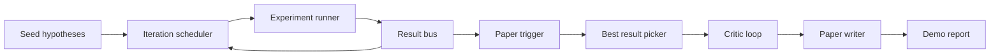
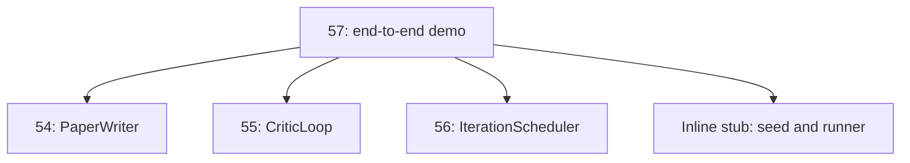
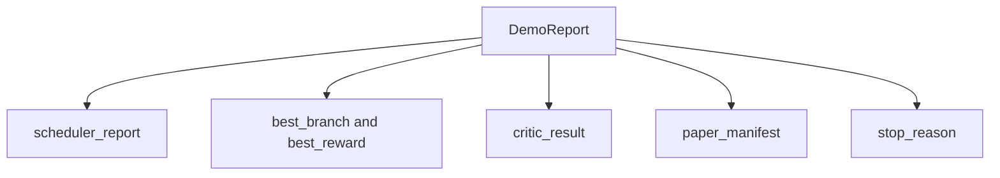

# 终端到终端的研究演示

> 演示是你之前写的每一份合同都必须写的场所.如果其中一个泄露,演示是抓住它的教训.

**Type:** Build
**Languages:** Python
**Prerequisites:** Phase 19 lessons 50-53
**Time:** ~90 minutes

## 学习目标

- 通过自动研究循环进行结尾:假设种子,实验运行者,安排者,评论者循环,论文作家.
- 通过简单的Python进口,而不是框架,编写前四个D轨道课程的原始内容.
- 运行循环到一个自动结束的终端, 发出一个单个演示报告,
- 保持演示确定性,以便测试组可以确认最终的形状.
- 任何阶段的合同破裂时,表面上设置一个明显的故障模式,以便下一个阶段不会出现破产输入.

```figure
ch-research-pipeline
```

## 在这里构成的



种子是一个列表三个假设. 编程师在它们上进行了六次实验,其中有三个并行插槽. 公共汽车报告一个或多个纸质触发器. 选手选择了单个最佳结果. 评论者循环在该结果构建的草稿上反复. 纸质编写者发出了最终的Latex,BibTeX和表格.

## 为什么进口而不是复制

每个早些时候的课程都会带来一个`main.py`演示程序通过调整它们进口`sys.path`这不是框架线程,而是以前的课程已经使用的检测文件的导入.



线条取代了50到53课程:一个小种子假设生成器和同步的奖励函数.用户可以通过调整两个进口来替换线条取这些课程的真实原始.

## 确定性保障

演示是建立的决定性.实验运行者种植的.评论循环的修改器在固定顺序中行走固定尺寸.纸作家的散文生成器是第五十四课中的嘲笑.规划者的UCB选手在反复顺序上打破了联系,而不是随机选择.

测试通过两次运行演示并比较表格来证实这一属性.

## 演示报告形状



每个字面上都是从上游阶段来的.演示程序不会转换任何输出,它会构成它们.这是演示程序的测试.

## 失效模式处理

每个阶段都会成功,或者会出现输入错误.

```text
Scheduler ........ returns SchedulerReport with stop_reason
                   in {queue_empty, max_experiments, deadline}
Best-result pick . raises NoTriggerError if no paper trigger fired
Critic loop ...... returns LoopResult with status converged or stopped
Paper writer ..... raises PaperValidationError on contract break
```

测试中,有任何阶段的失败, 测试中只有一种输入例外.`test_no_triggers_raises_typed_error`其他`test_best_picker_raises_when_no_triggers`确认选手提升`NoTriggerError`现在,`BestResultError`当没有一支支支支火发起子的时候,

## 最好的选择者

调度器每分支发出纸质触发器. 调度器选择所有触发器中最高平均奖励的分支. 结按分支 id 字母分裂,因此演示是确定性的. 调度器是一个小的纯函数;测试键在固定调度器报告上.

## 电缆的关键循环

五五课中的批判循环运行在一个`MiniPaper`演示程序建立了一个`MiniPaper`通过将抽象填写到分支ID,种植两个部分 (介绍和结果),并设置`originality_tag`根据分支的平均奖励 (如果高`>= 0.8`平均水平`>= 0.6`其他情况下,低).

修改者将草案重复到融合.输出进入纸质写作器.

## 电缆的报纸作家

课54的报纸作家在全文工作.`Paper`演示程序将升级收藏的数据.`MiniPaper`通过`mini_to_full_paper`根据评论家建议的引用密钥联盟,它将一个数字连接到选定的分支和一个小型合成文献.

## 如何读取代码

`code/main.py`定义`BestResultError`现在`NoTriggerError`现在`DemoReport`现在`pick_best_branch`现在`build_mini_paper`现在`mini_to_full_paper`其他`run_demo`进口量在最高调整`sys.path`一次,然后拉下`PaperWriter`现在`CriticLoop`其他`IterationScheduler`他们的课程.

`code/tests/test_e2e.py`封面:演示程序从端到端运行,并发出一个报告,所有五个填满的字段,两次运行中的确定性,没有分支越过门时的错误, 文件验证错误,当作者合同破裂时,纸质表包含选定的分支的数字,和安排器停止原因是预期值之一.

## 走得更远

一旦演示程序绿色,就值得连接三个扩展. 首先,持续状态:每个阶段的结果写入一个小的JSON存储器, 第二,仪表板:从调度器和评论循环中追踪事件作为一个单一的时间线. 第三,真正的模型调用:将嘲笑的散文生成器和确定性评论器换成基于模型的;

演示的任务是证明构成是建筑.五个课程,四个进口,一个报告.下次你添加一个阶段,
