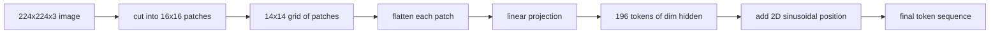

# 视觉编码器补丁

> 读像素的视觉模型需要一个像素代码器. 补丁嵌入是这个代码器. 切割图像成一个平方网,平平平每个平方,将它投射到一个线性层,然后添加一个2D位置信号,这样变压器就可以知道每个平方在原始图像中坐在那里.

**Type:** Build
**Languages:** Python
**Prerequisites:** Phase 19 lessons 30-37 (Track B foundations)
**Time:** ~90 minutes

## 学习目标

- 标记图像成固定长度的嵌入补丁序列.
- 实施一个`Conv2d`基于补丁投影,与"展开然后线性"的数学相匹配.
- 构建一个确定性2D双向状位置,嵌入,所以代号序符号编码空间位置.
- 检查片数量,嵌入形状,`Conv2d`合成装置的配方.

## 问题

变体食用了一个向量序列. 图像是一个三通道的网格. 读取每个像素作为一个符号, 序列长度会爆炸: 224x224 RGB 图像是 150,528 个符号, 读取图像,作为一个巨大的平面向量, 抛弃了位置, 编码器前端的任务是将像素格式压缩成几百个代币,每个代币都总结了一个方形区域.

补丁嵌入解决了一个线性投影.一个224x224图像切成16x16补丁产生14x14的格格 196补丁.每个补丁是平坦的从`(3, 16, 16) = 768`变压器看到196个维度代币.`hidden`网络其他部分可以取的序列.

## 概念



### 为什么是补丁,而不是像素

关注是序列长度的方形. 196 个代币的序列成本.`196 * 196 = 38,416`关注度分数每个头/层;一个150,528个代币的序列成本`150,528 * 150,528 = 22.6 billion`补丁可以减少注意力计算的590,000倍,而一个16x16区域可为高水平视觉任务承载足够的信号.成本是一个补丁内部细节空间细节的损失,这就是为什么下游多模块堆经常运行第二个高分辨率分支,当细节定位是重要的.

### 为什么线性投影足够

每个补丁都被视为一个独立的向量.投影学习了基础:边缘检测器,颜色过器,简单的纹理.`768 * 768 = 589,824`根据ViT-Base的标准,并快速列车.更深的卷积茎存在 ("混合"ViT),但平线线性投影是标准的,大多数现代开放权重编码器都具有这个形状.

### 其他`Conv2d`事

`Conv2d(in_channels=3, out_channels=hidden, kernel_size=patch_size, stride=patch_size)`没有填充的结果与fold-then-linear相同,因为每个输出位置点-produces的补丁像素对一个过器. 卷积是补丁投影,大多数生产代码基础将它运送到这种方式,因为它在 GPU上更快,使用一个更少的重塑.

### 位置嵌入

两个维的双向突嵌入式给每个代币一个固定信号,`(row, col)`位置. 嵌入维度的一半在多频率上编码行位置,另一半编码列位置. 编码是决定性的,因此可以在不需要重新训练的情况下交换分辨率,并且它清洁地插入模型在训练时从未看到的网格.

| Component | Shape | Parameters |
|-----------|-------|------------|
| Patch projection (`Conv2d`) | `(hidden, 3, patch, patch)` | `3 * P * P * hidden + hidden` |
| Position embedding (fixed) | `(num_patches, hidden)` | 0 (computed, not learned) |
| CLS token (learned) | `(1, hidden)` | `hidden` |

对于ViT-Base/16的 224 分辨率:投影中590.592 个参数,CLS代币中768个参数,对于鼻状位置则是零.下一个课程 (59) 将这个前端上堆叠一个12层变压器.

### 相当性作为智力检查

补丁步骤有两个拼写:`Conv2d`它们必须为相同的权重产生相同的输出.如果它们没有,则解体数学是错误的,而其余的编码器是建立在沙子上.本课中的测试实行了同等性.

```figure
ch-patch-tokenizer
```

## 建立它

`code/main.py`执行:

- `PatchEmbed`其他`nn.Module`包装`Conv2d`用于补丁投射.
- `sinusoidal_2d(grid_h, grid_w, dim)`构建2D位置表的无状态函数.
- `VisionFrontEnd`接,CLS预定,并将位置添加到一个前进传输中.
- `synthesize_image(seed)`通过  测量, 测量, 测量, 测量,`numpy.random`现在,我们要去.
- 通过前端运行一个固定图像的演示,打印出式形状,CLS代币标准,以及位置嵌入的一行.

运行它:

```bash
python3 code/main.py
```

输出:224x224固定符号为一个形状序列`(1, 197, 768)`首个代币是CLS,接下来的196个是补丁代币. 位置嵌入规范在一行内均,这是鼻状签名.

## 用它

现在,每一个现代视觉语言模型都出现了相同的补丁前端:Clip ViT-L/14,SigLIP,DINOv2,Qwen-VL家族,以及InternVL堆,`Conv2d`补丁投影加一个位置信号. 家庭之间的差异是下游 (CLS vs 没有CLS的集成,注册代币,不同补丁尺寸14 vs 16,通过插曲的位置进行动态分辨率). 本课程的前端是每个模型都站在的基板.

## 测试

`code/test_main.py`覆盖:

- 补丁数量匹配`(image_size / patch_size) ** 2`
- 输出形状匹配`(batch, num_patches + 1, hidden)`
- 其他`Conv2d`投影等于手动在小装置上打开然后直线
- 坐标位置表是通过调用的确定性
- 通过批量淡而无泄漏的CLS代币发射

运行它们:

```bash
python3 -m unittest code/test_main.py
```

## 运动

1. 换一个学会的位置.`nn.Parameter`训练后改变分辨率时,学习的位置在固定的分辨率上获胜;

2. 换一个`Conv2d`为了明确的`nn.Unfold`另外`nn.Linear`它们的输出与浮动容量相匹配.

3. 添加支持非方形补丁尺寸 (例如32x16用于宽面输入) 并验证位置表处理非方形网格.

4. 片步骤在批量1,8,64的配置.

5. 训练前端作为一个冷的特征提取器在4类合成形状数据集 (圆,方形,三角形,星).CLS代币输出应线性分开.

## 关键词

| Term | What it means |
|------|---------------|
| Patch | A square sub-region of the image, typically 14x14 or 16x16 |
| Patch embedding | Linear projection of one flattened patch to the hidden dim |
| Sequence length | Number of tokens after patch tokenization, usually plus CLS |
| Sinusoidal position | Fixed sin/cos signal that encodes 2D grid coordinates |
| CLS token | Learned vector prepended to the sequence as the pooling head |

## 进一步阅读

- 一张图像值16x16字 (ViT, 2021) 对于原始的补丁嵌入式框架.
- 关注就是你需要的 (2017) 对于这里适应2D的鼻形位置公式.
- 印证的DINOv2纸,可以添加为6练习.
