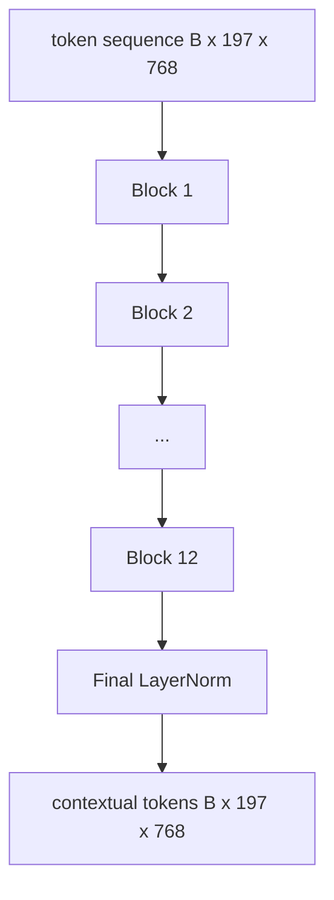
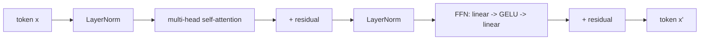

# 视觉变换器编码器

> 补丁本身就看不见.一个12层的LN前变压器,有12个注意头,将补丁代币的序列转化为文本代币的序列,CLS代币将整个图像的功能聚集在最后的隐藏状态中.这个课程是每个现代视觉语言模型的机器室.

**Type:** Build
**Languages:** Python
**Prerequisites:** Phase 19 lessons 30-37 (Track B foundations)
**Time:** ~90 minutes

## 学习目标

- 实现一个LN前变压器块,具有多头自注意和一个输送前置子层.
- 堆积12块,以形成一个ViT-Base编码器.
- 导向第58课前端的补丁进入编码器,然后向前传递.
- 检查CLS代币是否从每个补丁中汇集信息.

## 问题

补丁嵌入产生了197个代币的序列,每个代币都是一个向量,没有意识到任何其他补丁. 猫的照片需要每一个斑点,才能知道哪些斑点包含胡须,哪些包含背景,哪些包含眼睛. 变压器是建立意识的机制,一次性关注一层. 没有它,补丁前端是一个聪明的代币,没有理解.

标准配方是12块深,12个头宽, 具有前层规范的放置,GELU激活, 这种配方是Clip ViT-L,SigLIP,DINOv2,Qwen-VL家族,InternVL以及2025-2026年的其他开放权重视觉编码器的脊柱. 配方是足够稳定的,你可以读到任何一篇论文,

## 概念





### 预年与后年

原始变压器在剩余后放置了LayerNorm.前LN (每一个子层前LayerNorm) 是每个现代视觉语言模型所使用的版本,因为它稳定地训练而没有学习速度的加热技巧.前进的差异是前进传递中的一条线,深度12+的梯度流量是白天和夜.

### 多头自觉

每个头都将标志向量投射到自己的头`(query, key, value)`三维的三维`head_dim = hidden / num_heads`随着`hidden = 768`其他`heads = 12`每个头都有`dim = 64`双头的同时,其输出回归768维度,通过输出投影.多头的目的是,一个头可以学习"看猫眼睛",而另一个头可以学习"看背景梯度"而不受到干扰.

### 为什么4倍的进口扩张

美国联邦农业局`hidden -> 4 * hidden -> hidden`由于其实,在数据中,GELU是最重要的,但在数据中,GELU是最重要的. 因素4是经验性的,自2017年以来一直存在于语言和视觉变革器中. 较小 (2x) 低调;较大的 (8x) 超越固定数据预算.

| Component | Parameters at ViT-Base scale |
|-----------|------------------------------|
| qkv projection per block | `3 * 768 * 768 = 1.77M` |
| output projection per block | `768 * 768 = 590K` |
| FFN per block (4x expansion) | `2 * 768 * 4 * 768 = 4.72M` |
| LayerNorm per block | `4 * 768 = 3K` |
| Total per block | about 7.1M |
| 12 blocks | about 85M |
| Plus front end | about 86M total |

维特基是一个86M参数编码器.这在2026年标准上很小 (SigLIP-So400M是400M,Qwen-VL ViT是675M),但在宽度和深度上,架构是相同的.

### 原因面具还是不?

视觉变压器仅使用编码器,并且双向:代币`i`现在,我们可以参加.`j`解码器侧交叉注意力在第61课中将使用因果性面膜,但在视觉编码器内,注意力完全连接.

### 什么是CLS令牌学习

CLS标志开始作为一个学习参数,没有自己的补丁内容,并通过每个区块的注意力积累信息.到最后层,CLS行是整个图像的向量总结;下游头将这个单个向量投射到类日志,对比嵌入或交叉注意力键中.

```figure
ch-cls-funnel
```

## 建立它

`code/main.py`执行:

- `MultiHeadSelfAttention`随着`qkv`结果的投影, 标点产品注意力数学,
- `FeedForward`通过4倍扩展的GELU MLP.
- `Block`含残留物,包括注意和输送的子层.
- `ViT`只有一个最后的"级别"
- `VisionEncoder`哪些线`VisionFrontEnd`从第58课到第6课`ViT`起并暴露一个`forward()`返回文本序列和集成的CLS向量.
- 通过完整的编码器运行合成的224x224固定图像的演示,并在其他层中打印输入形状,输出形状,参数数和CLS标准.

运行它:

```bash
python3 code/main.py
```

输出: 装置编码为 a`(1, 197, 768)`由于层的合,CLS标准向上移动,然后在最后的层Norm中稳定.

## 用它

在此定义的编码器是,在宽度和深度上,相同的块堆,在2025-2026年,每一个开放重量的VLM内运输.

- **Width and depth.**维特-大是`hidden=1024, depth=24, heads=16`;siglipso400m是`hidden=1152, depth=27, heads=16`区块相同.
- **Pooling head.**总体而言,在这些课程中,
- **Position handling.**固定的阴影状 (课58) 与学习1D对 ALiBi对 2D RoPE.
- **Register tokens.**迪诺二预备了4个额外的学习代币.

接下来的课程 (60-63) 站在上面.

## 测试

`code/test_main.py`覆盖:

- 一块保持形状,不变于输入批量大小
- 关注点总数在关键轴上达到1 (软max智能)
- 剩余路径是有线 (零输入仍然通过CLS代币产生非零输出)
- 通过4层堆叠的前进通过产生正确的形状
- 从CLS输出流向补丁投影的梯度流

运行它们:

```bash
python3 -m unittest code/test_main.py
```

## 运动

1. 加入注册代币 (CLS后预pendiated的4学习向量) 和重复运行.通过最后层的软max分布的透来比较注意地图的顺度.

2. 换LN前后LN,在合成形状分类器上进行一段时间的列车.观察哪个列车在没有LR加热的情况下稳定地进行列车.

3. 实施因果化掩饰`attn_mask`按下下列方法来定义一个模块的模块.`(seq, seq)`低三角形.

4. 配置一张前进通行,以批量1,8,64为单位`torch.profiler` MLP 层主导墙壁时间,而不是注意力.

5. 换一个注意力头的q-k-v投影器,用低级的LoRA适配器, 结其余的,

## 关键词

| Term | What it means |
|------|---------------|
| Pre-LN | LayerNorm applied before each sub-layer instead of after |
| Self-attention | Each token attends to every other token in the same sequence |
| Multi-head | The hidden dim is split across `H` independent attention heads |
| FFN expansion | The feed-forward layer widens to `4 * hidden` before contracting |
| CLS pooling | Use the first token's final hidden state as the image summary |

## 进一步阅读

- 对于编码器配方,一个图像值16x16字 (ViT,2021年).
- 登记代币的DINOv2 (2023) 和自我监督预训目标.
- 对于第62课中使用的平均聚合变体和sigmoid对比损失的SigLIP (2023)
