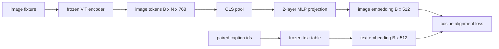

# 调整模式的投影层

> 视觉编码器生成图像代币.文本解码器消耗文本代币.这两个生活在不同的矢量空间中.一个小的两层MLP将图像代币投射到文本嵌入空间中,而对对对的副本的可西因对齐损失将两个空间拉入协议.该投影是视觉语言模型中最小的部分,并且是转移最重要的.

**Type:** Build
**Languages:** Python
**Prerequisites:** Phase 19 lessons 30-37 (Track B foundations)
**Time:** ~90 minutes

## 学习目标

- 构建一个两个层的MLP投影,将图像特性映射到文本嵌入空间中.
- 构建一个模拟文本嵌入表 (没有预先训练的代币,没有真正的体积).
- 计算预测图像代币和对标题嵌入之间的可西因对齐损失.
- 通过冷的视觉编码器和冷的文本表来训练单独的投影.

## 问题

你有一个视觉编码器 (58-59课) 产生维度标记`vision_hidden = 768`你有一个文本解码器,你想把它插入到上面.`text_hidden = 512`解码器预期文字形象的代币.图像代币不是文字形象:它们生活在一个编码器在视觉预训练中学到的基础上,没有与解码器的词向量关系.

两层MLP投影 (线性,GELU,线性) 弥合了差距.`768 * 1024 + 1024 * 512 = 1.3M`视觉编码器保持冷.文本嵌入表保持冷.只有投影运动.这是2023年发送的LLaVA配方,BLIP-2被重新框架为Q-Former,并且自那以后,每一个开放式VLM都以某种形式采用.

## 概念



### 在投射前汇集

视觉编码器发射197个代币.文本侧有一个标题级嵌入.为了对齐它们,你需要每样本一个图像级向量.CLS聚合是最简单的:从编码器中取出第一个代币并投射它.所有197个代币的平均聚合是另一个选择,这是SigLIP使用的.

### 为什么两个层而不是一个层

一个线性投影可以旋转和重新扩展,但如果两个空间有曲率不匹配,则不能固定基础. 两层线性之间的GELU给投影一个非线性曲线,这对Clip风格的特性进行对应到语言模型嵌入式的经验性足够. 深度投影 (LLaVA-NeXT使用GLU;Qwen-VL使用了一堆注意力层) 是扩展;双层MLP是可信的基线,是BLIP-2的Q-Former投影头舰在罩杯下面的.

| Layer | Shape | Parameters |
|-------|-------|------------|
| fc1 | `(vision_hidden, projection_hidden)` | `768 * 1024 + 1024` |
| activation | GELU | 0 |
| fc2 | `(projection_hidden, text_hidden)` | `1024 * 512 + 512` |

约为1.3M的参数`768 -> 1024 -> 512`头部.

### 位的可西因排行性损失

调整并不意味着`image_emb == text_emb`调整意味着`image_emb`方向的点`text_emb`体损失是`1 - cos_sim(image, text)`训练将这项工作推向每对零. 第62课将其概括为对比分批量 (InfoNCE),每个图像必须比批量的任何其他标题更接近自己的标题;本课使用每对版本,以便动态可见.

### 结编码器是这个技巧

视觉编码器具有86M参数. 文本表还有一些百万. 训练他们从假体是一个不初步. 结两者都意味着投影的1.3M参数是唯一的变化, 适配器的VLM的运行形状是这样的:重部件保持冷,轻桥列车.

```figure
ch-projection-bridge
```

## 建立它

`code/main.py`执行:

- `MLPProjector(in_dim, hidden_dim, out_dim)`两层线性MLP,具有GELU激活.
- `MockTextEmbedding(vocab_size, dim)`结结结嵌入表,由种子的定性源头.
- `make_pair(seed, vocab_size)`标题是短的 id 序列;标题嵌入是指合并于代币嵌入.
- `cosine_alignment_loss(image_emb, text_emb)`两人均`1 - cos_sim`目标.
- 训练循环,在32个合成对 (循环) 上运行了200步的投影,视觉编码器和文本表被结,每25步就会打印损失.

运行它:

```bash
python3 code/main.py
```

输出:训练报告在200步内从初始损失下降到0.80左右,证明仅投影可以将图像代币拉到文本空间.每对的最终共数相似性也会打印.

## 用它

任何开放式VLM都会出现相同的模式:

- **LLaVA 1.5.**双层GELU MLP投影从CLIP-ViT-L隐藏到LLaMA嵌入薄.冷视觉编码器,冷LLM,训练只有投影 (然后在第二阶段解LLM).
- **BLIP-2.**通过通过交叉注意力与图像代币进行学习的32个查询代币,然后将其投影到LLM嵌入式.Q-Former的最尾的投影头是本课的MLP的模拟.
- **MiniGPT-4.**从BLIP-2 Q-Former输出到Vicuna嵌入式.
- **Qwen-VL.**交叉注意力适配器有几个层,但最后的部分再次是投影到LM嵌入式.

形状不同,但作用是一样的:池图标,投影到文本嵌入模糊,单独列车.

## 测试

`code/test_main.py`覆盖:

- 投影机输出形状与配置相匹配`out_dim`
- 结结结文本嵌入表为零`requires_grad`参数
- 在相同的向量上,可素损失为零,而在反平行向量上则为2
- 投影仪梯度流动在一次向后过后
- 训练循环减少步骤0至步骤200之间的损失

运行它们:

```bash
python3 -m unittest code/test_main.py
```

## 运动

1. 替换CLS聚合式为196个补丁代币的平均聚合式,并比较200步后的最终损失.平均聚合式通常在合成数据上运行得更快;CLS在自然图像上更有效的样本.

2. 增加已知的度温度 (`cos / tau`) 并观察当`tau`低于 (渐变噪音) 或高于 (高于损失平原).

3. 换取两层MLP为单一线性层,量化损失差距.非线性更重要于自然图像特征,而不重要于合成特征.

4. 添加一个小的L2罚款在投影仪重量和观察它如何与可西因配线相互作用 (可西因是尺度不变,所以罚款大多缩小未使用的方向).

5. 继续投影仪的重量,然后重新加载并运行推断,而不需要视觉编码器向后通过,以验证在部署时只需要投影仪.

## 关键词

| Term | What it means |
|------|---------------|
| Modality alignment | The act of making image and text embeddings comparable in one shared space |
| Projection head | The small module that maps one space to another, usually a 2-layer MLP |
| Cosine similarity | Dot product divided by the product of L2 norms |
| Frozen encoder | The vision (or text) model has all parameters with `requires_grad=False` |
| Mock corpus | Synthetic pairs used so training has no dataset download dependency |

## 进一步阅读

- 两阶段火车的LLaVA纸 (项目,然后解LM).
- 作为可学习的投影替代品,用于Q-Former的BLIP-2纸.
- 作为更深层次的投影头,交叉注意力适配器的Qwen-VL技术报告.
